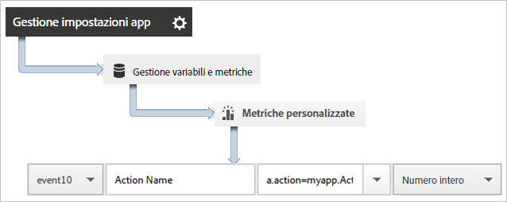
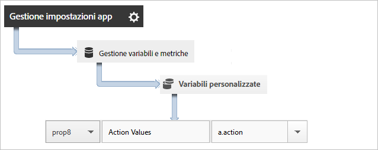

# Tracciare le azioni eseguite nell’app {#track-app-actions}

Le azioni sono gli eventi che si verificano nell’app Android e che desideri misurare.

Ogni azione ha una o più metriche corrispondenti che vengono incrementate ogni volta che si verifica l’evento. Ad esempio, puoi inviare una chiamata `trackAction` per ciascun nuovo abbonamento, ogni volta che viene visualizzato un articolo oppure ogni volta che viene completato un livello. Le azioni non vengono tracciate automaticamente, pertanto devi chiamare `trackAction` quando si verifica un evento che desideri tracciare e mappare l&#39;azione a un evento personalizzato.

## Tracciamento delle azioni {#section_380DF56C4EE4432A823940E4AE4C9E91}

1. Aggiungi la libreria al tuo progetto e implementa le funzioni di ciclo di vita (lifecycle).

   Per ulteriori informazioni, consulta *Aggiungere l’SDK e il file di configurazione al progetto IntelliJ IDEA o Eclipse* in [Implementazione e ciclo di vita di base](/help/android/getting-started/dev-qs.md).

1. Importa la libreria:

   ```java
   import com.adobe.mobile.*;
   ```

1. Quando l&#39;azione da tracciare si verifica nell&#39;app, invoca `trackAction` per inviare un hit per questa azione:

   ```java
   Analytics.trackAction("myapp.ActionName", null);
   ```

1. Nell’interfaccia utente di Adobe Mobile Services, seleziona l’app e fai clic su **[!UICONTROL Gestione impostazioni app]**.
1. Fai clic su **[!UICONTROL Gestione variabili e metriche]** e quindi sulla scheda **[!UICONTROL Metriche personalizzate]**.

1. Mappa su un evento personalizzato il nome dei dati contestuali definito nel codice, ad esempio `myapp.ActionName`.

   

Puoi anche impostare una proprietà che contenga tutti i valori delle azioni mediante la mappatura di una proprietà personalizzata denominata ad esempio **[!UICONTROL Azioni personalizzate]** e l’impostazione del valore su `a.action`.



## Invio di dati aggiuntivi {#section_3EBE813E54A24F6FB669B2478B5661F9}

Oltre al nome dell&#39;azione, con ogni chiamata di tracciamento delle azioni puoi inviare anche dati di contesto aggiuntivi:

```java
HashMap<String, Object> exampleContextData = new HashMap<String, Object>(); 
exampleContextData.put("myapp.social.SocialSource", "Twitter"); 
Analytics.trackAction("myapp.SocialShare", exampleContextData);
```

I valori dei dati contestuali devono essere mappati su variabili personalizzate in Adobe Mobile Services:


## Rapporti sulle azioni {#section_0F6A54AB7A3F42C9BB042D86A0FC4630}

| Interfaccia | Rapporto |
|--- |--- |
| Adobe Mobile Services | Rapporto **[!UICONTROL Percorsi azione]**. Visualizza l’ordine in cui si verificano le azioni nell’app. Puoi anche fare clic su **[!UICONTROL Personalizza]** su qualsiasi rapporto per visualizzare le azioni in base a classifica, tendenze o dettagli, oppure puoi applicare un filtro per vedere le azioni relative a un dato segmento. |
| Reporting e analisi di marketing | Rapporto **[!UICONTROL Evento personalizzato]**. Dopo aver mappato un’azione su un evento personalizzato, puoi visualizzare gli eventi da app mobile in modo analogo a tutti gli altri eventi di Analytics. |
| Analisi ad hoc | Rapporto **[!UICONTROL Evento personalizzato]**.  Dopo aver mappato un’azione su un evento personalizzato, puoi visualizzare gli eventi da app mobile in modo analogo a tutti gli altri eventi di Analytics. |
