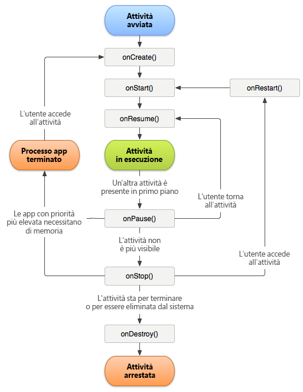

# Track app crashes {#track-app-crashes}

Queste informazioni sono utili per capire come vengono tracciati gli arresti anomali dell'app e quali best practice adottare per gestire i falsi arresti anomali.

>[!TIP]
>
>Gli arresti anomali delle app vengono tracciati come parte delle metriche del ciclo di vita. Before you can track crashes, add the library to your project and implement lifecycle. For more information, see Add the SDK and Config File to your IntelliJ IDEA or Eclipse Project in Core implementation and lifecycle.**[](/help/android/getting-started/dev-qs.md)

Quando si implementano le metriche del ciclo di vita, viene effettuata una chiamata a `Config.collectLifecycleData` nel metodo `OnResume` di ciascuna attività. In the `onPause` method, a call is made to `Config.pauseCollectingLifeCycleData`.

In `pauseCollectingLifeCycleData` viene impostato un flag per indicare una corretta uscita. Quando l'app viene avviata di nuovo o ripresa, `collectLifecycleData` verifica questo flag. Se lo stato del flag determina che l'uscita dall'app non è avvenuta correttamente, i dati contestuali `a.CrashEvent` vengono inviati con la chiamata successiva e viene segnalato un evento di arresto anomalo.

Per ottenere una segnalazione accurata degli arresti anomali, devi chiamare `pauseCollectingLifeCycleData` nel metodo `onPause` di ciascuna attività. Per capire il motivo per il quale è essenziale, ecco un diagramma che illustra il ciclo di vita dell'attività Android:



Per maggiori informazioni sul ciclo di vita dell'attività Android, consulta [Attività](https://developer.android.com/guide/components/activities.html).

*Questa illustrazione sul ciclo di vita Android è stata creata e[condivisa da Android Open Source Project](https://source.android.com/)e viene utilizzata in base ai termini della[Creative Commons 2.5 Attribution License](https://creativecommons.org/licenses/by/2.5/).*

## Cosa causa la segnalazione di un arresto anomalo falso?

1. Se esegui il debugging utilizzando un IDE, come Android Studio, l'avvio di un'app nuovamente dall'IDE quando l'app è in primo piano causa un arresto anomalo.

   >[!TIP]
   >
   >Potete evitare questo arresto anomalo mettendo in background l'app prima di avviarla nuovamente dall'IDE.

1. If the last foreground Activity of your app is backgrounded and does not call `Config.pauseCollectingLifecycleData();` in `onPause`, and your app is manually closed or killed by the OS, the next launch results in a crash.

## Come vanno gestiti i fragmenti?

I frammenti hanno eventi del ciclo di vita dell'applicazione simili alle attività. Tuttavia, un frammento non può essere attivo se non è collegato a un'attività.

>[!IMPORTANT]
>
>È necessario fare affidamento sugli eventi del ciclo di vita rispetto ai quali le attività contenitore possono eseguire il codice. L'operazione viene gestita dalla vista principale del frammento.

## (Optional) Implement activity lifecycle callbacks

A partire dall'API livello 14, Android consente callback del ciclo di vita globali per le attività. For more information, see [Application](https://developer.android.com/reference/android/app/Application).

You can use these callbacks to ensure that all of your Activities correctly call `collectLifecycleData()` and `pauseCollectingLifecycleData()`. Occorre aggiungere questo codice solo nell'attività principale e in qualsiasi altra attività in cui la tua app potrebbe essere avviata:

```js
import com.adobe.mobile.Config; 
  
public class MainActivity extends Activity { 
... 
    @Override 
    protected void onCreate(Bundle savedInstanceState) { 
        super.onCreate(savedInstanceState); 
        setContentView(R.layout.activity_main); 
  
        getApplication().registerActivityLifecycleCallbacks(new Application.ActivityLifecycleCallbacks() { 
            @Override 
            public void onActivityResumed(Activity activity) { 
                Config.setContext(activity.getApplicationContext()); 
                Config.collectLifecycleData(activity); 
            } 
  
            @Override 
            public void onActivityPaused(Activity activity) {     
                Config.pauseCollectingLifecycleData(); 
            } 
    
            // the following methods aren't needed for our lifecycle purposes, but are required to be implemented 
            // by the ActivityLifecycleCallbacks object 
            @Override 
            public void onActivityCreated(Activity activity, Bundle savedInstanceState) {} 
            @Override 
            public void onActivityStarted(Activity activity) {} 
            @Override 
            public void onActivityStopped(Activity activity) {} 
            @Override 
            public void onActivitySaveInstanceState(Activity activity, Bundle outState) {} 
            @Override 
            public void onActivityDestroyed(Activity activity) {} 
        }); 
    } 
... 
}
```

To send additional context data with your lifecycle call by using `Config.collectLifecycleData(Activity activity`, `Map<String`, `Object> contextData)`, you must override the `onResume` method for that Activity and ensure that you call `super.onResume()` after manually calling `collectLifecycleData`.

```js
@Override 
protected void onResume() { 
    HashMap<String, Object> cdata = new HashMap<>(); 
    cdata.put("someKey", "someValue"); 
    Config.collectLifecycleData(this, cdata); 
  
    super.onResume(); 
}
```

