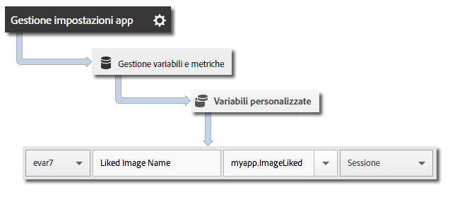

# Valore &quot;lifetime&quot; del ciclo di vita del visitatore {#visitor-lifetime-value}

Il valore “lifetime” permette di misurare e impostare come destinazione un valore del ciclo di vita per ogni utente. È utile per memorizzare gli acquisti, le visualizzazioni di annunci, la visione completa di un video, le condivisioni social, i caricamenti di foto e così via, nel corso del ciclo di vita.

Ogni volta che viene inviato un valore con `trackLifetimeValueIncrease`, tale valore viene aggiunto a quello esistente. Il valore &quot;lifetime&quot; del ciclo di vita è memorizzato nel dispositivo e può essere recuperato in qualsiasi momento con una chiamata `lifetimeValue`.

## Tracciare il valore del ciclo di vita del visitatore {#section_390943A49AF841F2941E65D6DF2B3F5A}

1. Aggiungi la libreria al tuo progetto e implementa le funzioni di ciclo di vita (lifecycle).

   Per ulteriori informazioni, consulta *Aggiungere l’SDK e il file di configurazione al progetto IntelliJ IDEA o Eclipse* in [Implementazione e ciclo di vita di base](/help/android/getting-started/dev-qs.md).
1. Importa la libreria:

   ```java
   import com.adobe.mobile.*;
   ```

1. Invoca `trackLifetimeValueIncrease` con l&#39;incremento da aggiungere al valore:

   ```java
   Analytics.trackLifetimeValueIncrease(BigDecimal.valueOf(5.0), null);
   ```

## Inviare dati aggiuntivi {#section_3EBE813E54A24F6FB669B2478B5661F9}

Oltre al valore &quot;lifetime&quot; del ciclo di vita, con ogni chiamata di tracciamento delle azioni puoi inviare anche dati di contesto aggiuntivi:

```java
HashMap cdata = new HashMap<String, Object>(); 
cdata.put("myapp.ImageLiked", imageName); 
Analytics.trackLifetimeValueIncrease(BigDecimal.valueOf(5.0), cdata);
```

I valori dei dati contestuali devono essere mappati su variabili personalizzate in Adobe Mobile Services:


