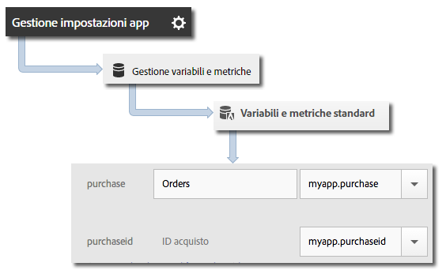

# Variabile dei prodotti {#products-variable}

La variabile &quot;products&quot; non può essere impostata utilizzando le regole di elaborazione. Nell’SDK di Mobile devi usare una sintassi particolare nel parametro dei dati contestuali per impostare i prodotti nella chiamata al server.

Per impostare la variabile *prodotti*, imposta una chiave di dati contestuali su `"&&products"`, quindi imposta il valore utilizzando la sintassi definita per la variabile *prodotti*:

```java
cdata.put("&&products", "Category;Product;Quantity;Price[,Category;Product;Quantity;Price]");
```

Ad esempio:

```java
//create a context data dictionary 
HashMap cdata = new HashMap<String, Object>(); 
 
// add products, a purchase id, a purchase context data key, and any other data you want to collect. 
// Note the special syntax for products 
cdata.put("&&products", ";Running Shoes;1;69.95,;Running Socks;10;29.99"); 
cdata.put("myapp.purchase", "1"); 
cdata.put("myapp.purchaseid", "1234567890"); 
 
// send the tracking call - use either a trackAction or TrackState call. 
// trackAction example: 
Analytics.trackAction("purchase", cdata); 
// trackState example: 
Analytics.trackState("Order Confirmation", cdata);
```

La variabile *prodotti* è impostata sulla richiesta dell&#39;immagine e le altre variabili sono impostate come dati contestuali. Tutte le variabili dei dati di contesto devono essere mappate utilizzando le regole di elaborazione:



Non è necessario mappare la variabile  *prodotti* mediante le regole di elaborazione, perché viene impostata direttamente nella richiesta dell&#39;immagine dall&#39;SDK.
