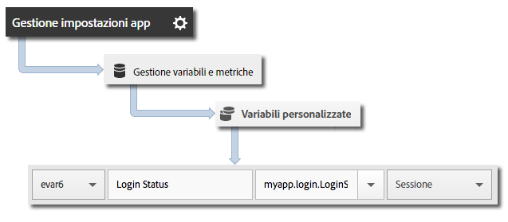

# Tracciare gli stati dell&#39;app {#track-app-states}

Per &quot;stati&quot; si intendono le diverse schermate o visualizzazioni disponibili nell&#39;app.

Ogni volta che nell&#39;applicazione viene visualizzato un nuovo stato, ad esempio quando l&#39;utente si sposta dalla homepage al feed di notizie, viene inviata una chiamata `trackState`. In Android, `trackState` viene generalmente chiamato ogni volta che si carica una nuova attività.

## Tracciamento degli stati {#section_380DF56C4EE4432A823940E4AE4C9E91}

1. Aggiungi la libreria al tuo progetto e implementa le funzioni di ciclo di vita (lifecycle).

   Per ulteriori informazioni, consulta *Aggiungere l’SDK e il file di configurazione al progetto IntelliJ IDEA o Eclipse* in [Implementazione e ciclo di vita di base](/help/android/getting-started/dev-qs.md).

1. Importa la libreria:

   ```java
   import com.adobe.mobile.*;
   ```

1. Nella funzione `onCreate`, chiama `trackState` per inviare un hit per questa visualizzazione di stato:

   ```java
   @Override 
   public void onCreate(Bundle savedInstanceState) { 
       super.onCreate(savedInstanceState); 
       setContentView(R.layout.main); 
   
       // Adobe - track when this state loads 
       Analytics.trackState("State Name", null); 
   }
   ```

Il `"State Name"` è indicato nella variabile `View State` in Adobe Mobile Services e viene registrata una visualizzazione per ciascuna chiamata `trackState`. In altre interfacce di Analytics, `View State` viene riportato come `Page Name`, e `state views` viene riportato come `page views`.

## Inviare dati aggiuntivi {#section_CFDB4F944496401786A145C209AB387C}

Oltre al `"State Name"`, con ogni chiamata di tracciamento delle azioni puoi inviare anche dati contestuali aggiuntivi:

```java
@Override 
public void onCreate(Bundle savedInstanceState) { 
    super.onCreate(savedInstanceState); 
    setContentView(R.layout.main); 
  
    // Adobe - track when this state loads 
    HashMap<String, Object> exampleContextData = new HashMap<String, Object>(); 
    exampleContextData.put("myapp.login.LoginStatus", "logged in"); 
    Analytics.trackState("Home Screen", exampleContextData); 
}
```

I valori dei dati contestuali devono essere mappati su variabili personalizzate in Adobe Mobile Services:



## Generazione di rapporti sugli stati dell&#39;app {#section_0F6A54AB7A3F42C9BB042D86A0FC4630}

Gli stati vengono generalmente visualizzati utilizzando un rapporto sui percorsi, che consente di vedere in che modo gli utenti si spostano nell&#39;app e quali stati vengono visualizzati più di frequente.

|  |  |
|--- |--- |
| Adobe Mobile Services | Il rapporto **[!UICONTROL Stati di visualizzazione]**. Questo rapporto si basa sui percorsi seguiti dagli utenti all&#39;interno dell&#39;applicazione. A sample path is  **[!UICONTROL Home]**  >  **[!UICONTROL Settings]**  > **[!UICONTROL Feed]**. |
| Adobe Analytics | Gli stati possono essere visualizzati ovunque possano essere visualizzate le Pagine, ad esempio nei rapporti **[!UICONTROL Pagine]**, **[!UICONTROL Visualizzazioni pagina]** e **[!UICONTROL Percorso]**. |
| Analisi ad hoc | Gli stati possono essere visualizzati ovunque possano essere visualizzate le Pagine utilizzando la dimensione **[!UICONTROL Pagina]**, la metrica **[!UICONTROL Visualizzazioni pagina]** e i rapporti **[!UICONTROL Percorso]**. |


