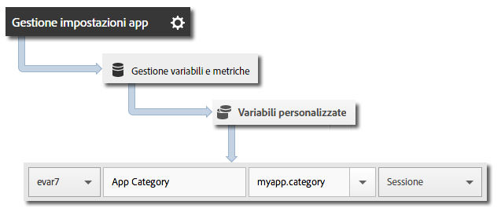

# Implementazione e ciclo di vita di base {#core-implementation-and-lifecycle}

Queste informazioni sono utili per implementare la libreria Android e raccogliere metriche sul ciclo di vita, come avvii, aggiornamenti, sessioni, utenti attivi e così via.

## Scaricare l'SDK {#section_99FE1A17A36D4A2C943939023CF6265C}

>[!IMPORTANT]
>
>Per scaricare l'SDK, devi usare Android 2.2 o successivo.

1. Effettua i passaggi descritti nelle sezioni seguenti per impostare una suite di rapporti per la fase di sviluppo e scaricare una versione precompilata del file di configurazione:

   * [Creare una suite di rapporti](/help/android/getting-started/requirements.md)
   * [Scaricare l'SDK](/help/android/getting-started/requirements.md)

1. Scarica e decomprimi il file `[Your_App_Name_]AdobeMobileLibrary-4.*-Android.zip` e verifica che siano presenti i seguenti componenti software:

   * `adobeMobileLibrary.jar`, che è la libreria che sarà utilizzata con dispositivi e simulatori Android.

   * `ADBMobileConfig.json`, file di configurazione dell’SDK personalizzato per la tua app.
   >[!IMPORTANT]
   >
   >Se scarichi l'SDK all'esterno dell'interfaccia utente di Adobe Mobile Services, il file `ADBMobileConfig.json` dovrà essere configurato manualmente. Se hai poca esperienza con Analytics e l'SDK Mobile e desideri impostare una suite di rapporti per la fase di sviluppo e scaricare una versione precompilata del file di configurazione, vedi [Prima di iniziare](/help/android/getting-started/requirements.md).

## Aggiungere l'SDK e il file di configurazione al progetto IntelliJ IDEA o Eclipse {#section_B89510FBB4C646AEA73A185B966E54D3}

**Progetto IntelliJ IDEA**

Per aggiungere l'SDK e il file di configurazione al tuo progetto:

1. Aggiungi il file `ADBMobileConfig.json` alla cartella `assets` del progetto.

1. Fai clic con il pulsante destro del mouse nel pannello di navigazione del progetto.
1. Seleziona **[!UICONTROL Impostazioni modulo aperto]**.
1. In **[!UICONTROL Impostazioni progetto]**, seleziona **[!UICONTROL Librerie]**.
1. Fai clic sull'icona **[!UICONTROL +]** per aggiungere una nuova libreria.
1. Seleziona **[!UICONTROL Java]** e naviga fino al file `adobeMobileLibrary.jar`.
1. Seleziona i moduli nei quali intendi usare la libreria mobile.
1. Fai clic su **[!UICONTROL Applica]** e su **[!UICONTROL OK]** per chiudere la finestra Impostazioni modulo.

**Progetto Eclipse**

Per aggiungere l'SDK e il file di configurazione al tuo progetto:

1. Aggiungi il file `ADBMobileConfig.json` alla cartella `assets` del progetto.
1. In **[!UICONTROL Eclipse IDE]**, fai clic con il pulsante destro del mouse sul nome del progetto.
1. Fai clic su **[!UICONTROL Percorso build]** &gt; **[!UICONTROL Aggiungi archivi esterni]**.
1. Seleziona `adobeMobileLibrary.jar`.
1. Fai clic su **[!UICONTROL Apri]**.
1. Fai clic nuovamente con il pulsante destro del mouse sul progetto e seleziona **[!UICONTROL Percorso build]** &gt; **[!UICONTROL Configura percorso build]**.
1. Nella scheda **[!UICONTROL Ordine ed esportazione]**, accertati che sia selezionato **`adobeMobileLibrary.jar`**.

## Aggiungere le autorizzazioni dell'app {#section_2EAF73ABF6424647B219A63B33B02CD5}

La libreria AppMeasurement richiede le seguenti autorizzazioni per inviare dati e registrare le chiamate di tracciamento offline:

* `INTERNET`
* `ACCESS_NETWORK_STATE`

Per aggiungere queste autorizzazioni, aggiungi le seguenti righe al file `AndroidManifest.xml`, che si trova nella directory di progetto dell'applicazione:

```java
<uses-permission android:name="android.permission.INTERNET" /> 
<uses-permission android:name="android.permission.ACCESS_NETWORK_STATE" />
```

## Impostare il contesto dell'applicazione {#set-application-context}

Nel metodo `onCreate` dell'attività principale deve essere aggiunto il seguente codice:

```java
   @Override
   public void onCreate(BundlesavedInstanceState){
     super.onCreate(savedInstanceState)
     setContentView(R.layout.main);
     Config.setContext(this.getApplicationContext());
   }
````

## Implementare le metriche del ciclo di vita {#section_BA686C09021F474AADDE8690BBB910F7}

Dopo che avrai abilitato la funzione "lifecycle" (ciclo di vita), ad ogni avvio dell'app viene inviato un hit per la misurazione di avvii, aggiornamenti, sessioni, utenti coinvolti e molte altre metriche. Per ulteriori informazioni, vedi [Metriche del ciclo di vita](/help/android/metrics.md).

**Completa i seguenti passaggi in ciascuna attività della tua applicazione:**

1. Importa la libreria:

   ```java
   import com.adobe.mobile.*;
   ```

1. Nella funzione `onResume`, avvia la raccolta di dati del ciclo di vita:

   ```java
   @Override 
   public void onResume() { 
       Config.collectLifecycleData(this); 
       // -or- Config.collectLifecycleData(this, contextData); 
   }
   ```

1. Nella funzione `onPause`, sospendi la raccolta di dati del ciclo di vita:

   ```java
   @Override 
   public void onPause() { 
       Config.pauseCollectingLifecycleData(); 
   }
   ```

>[!IMPORTANT]
>
>Devi aggiungere queste chiamate a ogni attività per garantire una segnalazione accurata degli arresti anomali. Per ulteriori informazioni, vedi [Tracciare gli arresti anomali delle app](/help/android/analytics-main/crashes.md).

## Includere dati aggiuntivi con le chiamate "lifecycle"

Per includere dati aggiuntivi con le chiamate delle metriche "lifecycle", usa un parametro aggiuntivo a `collectLifecycleData` che contenga dati contestuali:

```java
@Override 
public void onResume() {
    HashMap<String, Object> contextData = new HashMap<String, Object>(); 
    contextData.put("myapp.category", "Game"); 
    Config.collectLifecycleData(this, contextData); 
}
```

Eventuali valori di dati di contesto aggiuntivi inviati con `collectLifecycleData` devono essere mappati su variabili personalizzate in Adobe Mobile Services:



Altre metriche "lifecycle" vengono raccolte automaticamente. Per ulteriori informazioni, vedi [Metriche del ciclo di vita](/help/android/metrics.md).

## Passi successivi {#section_BF709684E1DD40EA9169BC1D0D4B37C2}

Completa le attività seguenti:

* [Tracciare gli stati dell'app](/help/android/analytics-main/states.md)
* [Tracciare le azioni eseguite nell'app](/help/android/analytics-main/actions.md)

