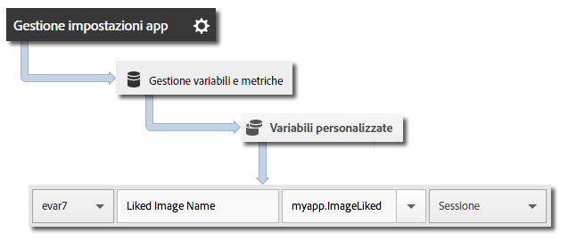

# Tracciamento dei beacon {#beacon-tracking}

Il tracciamento dei beacon consente di misurare e indirizzare microposizioni utilizzando iBeacon e BLE (Bluetooth Low Energy).

Quando viene invocato `trackBeacon`, i seguenti dati beacon vengono inviati ad Analytics e Target:

* `a.beacon.uuid` - ProximityUUID del beacon.
* `a.beacon.major` - Numero principale del beacon (come numero dello store).
* `a.beacon.minor` - Numero secondario del beacon (come numero univoco all&#39;interno dello store).
* `a.beacon.prox` - Valori da 0 a 3 che rappresentano la vicinanza dell&#39;utente al beacon.

Significato dei valori:

* 0 = sconosciuta
* 1 = nelle immediate vicinanze
* 2 = vicino
* 3 = distante

Questi dati del beacon vengono catturati nelle variabili della soluzione mobile.

## Tracciare i beacon {#section_FC3F213545944A468B1E6D5D5C8E2F1F}

1. Aggiungi la libreria al tuo progetto e implementa le funzioni di ciclo di vita (lifecycle).

   Per ulteriori informazioni, consulta *Aggiungere l’SDK e il file di configurazione al progetto IntelliJ IDEA o Eclipse* in [Implementazione e ciclo di vita di base](/help/android/getting-started/dev-qs.md).

1. Importa la libreria:

   ```java
   import com.adobe.mobile.*;
   ```

1. Raccogli la posizione del beacon.

   Sono disponibili diverse librerie di terze parti per la scansione dei beacon BLE, a seconda del produttore del beacon.
1. Dopo aver ottenuto le informazioni sul beacon, usa la seguente chiamata per tenere traccia della posizione:

   ```java
   // assumed that the following variables will have been retrieved by the 3rd party beacon library 
   String beaconUUID; 
   String major; 
   String minor; 
   Analytics.BEACON_PROXIMITY proximity;  
   // BEACON_PROXIMITY is an enum available in the SDK. Number 0-3 representing how close the 
   // user is to the beacon. 0 unknown, 1 immediate, 2 near, 3 far.  
   Analytics.trackBeacon(beaconUUID, major, minor, proximity, null);
   ```

1. Quando l’utente si allontana dal beacon, cancella il beacon corrente:

   ```java
   Analytics.clearBeacon();
   ```

## Inviare dati aggiuntivi {#section_3EBE813E54A24F6FB669B2478B5661F9}

Oltre ai dati sul beacon, puoi inviare dati di contesto aggiuntivi con ciascuna chiamata `trackBeacon`:

```java
HashMap cdata = new HashMap<String, Object>(); 
cdata.put("myapp.ImageLiked", imageName); 
Analytics.trackBeacon(beaconUUID, major, minor, proximity, cdata);
```

I valori dei dati contestuali devono essere mappati su variabili personalizzate in Adobe Mobile Services:


