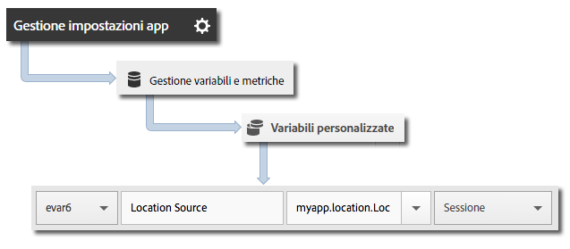

# Geolocalizzazione e punti di interesse {#geo-location-and-points-of-interest}

La geolocalizzazione consente di misurare i dati sulla posizione mediante latitudine e longitudine e punti di interesse predefiniti nelle app Android.

Ciascuna chiamata `trackLocation` invia le informazioni seguenti:

* Latitudine, longitudine e posizione in un punto di interesse (POI) che è definito nell&#39;interfaccia utente di Adobe Mobile Services.

   Queste informazioni vengono passate alle variabili della soluzione mobile per la generazione automatica dei rapporti.

* Distanza dal centro e precisione passate come dati contestuali.

   Queste variabili non vengono acquisite automaticamente. Devi mappare queste variabili di dati contestuali, seguendo le istruzioni disponibili nella sezione *Invio di dati aggiuntivi* seguente.

## Aggiornamenti POI dinamici {#section_3747B310DD5147E2AAE915E762997712}

A partire della versione 4.2, i POI sono definiti nell&#39;interfaccia di Adobe Mobile e sincronizzati in modo dinamico con il file di configurazione dell&#39;app. Questa sincronizzazione richiede un’impostazione `analytics.poi` nel [file di configurazione ADBMobile JSON](/help/android/configuration/json-config/json-config.md):

```js
"analytics.poi": "https://assets.adobedtm.com/…/yourfile.json",
```

Se questa configurazione non è presente, devi scaricare una versione aggiornata del file `ADBMobile.json` e aggiungerla all&#39;app. Per ulteriori informazioni, consulta [Scaricare l’SDK e gli strumenti di prova](/help/android/getting-started/requirements.md).

## Tracciamento di geolocalizzazione e POI {#section_B1616E400A7548F9A672F97FEC75AE27}

1. Aggiungi la libreria al tuo progetto e implementa le funzioni di ciclo di vita (lifecycle).

   Per ulteriori informazioni, consulta *Aggiungere l’SDK e il file di configurazione al progetto IntelliJ IDEA o Eclipse* in [Implementazione e ciclo di vita di base](/help/android/getting-started/dev-qs.md).

1. Importa la libreria:

   ```java
   import com.adobe.mobile.*;
   ```

1. Invoca `trackLocation` per tenere traccia della posizione corrente:

   ```java
   Location currentLocation = new Location("my location here"); 
   Analytics.trackLocation(currentLocation, null);
   ```

   >[!TIP]
   >
   >Puoi invocare `trackLocation` in qualsiasi momento.

   Puoi usare le strategie di posizione per determinare la posizione passata alla chiamata `trackLocation`. Per ulteriori informazioni, consulta [Strategie posizione Android](https://developer.android.com/guide/topics/location/strategies.html).

Inoltre, se la posizione si trova entro il raggio di un punto di interesse definito, una variabile di dati contestuali `a.loc.poi` viene inviata con l’hit `trackLocation` e indicata come punto di interesse nei rapporti di **[!UICONTROL dettaglio della posizione]**. Viene inoltre inviata una variabile di dati contestuali `a.loc.dist`, con la distanza (in metri) dalle coordinate definite.

## Invio di dati aggiuntivi {#section_3EBE813E54A24F6FB669B2478B5661F9}

Oltre ai dati sulla posizione, con ogni chiamata di tracciamento della posizione puoi inviare anche dati di contesto aggiuntivi:

```java
HashMap<String, Object> locationContextData = new HashMap<String, Object>(); 
locationContextData.put("myapp.location.LocationSource", "GPS"); 
 
Location currentLocation = new Location("my location here"); 
Analytics.trackLocation(currentLocation, locationContextData);
```

I valori dei dati contestuali devono essere mappati su variabili personalizzate nell&#39;interfaccia utente di Adobe Mobile Services:



## Dati contestuali sulla posizione {#section_FFB71E6653F9410A89CC6ACC0C9164A9}

I dati di latitudine e longitudine vengono inviati mediante tre diversi parametri di dati contestuali, ciascuno dei quali rappresenta un diverso livello di precisione, per un totale di sei parametri di dati contestuali.

Ad esempio, le coordinate lat = 40.93231, long = -111.93152 rappresentano una posizione con precisione pari a 1 metro. Questa posizione viene divisa in base al livello di precisione tra le seguenti variabili:

`a.loc.lat.a` = 040,9

`a.loc.lat.b` = 32

`a.loc.lat.c` = 31

`a.loc.lon.a` = -111,9

`a.loc.lon.b` = 31

`a.loc.lon.c` = 52

Alcuni livelli di precisione possono apparire come `00` in base alla precisione della posizione attuale. Ad esempio, se la posizione ha un livello di precisione di 100 m, `a.loc.lat.c` e `a.loc.lon.c` saranno pari a `00`.

Considerazioni da ricordare:

* Una richiesta `trackLocation` invia l&#39;equivalente di una chiamata `trackAction`.

* I POI non sono passati nell&#39;ambito di chiamate `trackAction` e `trackState` tipiche, pertanto devi usare una chiamata `trackLocation` per tracciare i POI.

* La chiamata `trackLocation` deve essere invocata ogni volta che sia necessario per tenere traccia di posizione e POI.

   Consigliamo di chiamare `trackLocation` all&#39;avvio dell&#39;app e quindi quando necessario, in base ai requisiti dell&#39;app.

* I POI sono popolati solo dopo essere stati definiti nel file di configurazione dell&#39;app.

   I POI non vengono applicati a chiamate `trackLocation` storiche inviate in precedenza.
* Le chiamate `trackLocation` supportano l&#39;invio di dati di contesto aggiuntivi, in modo analogo alle chiamate `trackAction`.

* Quando i diametri di due POI si sovrappongono, viene usato il primo POI che contiene la posizione corrente.

   Se i punti di interesse si sovrappongono, elencali in ordine dal più dettagliato al meno dettagliato, affinché venga trasmesso il POI più dettagliato.
