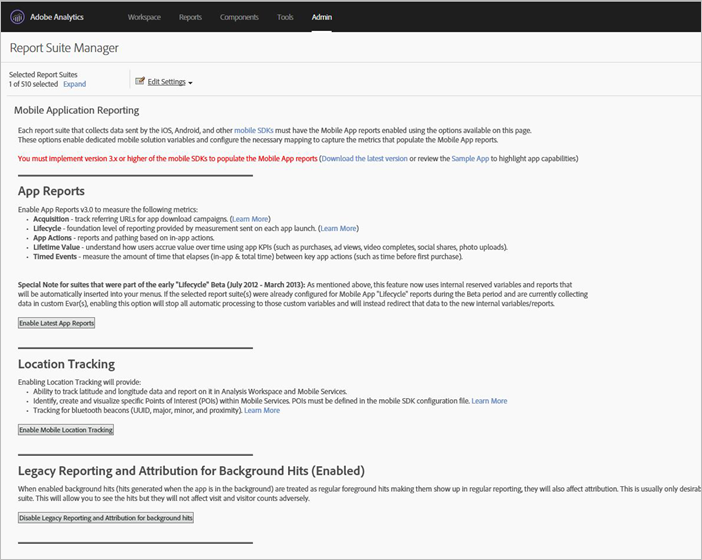

# Analytics {#analytics}

Dopo aver aggiunto la libreria al progetto, puoi eseguire qualsiasi chiamata dei metodi di Analytics ovunque nell’app (assicurati di importare ADBMobile.h nella classe).

## Enable mobile application reports in Analytics {#task_3DA1354942CF4BF4B11B9CC97588A9ED}

Prima di aggiungere il codice, chiedi all’amministratore di Analytics di completare le seguenti operazioni in modo da abilitare il tracciamento del ciclo di vita dell’app per dispositivi mobili. Ciò assicura che la suite di rapporti sia pronta ad acquisire le metriche quando inizi lo sviluppo.


1. Open **[!UICONTROL Admin Tools]** &gt; **[!UICONTROL Report Suites]** and select your mobile report suite(s).
1. Click **[!UICONTROL Edit Settings]** &gt; **[!UICONTROL Mobile Management]** &gt; **[!UICONTROL Mobile Application Reporting]**.

   

1. Click **[!UICONTROL Enable Latest App Reports]**.

   Optionally, you can also click **[!UICONTROL Enable Mobile Location Tracking]** and **[!UICONTROL Enable Legacy Reporting and Attribution for background hits]**.

   

Lifecycle metrics are now ready to be captured, and Mobile Application Reports] appear in the **[!UICONTROL Reports]** menu in the marketing reports interface.

## Raccolta delle metriche del ciclo di vita {#task_25D469C62DF84573AEB5E8E950B96205}

1. To collect lifecycle metrics in your app, call `collectLifecycleData()` in the `ApplicationUI` constructor.

   Ad esempio:

   ```java
   ApplicationUI::ApplicationUI(bb::cascades::Application *app): QObject(app) { 
   //... 
   ADBMobile::collectLifecycleData(); 
   } 
   ```

   If `collectLifecycleData()` is called twice in the same session, then your application will report a crash on every call after the first. L'SDK imposta un flag quando l'applicazione viene chiusa, per indicare una chiusura corretta. If this flag is not set, `collectLifecyleData()` reports a crash.

## Events, props, and eVars {#concept_B885D5A71A5D45129CE7C1C3426A7D28}


Se hai esaminato la Guida di riferimento [per le classi e i metodi di](/help/blackberry/methods.md)ADBMobile, probabilmente ti stai chiedendo dove impostare eventi, eVar, prop, eredi ed elenchi. Nella versione 4, non è più possibile assegnare direttamente nell'app questi tipi di variabili. L’SDK utilizza invece i dati contestuali e le regole di elaborazione per mappare i dati dell’app sulle variabili di Analytics a scopo di reportistica.

L’elaborazione di regole offre diversi vantaggi:

* È possibile cambiare la mappatura dei dati senza dover inviare un aggiornamento all’App Store.
* Invece di impostare variabili specifiche per una suite di rapporti, è possibile assegnare ai dati dei nomi significativi.
* L’impatto dell’invio di dati aggiuntivi è limitato. Questi valori compariranno nei rapporti solo dopo che questi saranno stati mappati utilizzando delle regole di elaborazione.

Any values that you were assigning directly to variables should be added to the `data` HashMap instead.

## Regole di elaborazione {#concept_3EA4CD602AF4488A896B0EDD3BA2D969}

L’elaborazione delle regole viene usata per copiare i dati inviati in variabili di dati di contesto a elementi evar, prop e ad altre variabili a scopo di reportistica.

[Formazione sulle regole di elaborazione](https://tv.adobe.com/embed/1181/16506/) @ Summit 2013

[Regole di elaborazione](https://docs.adobe.com/content/help/en/analytics/admin/admin-tools/processing-rules/processing-rules.html)

[Diventare autorizzati a utilizzare le regole di elaborazione](https://helpx.adobe.com/analytics/kb/processing-rules-authorization.html)

Si consiglia di raggruppare le variabili di dati di contesto utilizzando "spazi nome", in quanto aiuta a mantenere un ordine logico. Ad esempio, se desideri raccogliere informazioni su un prodotto, puoi definire le seguenti variabili:

```js
"product.type":"hat" 
"product.team":"mariners" 
"product.color":"blue"
```

Le variabili di dati di contesto sono riportate in ordine alfabetico nell’interfaccia delle regole di elaborazione, così utilizzando i namespace puoi vedere rapidamente le variabili di uno stesso namespace.

Inoltre, alcuni programmatori hanno l’abitudine di denominare le chiavi dei dati di contesto utilizzando il numero evar o prop:

```js
"eVar1":"jimbo"
```

Anche se tali numeri possono facilitare *leggermente* un lavoro di mappatura una tantum nelle regole di elaborazione, potrebbe rendere il codice meno leggibile durante le attività di debug e complicare gli aggiornamenti del codice futuri. Piuttosto, consigliamo vivamente di assegnare a chiavi e valori dei nomi descrittivi:

```js
"username":"jimbo"
```

Le variabili di contesto che definiscono eventi contatore possono avere la stessa chiave e lo stesso valore:

```js
"logon":"logon"
```

Per le variabili di contesto che definiscono eventi di incremento, puoi usare l'evento come chiave e l'entità dell'incremento come valore:

```js
"levels completed":"6"
```

>[!TIP]
>
>Adobe riserva lo spazio dei nomi `a.`. Con l'eccezione di questo vincolo, le variabili di dati di contesto devono essere univoche per la società di accesso in modo da evitare collisioni.

## Abilita tracciamento offline {#concept_402F4ECE240B4CA1B779322A7BFCB8DE}

To store hits when the device is offline, you can optionally enable offline tracking in the `ADBMobileConfig.json` file.

Prima di attivare il tracciamento offline, fai molta attenzione ai requisiti del timestamp descritti nei riferimenti del file di configurazione.

## Metodi di analisi

Per un elenco dei metodi di Analytics disponibili per BlackBerry, consultate Metodi *di* Analytics in Guida di riferimento [delle classi e dei metodi di](/help/blackberry/methods.md)Adobe Mobile.