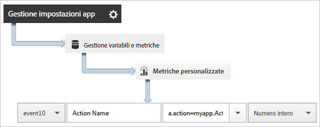
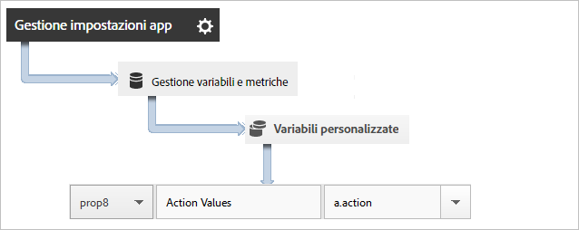
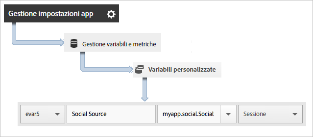

# Track app actions {#track-app-actions}

Per "azioni" si intendono gli eventi che si verificano nell'app oggetto delle misurazioni. A ogni azione corrispondono una o più metriche che vengono incrementate ogni volta che si verifica l'evento. Ad esempio, puoi tenere traccia di un nuovo abbonamento, di ogni nuova visualizzazione di un articolo o di un completamento di un livello. La metrica corrispondente per questo tipo di eventi è configurata come abbonamenti, articoli letti o livelli completati.

Le azioni non vengono tracciate automaticamente, pertanto per tracciare un evento devi invocare `trackAction`.

## Tracking actions {#section_380DF56C4EE4432A823940E4AE4C9E91}

1. Aggiungi la libreria al tuo progetto e implementa le funzioni di ciclo di vita (lifecycle).

   Per ulteriori informazioni, vedi *Aggiungere l'SDK e il file di configurazione al progetto* in [Implementazione e ciclo di vita di base](/help/ios/getting-started/dev-qs.md).
1. Importa la libreria.

   ```objective-c
   #import "ADBMobile.h"
   ```

1. Quando l'azione da tracciare si verifica nell'app, invoca `trackAction` per inviare un hit per questa azione.

   ```objective-c
   [ADBMobile trackAction:@"myapp.ActionName"  
                     data:nil];
   ```

   >[!TIP]
   >
   >If the code where you are adding this call might run while the app is in the background, call `trackActionFromBackground` instead of `trackAction`.

1. In the Adobe Mobile services UI, select your app and click **[!UICONTROL Manage App Settings]**.

1. Fai clic su **[!UICONTROL Gestione variabili e metriche]** e quindi sulla scheda **Metriche personalizzate[!UICONTROL .]**

1. Mappa su un evento personalizzato il nome dei dati contestuali definito nel codice, ad esempio `a.action=myapp.ActionName`.

   

Puoi anche impostare un prop che contenga tutti i valori delle azioni mediante la mappatura di un prop personalizzato con un nome come **[!UICONTROL Azioni personalizzate]** e l'impostazione del valore su `a.action`.



## Sending additional data {#section_3EBE813E54A24F6FB669B2478B5661F9}

Oltre al nome dell'azione, con ogni chiamata di tracciamento delle azioni puoi inviare anche dati di contesto aggiuntivi:

```objective-c
NSMutableDictionary *contextData = [NSMutableDictionary dictionary]; 
[contextData setObject:@"Twitter" forKey:@"myapp.social.SocialSource"]; 
[ADBMobile trackAction:@"myapp.SocialShare" data:contextData];
```

I valori dei dati contestuali devono essere mappati su variabili personalizzate:



## Tracking background actions {#section_AC13013F207D4FBAAF27E4412034251E}

Se tieni traccia di un'azione nel codice che potrebbe venire eseguita quando l'app funziona in background, invoca `trackActionFromBackground` invece di `trackAction`. `trackActionFromBackground` ha gli stessi parametri, ma contiene elementi di logica aggiuntiva per impedire che le chiamate "lifecycle" possano essere eseguite al momento sbagliato.

## Action reporting {#section_0F6A54AB7A3F42C9BB042D86A0FC4630}

| Interfaccia | Rapporto |
|--- |--- |
| Adobe Mobile Services | **[!UICONTROL Rapporto Percorsi azione.]** Visualizza l'ordine in cui si verificano le azioni nell'app. Puoi anche fare clic su **[!UICONTROL Personalizza]su qualsiasi rapporto per visualizzare le azioni in base a classifica, tendenze o dettagli, oppure puoi applicare un filtro per vedere le azioni relative a un dato segmento.** |
| Reporting e analisi di marketing | **[!UICONTROL Rapporto Evento personalizzato.]**  Dopo aver mappato un'azione su un evento personalizzato, puoi visualizzare gli eventi da app mobile in modo analogo a tutti gli altri eventi di Analytics. |
| Analisi ad hoc | **[!UICONTROL Rapporto Evento personalizzato.]** Dopo aver mappato un'azione su un evento personalizzato, puoi visualizzare gli eventi da app mobile in modo analogo a tutti gli altri eventi di Analytics. |