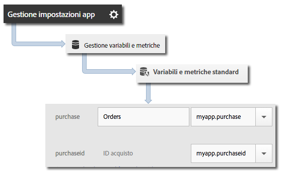

# Variabile &quot;products&quot;  {#products-variable}

Non è possibile impostare la variabile &quot;products&quot; utilizzando le regole di elaborazione. Nell’SDK iOS 4.x devi usare una sintassi particolare nel parametro dei dati contestuali per impostare i prodotti direttamente nella chiamata al server.

Per impostare la variabile *`products`*, imposta una chiave di dati contestuali su `"&&products"`, quindi imposta il valore utilizzando la sintassi definita per la variabile *`products`*:

```objective-c
[contextData setObject:@"Category;Product;Quantity;Price[,Category;Product;Quantity;Price]" forKey:@"&&products"];
```

Ad esempio:

```objective-c
//create a context data dictionary 
NSMutableDictionary *contextData = [NSMutableDictionary dictionary]; 
 
// add products, a purchase id, a purchase context data key, and any other data you want to collect. 
// Note the special syntax for products 
[contextData setObject:@";Running Shoes;1;69.95,;Running Socks;10;29.99" forKey:@"&&products"]; 
[contextData setObject:@"1234567890" forKey:@"m.purchaseid"]; 
[contextData setObject:@"1" forKey:@"m.purchase"]; 
 
// send the tracking call - use either a trackAction or TrackState call. 
// trackAction example: 
[ADBMobile trackAction:@"purchase" data:contextData]; 
// trackState example: 
[ADBMobile trackState:@"Order Confirmation" data:contextData]; 
```

*`products`* è impostato direttamente nella richiesta dell’immagine, e le altre variabili sono impostate come dati contestuali. Tutte le variabili dei dati di contesto devono essere mappate utilizzando le regole di elaborazione:



Non è necessario mappare la variabile   *`products`* mediante le regole di elaborazione, perché viene impostata direttamente nella richiesta dell’immagine dall’SDK.
