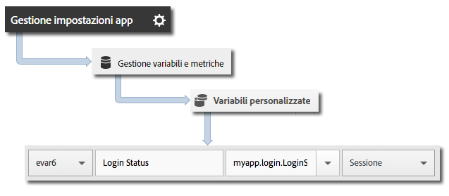

# Tracciare gli stati dell’app {#track-app-states}

Per &quot;stati&quot; si intendono le diverse schermate o visualizzazioni disponibili nell&#39;app. Ogni volta che nell’applicazione viene visualizzato un nuovo stato, ad esempio quando l’utente si sposta dalla homepage al feed di notizie, viene inviata una chiamata. In iOS, il tracciamento di uno stato avviene solitamente con il metodo viewDidLoad di ciascuna visualizzazione.

>[!TIP]
>
>Per tracciare gli stati, invoca `trackState`. Gli stati non vengono tracciati automaticamente.

## Tracciamento degli stati {#section_380DF56C4EE4432A823940E4AE4C9E91}

1. Aggiungi la libreria al tuo progetto e implementa le funzioni di ciclo di vita (lifecycle).

   Per ulteriori informazioni, consulta *Aggiungere l’SDK e il file di configurazione al progetto* in [Implementazione e ciclo di vita di base](/help/ios/getting-started/dev-qs.md).
1. Importa la libreria.

   ```objective-c
   #import "ADBMobile.h"
   ```

1. Invoca `trackState` per inviare un hit per la visualizzazione di questo stato.

   ```objective-c
   [ADBMobile trackState:@"Login Screen"  
                    data:nil];
   ```

In Adobe Mobile Services, il **[!UICONTROL Nome dello stato]** è riportato nella variabile *`View State`*, e viene registrata una visualizzazione per ogni chiamata `trackState`. Nelle altre interfacce di Analytics, **[!UICONTROL Stato di visualizzazione]** è indicato come **[!UICONTROL Nome pagina]** e le visualizzazioni degli stati sono indicate come visualizzazioni di pagina.

## Invio di dati aggiuntivi {#section_CFDB4F944496401786A145C209AB387C}

Oltre al **[!UICONTROL Nome stato]**, puoi inviare dati contestuali aggiuntivi con ciascuna chiamata di azione di tracciamento:

```objective-c
NSMutableDictionary *contextData = [NSMutableDictionary dictionary]; 
[contextData setObject:@"logged in" forKey:@"myapp.login.LoginStatus"]; 
[ADBMobile trackState:@"Home Screen" data:contextData];
```

I valori dei dati contestuali devono essere mappati su variabili personalizzate:



## Generazione di rapporti sugli stati dell&#39;app {#section_0F6A54AB7A3F42C9BB042D86A0FC4630}

Gli stati vengono generalmente visualizzati mediante un rapporto di percorsi, che consente di vedere in che modo gli utenti navigano nell’app e quali stati vengono visualizzati di più.

|  |  |
|--- |--- |
| Adobe Mobile Services | Il rapporto **[!UICONTROL Stati di visualizzazione]**. Questo rapporto si basa sui percorsi seguiti dagli utenti all’interno dell’applicazione. Un esempio di percorso è **[!UICONTROL Home]** > **[!UICONTROL Impostazioni]** > **[!UICONTROL Feed]**. |
| Adobe Analytics | Gli stati possono essere visualizzati ovunque possano essere visualizzate le Pagine, ad esempio nei rapporti **[!UICONTROL Pagine]**, **[!UICONTROL Visualizzazioni pagina]** e **[!UICONTROL Percorso]**. |
| Analisi ad hoc | Gli stati possono essere visualizzati ovunque possano essere visualizzate le pagine utilizzando la dimensione **[!UICONTROL Pagina]**, la metrica **[!UICONTROL Visualizzazioni pagina]** e i rapporti **[!UICONTROL Percorso]**. |
