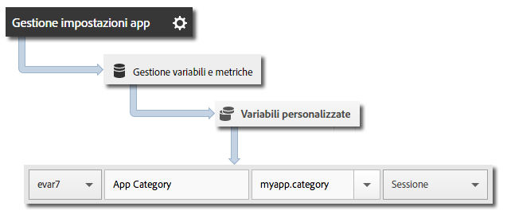

# Implementazione e ciclo di vita di base {#core-implementation-and-lifecycle}

Queste informazioni sono utili per implementare la libreria iOS e raccogliere metriche sul ciclo di vita, come avvii, aggiornamenti, sessioni, utenti attivi e così via.

## Scaricare l&#39;SDK {#section_99FE1A17A36D4A2C943939023CF6265C}

>[!IMPORTANT]
>
>L’SDK richiede iOS 8 o versione successiva.

**Prerequisito**

Prima di scaricare l’SDK, completa i passaggi descritti in *Creare una suite di rapporti* in [Implementazione e ciclo di vita di base](/help/ios/getting-started/requirements.md) per impostare una suite di rapporti per lo sviluppo e scaricare una versione precompilata del file di configurazione.

Per scaricare l’SDK:

>[!IMPORTANT]
>
>A partire dalla versione 4.21.0, l’SDK viene distribuito tramite XCFrameworks. Se utilizzi la versione 4.21.0 o successiva, procedi come segue.
>
>La versione 4.21.0 dell’SDK richiede Xcode 12.0 o versione successiva e, se applicabile, Cocoapods 1.10.0 o versione successiva.

1. Scarica e decomprimi il file `[Your_App_Name_]AdobeMobileLibrary-4.*-iOS.zip` e verifica che i seguenti componenti software siano presenti nella directory `AdobeMobileLibrary`:

   * `ADBMobile.h`: il file di intestazione Objective-C utilizzato per l’SDK iOS.
   * `ADBMobileConfig.json`: file di configurazione dell’SDK personalizzato per la tua app.
   * `AdobeMobile.xcframework`: contiene due fat binary, uno per dispositivi iOS (armv7, armv7s, arm64) e uno per simulatori (i386, x86_64, arm64). 

      Questo XCFramework deve essere collegato quando lo si utilizza per un’app iOS.

   * `AdobeMobileExtension.xcframework`: contiene due fat binary, uno per dispositivi iOS (armv7, armv7s, arm64) e uno per simulatori (i386, x86_64, arm64). 

      Questo XCFramework deve essere collegato quando lo si utilizza per un’estensione iOS.

   * `AdobeMobileWatch.xcframework`: contiene due fat binary, uno per dispositivi watchOS (arm64_32, armv7k) e uno per simulatori (i386, x86_64, arm64). 

      Questo XCFramework deve essere collegato quando lo si utilizza per un’app Apple Watch (watchOS).

   * `AdobeMobileTV.xcframework`: contiene due fat binary, uno per dispositivi tvOS (arm64) e uno per simulatori (x86_64, arm64). 

      Questo XCFramework deve essere collegato quando lo si utilizza per un’app Apple TV (tvOS).

>[!IMPORTANT]
>
>Nelle versioni precedenti alla 4.21.0, l’SDK viene distribuito tramite file binari. Se utilizzi una versione precedente alla 4.21.0, segui i passaggi indicati di seguito.

1. Scarica e decomprimi il file `[Your_App_Name_]AdobeMobileLibrary-4.*-iOS.zip` e verifica di disporre dei seguenti componenti software:

   * `ADBMobile.h`: file di intestazione Objective-C usato per iOS AppMeasurement.
   * `ADBMobileConfig.json`: file di configurazione dell’SDK personalizzato per la tua app.
   * `AdobeMobileLibrary.a`: fat binary abilitato per bitcode contenente le build della libreria per dispositivi (armv7, armv7s, arm64) e simulatori (i386, x86_64) iOS.

      Se la destinazione sarà un&#39;app iOS, il fat binary deve essere collegato.

   * `AdobeMobileLibrary_Extension.a`: fat binary abilitato per bitcode contenente le build della libreria per dispositivi (armv7, armv7s, arm64) e simulatori (i386, x86_64) iOS.

      Se la destinazione sarà un&#39;estensione iOS, il fat binary deve essere collegato.

   * `AdobeMobileLibrary_Watch.a`: fat binary abilitato per bitcode contenente le build della libreria per dispositivi (armv7k) e simulatori (i386, x86_64) Apple Watch.

      Se la destinazione sarà un&#39;app estensione Apple Watch (watchOS 2), il fat binary deve essere collegato.

   * `AdobeMobileLibrary_TV.a`: un fat binary abilitato per bitcode contenente le build della libreria per dispositivi (arm64) e simulatori (x86_64) Apple TV.

      Se la destinazione sarà un&#39;app estensione Apple TV (tvOS), il fat binary deve essere collegato.

>[!IMPORTANT]
>
>Se scarichi l&#39;SDK all&#39;esterno dell&#39;interfaccia utente di Adobe Mobile Services, il file `ADBMobileConfig.json` dovrà essere configurato manualmente. Se hai poca esperienza con Analytics e l&#39;SDK Mobile e desideri impostare una suite di rapporti per la fase di sviluppo e scaricare una versione precompilata del file di configurazione, vedi [Prima di iniziare](/help/ios/getting-started/requirements.md).

## Aggiungi l&#39;SDK e il file di configurazione al tuo progetto {#section_93C25D893B4A4CD3B996CF3C5590C8DC}

1. Avvia l&#39;IDE di Xcode e apri la tua app.
1. In Navigatore progetti, trascina la cartella `AdobeMobileLibrary` e rilasciala sotto al tuo progetto.
1. Verifica quanto segue:

   * La casella **[!UICONTROL Copia elementi se necessario]** deve essere selezionata.
   * **[!UICONTROL Crea gruppi]** deve essere selezionato.
   * Nessuna delle caselle della sezione **[!UICONTROL Aggiungi a destinazioni]** deve essere selezionata.

   

1. Fai clic su **[!UICONTROL Fine]**.
1. In **[!UICONTROL Navigatore progetti]**, seleziona **`ADBMobileConfig.json`**.
1. In **[!UICONTROL Ispettore file]**, aggiungi il file JSON alle destinazioni nel tuo progetto che useranno l’SDK di Adobe.

   

1. In **[!UICONTROL Navigatore progetti]**, completa i passaggi seguenti:

   1. Fai clic sull’app.
   1. Nella scheda **[!UICONTROL Generale]**, seleziona le destinazioni e collega le librerie e i framework necessari nelle sezioni **[!UICONTROL Framework collegati]** e **[!UICONTROL Librerie]**.
   * **Destinazioni di app iOS**
      * `SystemConfiguration.framework`
      * `WebKit.framework`
      * `libsqlite3.0.tbd`
      * `AdobeMobileLibrary.a`
      * `CoreLocation.framework` (facoltativo, ma richiesto per le funzionalità di tracciamento geografico)
   * **Destinazioni di estensioni iOS**

      * `SystemConfiguration.framework`
      * `libsqlite3.0.tbd`
      * `AdobeMobileLibrary\_Extension.a`
   * **Destinazioni Apple Watch (watchOS 2)**

      * `libsqlite3.0.tbd`
      * `AdobeMobileLibrary\_Watch.a`
   * **Destinazioni Apple TV (tvOS)**

      * `SystemConfiguration.framework`
      * `libsqlite3.0.tbd`
      * `AdobeMobileLibrary\_TV.a`

   >[!CAUTION]
   >
   > Se colleghi più file `AdobeMobileLibrary*.a` nella stessa destinazione, si verifica un comportamento imprevisto o l&#39;impossibilità di generare la build.

   >[!IMPORTANT]
   >
   > Se utilizzi la versione 4.21.0 o successiva, il codice Adobe XCFrameworks non deve essere incorporato.

   

1. Conferma che l&#39;app possa essere generata senza errori.

## Implementare le metriche del ciclo di vita {#section_532702562A7A43809407C9A2CBA80E1E}

>[!IMPORTANT]
>
>iOS invierà dati sul ciclo di vita con o senza una chiamata a `collectlifecycledata`; inoltre `collectlifecycledata` rappresenta solo un modo di avviare il ciclo di vita prima nella sequenza di avvio dell&#39;applicazione.

Dopo che avrai abilitato la funzione ciclo di vita, ad ogni avvio dell&#39;app viene inviato un hit per la misurazione di avvii, aggiornamenti, sessioni, utenti coinvolti e altre [Metriche del ciclo di vita](/help/ios/metrics.md).

Aggiungi una chiamata `collectLifecycleData`/`collectLifecycleDataWithAdditionalData` in `application:didFinishLaunchingWithOptions`:

```objective-c
- (BOOL)application:(UIApplication *)application didFinishLaunchingWithOptions:(NSDictionary *)launchOptions {
 [ADBMobile collectLifecycleData];
    return YES;
}
```

### Includere dati aggiuntivi con le chiamate &quot;lifecycle&quot;

Per includere dati aggiuntivi con le chiamate delle metriche &quot;lifecycle&quot;, usa `collectLifecycleDataWithAdditionalData`:

>[!IMPORTANT]
>
>I dati passati all&#39;SDK tramite `collectLifecycleDataWithAdditionalData:` verranno memorizzati in `NSUserDefaults` dall&#39;SDK. L&#39;SDK elimina dal parametro `NSDictionary` i valori che non sono di tipo `NSString` o `NSNumber`.

```objective-c
- (BOOL)application:(UIApplication *)application didFinishLaunchingWithOptions:(NSDictionary *)launchOptions {
    NSMutableDictionary *contextData = [NSMutableDictionary dictionary];
    [contextData setObject:@"Game" forKey:@"myapp.category"];
    [ADBMobile collectLifecycleDataWithAdditionalData:contextData];
    return YES;
}
```

Eventuali valori di dati di contesto aggiuntivi inviati con `collectLifecycleDataWithAdditionalData` devono essere mappati su variabili personalizzate in Adobe Mobile Services:



Altre metriche &quot;lifecycle&quot; vengono raccolte automaticamente. Per ulteriori informazioni, vedi [Metriche del ciclo di vita](/help/ios/metrics.md).

## Passi successivi {#section_A24DC703359D4B5C8F493D6421306FD3}

Completa le attività seguenti:

* [Tracciare gli stati dell’app](/help/ios/analytics-main/states.md)
* [Tracciare le azioni eseguite nell’app](/help/ios/analytics-main/actions.md)
