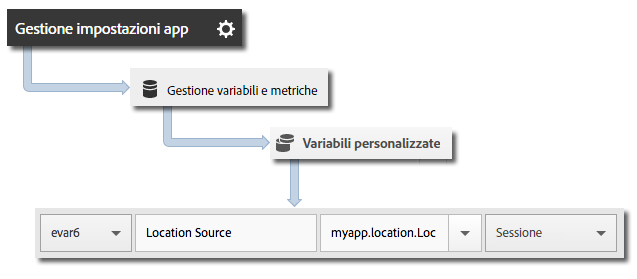

# Geolocalizzazione e punti di interesse {#geo-location-and-points-of-interest}

La geolocalizzazione permette di misurare i dati relativi alla posizione utilizzando latitudine e longitudine e punti di interesse predefiniti nelle app iOS.

Ogni chiamata `trackLocation` invia i seguenti dati:

* Latitudine, longitudine e posizione in un punto di interesse (POI) definito in Adobe Mobile Services.

   Queste informazioni vengono passate alle variabili della soluzione mobile per la generazione automatica dei rapporti.

* Distanza dal centro e precisione passate come dati contestuali.

   Queste variabili non vengono acquisite automaticamente. Devi mappare queste variabili di dati contestuali, seguendo le istruzioni disponibili nella sezione *Invio di dati aggiuntivi* di seguito.

## Aggiornamenti POI dinamici {#section_3747B310DD5147E2AAE915E762997712}

A partire dalla versione 4.2, i punti di interesse (POI) sono definiti nell&#39;interfaccia di Adobe Mobile e sincronizzati dinamicamente con il file di configurazione dell&#39;app. Tale sincronizzazione richiede un&#39;impostazione `analytics.poi` nel file `ADBMobile.json`:

```js
“analytics.poi”: “https://assets.adobedtm.com/…/yourfile.json”,
```

Per ulteriori informazioni, vedi [File di configurazione ADBMobile JSON](/help/ios/configuration/json-config/json-config.md).

Se non è configurata, devi scaricare e aggiungere all&#39;app una versione aggiornata del file `ADBMobile.json`. Per ulteriori informazioni e istruzioni, consulta *Scaricare l’SDK e gli strumenti di prova* in [Prima di iniziare](/help/ios/getting-started/requirements.md).

## Tracciare geolocalizzazioni e POI {#section_B1616E400A7548F9A672F97FEC75AE27}

1. Aggiungi la libreria al tuo progetto e implementa le funzioni di ciclo di vita (lifecycle).

   Per ulteriori informazioni, consulta *Aggiungere l’SDK e il file di configurazione al progetto* in [Implementazione e ciclo di vita di base](/help/ios/getting-started/dev-qs.md).
1. Importa la libreria:

   ```objective-c
   #import "ADBMobile.h"
   ```

1. Invoca `trackLocation` per tenere traccia della posizione corrente:

   ```objective-c
   CLLocation *currentLocation = location; 
   [ADBMobile trackLocation: currentLocation data: nil]; 
   ```

   >[!TIP]
   >
   >Puoi invocare `trackLocation` in qualsiasi momento.

   Per determinare la posizione passata alla chiamata `trackLocation`, usa [Ottenere la posizione dell&#39;utente](https://developer.apple.com/Library/ios/documentation/UserExperience/Conceptual/LocationAwarenessPG/CoreLocation/CoreLocation.html).

Inoltre, se la posizione è determinata entro il raggio definito per un POI, con l&#39;hit `a.loc.poi` viene inviata una variabile di dati di contesto `trackLocation` che viene inserita come POI nei rapporti sulla posizione. Viene inoltre inviata una variabile di dati contestuali `a.loc.dist`, con la distanza (in metri) dalle coordinate definite.

## Inviare dati aggiuntivi {#section_3EBE813E54A24F6FB669B2478B5661F9}

Oltre ai dati sulla posizione, con ogni chiamata di tracciamento della posizione puoi inviare anche dati di contesto aggiuntivi:

```objective-c
NSMutableDictionary *contextData = [NSMutableDictionary dictionary]; 
[contextData setObject:@"GPS" forKey:@"myapp.location.LocationSource"]; 
[ADBMobile trackLocation: currentLocation data:contextData];
```

I valori dei dati contestuali devono essere mappati su variabili personalizzate:



## Dati contestuali sulla posizione {#section_FFB71E6653F9410A89CC6ACC0C9164A9}

I dati di latitudine e longitudine vengono inviati con tre diversi parametri di dati contestuali, ciascuno dei quali rappresenta un diverso livello di precisione, per un totale di sei parametri di dati contestuali.

Ad esempio, le coordinate lat = 40.93231, lon = -111.93152 rappresentano una posizione con precisione pari a 1 metro. Questa posizione viene divisa in base al livello di precisione tra le seguenti variabili:

* `a.loc.lat.a` = 040,9
* `a.loc.lat.b` = 32
* `a.loc.lat.c` = 31
* `a.loc.lon.a` = -111,9
* `a.loc.lon.b` = 31
* `a.loc.lon.c` = 52

Alcuni livelli di precisione potrebbe essere riportati come &quot;00&quot;, a seconda dell&#39;accuratezza della posizione corrente. Ad esempio, se la posizione ha un livello di precisione di 100 m, `a.loc.lat.c` e `a.loc.lon.c` saranno pari a &quot;00&quot;.

## Informazioni aggiuntive {#section_931AC1E0D88147E29FE1B6E3CC1E9550}

Considerazioni da ricordare:

* Una richiesta `trackLocation` invia l&#39;equivalente di una chiamata `trackAction`.

* I POI non vengono passati in normali chiamate `trackAction` e `trackState`; per tenere traccia dei POI devi quindi usare una chiamata `trackLocation`.

* La chiamata `trackLocation` deve essere invocata ogni volta che sia necessario per tenere traccia di posizione e POI.

   Consigliamo di invocare `trackLocation` all&#39;avvio dell&#39;app e quindi in base alle esigenze, secondo i requisiti dell&#39;applicazione.

* I POI vengono compilati solo dopo essere stati definiti nel file di configurazione dell&#39;app.

   Non vengono applicati a chiamate `trackLocation` storiche precedentemente inviate.
* Le chiamate `trackLocation` supportano l&#39;invio di dati di contesto aggiuntivi, in modo analogo alle chiamate `trackAction`.

* Quando i diametri di due POI si sovrappongono, viene usato il primo POI che contiene la posizione corrente.

   Se i punti di interesse si sovrappongono, elencali in ordine dal più dettagliato al meno dettagliato, affinché venga trasmesso il POI più dettagliato.

