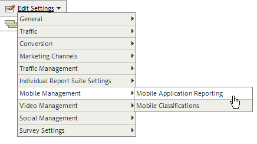

# Analytics {#analytics}

Dopo aver aggiunto la libreria al progetto, puoi effettuare una qualsiasi chiamata al metodo Analytics in qualsiasi punto dell’app.

>[!TIP]
>
>Accertatevi di effettuare l’importazione `ADBMobile.h` nella classe.

## Abilitare i rapporti sulle applicazioni mobili in Analytics {#section_F2F9234009184F20BA36B5CDE872B424}

Prima di aggiungere il codice, chiedi all’amministratore di Analytics di completare quanto segue per abilitare il tracciamento del ciclo di vita delle app mobili. In questo modo, la suite di rapporti è pronta per acquisire le metriche all&#39;inizio dello sviluppo.

1. Apri Strumenti **[!UICONTROL di]** amministrazione > Suite di **[!UICONTROL rapporti]** e seleziona le suite di rapporti per dispositivi mobili.

1. Fate clic su **[!UICONTROL Modifica impostazioni]** > **[!UICONTROL Mobile Management]** > **[!UICONTROL Mobile Application Reporting]**.

   

1. Fate clic su **[!UICONTROL Abilita rapporti]** app più recenti.

   Facoltativamente, puoi anche fare clic su **[!UICONTROL Abilita tracciamento]** posizione mobile o **[!UICONTROL Abilita rapporti legacy e attribuzione per hit]** in background.

   

Le metriche del ciclo di vita sono ora pronte per essere acquisite e i rapporti sulle applicazioni mobili vengono visualizzati nel menu **[!UICONTROL Rapporti]** nell&#39;interfaccia dei rapporti di marketing.

### Nuove versioni

Periodicamente vengono rilasciate nuove versioni dei rapporti sulle applicazioni mobili. Le nuove versioni non vengono applicate automaticamente alla suite di rapporti. Per eseguire l&#39;aggiornamento, è necessario ripetere questi passaggi. Ogni volta che aggiungete nuove funzionalità  Experience Cloud all&#39;app, si consiglia di ripetere questi passaggi per essere certi di disporre della configurazione più recente.

## Metriche del ciclo di vita {#section_532702562A7A43809407C9A2CBA80E1E}

Per raccogliere le metriche del ciclo di vita nell&#39;app, aggiungi chiamate a quando l&#39;applicazione viene attivata, come mostrato negli esempi seguenti.

### WinJS in default.js

```js
app.onactivated = function (args) { 
  if (args.detail.kind === activation.ActivationKind.launch) { 
   ... 
   // launched and resumed stuff  
   ADBMobile.Config.collectLifecycleData(); 
  } 
}; 
app.oncheckpoint = function (args) { 
  ADBMobile.Config.pauseCollectingLifecycleData(); 
}
```

### C# in App.xaml.cs

```js
public App() 
{ 
    this.InitializeComponent(); 
    this.Resuming += OnResuming; 
    this.Suspending += OnSuspending; 
} 
protected override void OnLaunched(LaunchActivatedEventArgs e) 
{   ... 
    ADBMobile.Config.CollectLifecycleData(); 
    ... 
} 
private void OnResuming(object sender, object e) 
{ 
    ... 
    ADBMobile.Config.CollectLifecycleData(); 
    ... 
} 
private void OnSuspending(object sender, SuspendingEventArgs e) 
{ 
    ... 
    ADBMobile.Config.PauseCollectingLifecycleData(); 
    ... 
}
```

### C++/CX in App.xaml.cpp

```js
App::App() 
{ 
 InitializeComponent(); 
 Resuming += ref new EventHandler<Object ^>(this, &App::OnResuming); 
 Suspending += ref new SuspendingEventHandler(this, &App::OnSuspending); 
} 
void App::OnResuming(Object ^sender, Object ^args) 
{ 
 ... 
 ADBMobile::Config::CollectLifecycleData(); 
 ... 
} 
void App::OnSuspending(Object^ sender, SuspendingEventArgs^ e) 
{ 
 ... 
 ADBMobile::Config::PauseCollectingLifecycleData(); 
 ... 
} 
void App::OnLaunched(Windows::ApplicationModel::Activation::LaunchActivatedEventArgs^ e) 
{ 
 ... 
 ADBMobile::Config::CollectLifecycleData(); 
 ... 
}
```

Se `CollectLifecycleData()` viene chiamato due volte nella stessa sessione, l&#39;applicazione segnala un arresto anomalo a ogni chiamata successiva alla prima. L’SDK imposta un flag quando l’applicazione viene chiusa per indicare un’uscita corretta. Se questo flag non è impostato, `CollectLifecyleData()` segnala un arresto anomalo.

## Eventi, prop ed eVar {#section_76EA6F5611184C5CAE6E62956D84D7B6}

Se hai esaminato i metodi [](/help/universal-windows/c-configuration/methods.md)SDK, probabilmente ti chiederai dove impostare eventi, eVar, prop, eredi ed elenchi. Nella versione 4, non è più possibile assegnare questi tipi di variabili direttamente nell&#39;app. L’SDK utilizza invece i dati contestuali e le regole di elaborazione per mappare i dati dell’app sulle variabili di Analytics a scopo di reportistica.

Le regole di elaborazione offrono diversi vantaggi:

* Puoi modificare la mappatura dei dati senza inviare un aggiornamento all’App Store.
* Puoi assegnare ai dati dei nomi significativi invece di impostare variabili specifiche per una suite di rapporti.
* L’invio di dati aggiuntivi ha un impatto minimo. Questi valori verranno visualizzati nei rapporti solo dopo che saranno stati mappati utilizzando delle regole di elaborazione.

Eventuali valori che venivano assegnati direttamente alle variabili ora dovranno essere aggiunti ai dati contestuali.

## Regole di elaborazione {#section_66EE762EEA5E4728864166201617DEBF}

Le regole di elaborazione vengono utilizzate per copiare i dati inviati in variabili di dati di contesto a variabili evar, prop e ad altre variabili per il reporting.

[Formazione sulle regole di elaborazione](https://tv.adobe.com/embed/1181/16506/) @ Summit 2013

[Guida sulle regole di elaborazione](https://docs.adobe.com/content/help/it-IT/analytics/admin/admin-tools/processing-rules/processing-rules.html)

[Diventare autorizzati a utilizzare le regole di elaborazione](https://helpx.adobe.com/analytics/kb/processing-rules-authorization.html)

È consigliabile raggruppare le variabili di dati di contesto utilizzando &quot;spazi dei nomi&quot;, in quanto consente di mantenere l&#39;ordine logico. Ad esempio, se desideri raccogliere informazioni su un prodotto, puoi definire le seguenti variabili:

```javascript
"product.type":"hat" 
"product.team":"mariners" 
"product.color":"blue"
```

Le variabili di dati di contesto sono ordinate in ordine alfabetico nell&#39;interfaccia delle regole di elaborazione, per cui gli spazi dei nomi consentono di visualizzare rapidamente le variabili che si trovano nello stesso namespace.

Inoltre, alcuni di voi stanno denominando le chiavi dei dati di contesto utilizzando il numero evar o prop:

```js
"eVar1":"jimbo"
```

This might make it *slightly* easier when you perform the one time mapping in processing rules, but you lose readability during debugging and future code updates can be more difficult. È invece consigliabile utilizzare nomi descrittivi per chiavi e valori:

```js
"username":"jimbo"
```

Impostate le variabili di contesto che definiscono gli eventi del contatore su un valore pari a &quot;1&quot;:

```js
"logon":"1"
```

Le variabili di dati di contesto che definiscono eventi di incremento possono avere il valore da incrementare:

```js
"levels completed":"6"
```

>[!TIP]
>
>Adobe riserva lo spazio dei nomi `a.`. A parte questa limitazione, le variabili dei dati di contesto devono essere univoche nella società di accesso per evitare conflitti.

## Variabile &quot;products&quot; {#section_AFBA36F3718C44D29AF81B9E1056A1B4}

Per impostare *`products`* nell’SDK di Mobile, devi usare una sintassi particolare. Per ulteriori informazioni, vedi [Variabile](/help/universal-windows/analytics/products.md)Prodotti.

## (Facoltativo) Abilita tracciamento offline {#section_955B2A03EB854742BDFC4A0A3C287009}

Per memorizzare gli hit quando il dispositivo è offline, puoi abilitare il tracciamento offline nel file dei metodi [](/help/universal-windows/c-configuration/methods.md) SDK. Prima di attivare il tracciamento offline, prestate particolare attenzione ai requisiti relativi alle marche temporali descritti nel riferimento al file di configurazione.

## Geolocalizzazione e punti di interesse {#section_BAD34A8DD013454DB355121316BD7FD4}

La geolocalità consente di misurare i dati sulla posizione (latitudine/longitudine) e i punti di interesse predefiniti. Ogni `TrackLocation` chiamata invia:

* Latitudine/longitudine e POI (se all’interno di un POI definito nel file di `ADBMobileConfig.json` configurazione).

   Questi vengono passati alle variabili della soluzione mobile per il reporting automatico.

* Distanza dal centro e precisione passate come dati contestuali.

   Acquisisci utilizzando una regola di elaborazione.

Per tracciare una posizione:

```js
var ADB = ADBMobile; 
ADB.Analytics.trackLocation(37.75345, -122.33207, null);
```

Se il seguente POI è definito nel file di `ADBMobileConfig.json` configurazione:

```js
"poi" : [ 
            ["San Francisco",37.757144,-122.44812,7000], 
        ]
```

Quando la posizione del dispositivo è determinata entro un raggio di 7000 metri dal punto definito, una variabile di dati di `a.loc.poi` contesto con il valore `San Francisco` viene inviata con l&#39; `TrackLocation` hit. An `a.loc.dist` context variable is sent with the distance in meters from the defined coordinates.

## Lifetime value {#section_D2C6971545BA4D639FBE07F13EF08895}

Il valore &quot;lifetime&quot; permette di misurare e impostare come destinazione un valore del ciclo di vita per ogni utente. Ogni volta che viene inviato un valore con `TrackLifetimeValueIncrease`, tale valore viene aggiunto a quello esistente. Il valore &quot;lifetime&quot; del ciclo di vita è memorizzato nel dispositivo e può essere recuperato in qualsiasi momento con una chiamata `GetLifetimeValue`. È utile per memorizzare gli acquisti, le visualizzazioni di annunci, la visione completa di un video, le condivisioni social, i caricamenti di foto, ecc. nel corso del ciclo di vita.

```js
// Lifetime Value Example 
var ADB = ADBMobile; 
var purchasePrice = 39.95; 
var cdata = new Windows.Foundation.Collections.PropertySet(); 
cdata["ItemPurchaseEvent"] = "ItemPurchaseEvent"; 
cdata["PurchaseItem"] = "Item453"; 
cdata["PurchasePrice"] = purchasePrice; 
ADB.Analytics.trackLifetimeValueIncrease(purchasePrice, cdata);
```

## Azioni temporizzate {#section_7FF8B6A913A0460EAA4CAE835E32D8C1}

Le azioni temporizzate consentono di misurare il tempo trascorso nell&#39;app e il tempo totale tra l&#39;inizio e la fine di un&#39;azione. L’SDK calcola il tempo necessario per completare l’azione in una sessione e complessivamente in più sessioni. Questo può essere utilizzato per definire i segmenti da confrontare in base al tempo di acquisto, al livello di passaggio, al flusso di cassa e così via.

* Numero totale di secondi trascorsi nell’app dall’inizio alla fine, per più sessioni
* Numero totale di secondi dall’inizio alla fine (in base all’ora effettiva)

```js
// Timed Action Start Example 
var ADB = ADBMobile; 
var cdata = new Windows.Foundation.Collections.PropertySet(); 
cdata["ExperienceName"] = experience; 
ADB.Analytics.trackTimedActionStart("TimeUntilPurchase", cdata);
```

```js
// Timed Action Update Example 
var ADB = ADBMobile; 
var cdataUpdate = new Windows.Foundation.Collections.PropertySet(); 
cdataUpdate["ImageLiked"] = imageName; 
ADB.Analytics.trackTimedActionStart("TimeUntilPurchase", cdata); 
```

```js
// Timed Action End Example 
var ADB = ADBMobile; 
ADB.Analytics.trackTimedActionEnd("TimeUntilPurchase");
```
