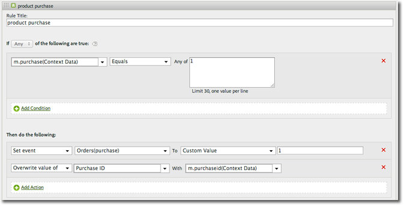

# Variabile &quot;products&quot; {#products-variable}

La variabile &quot;products&quot; non può essere impostata utilizzando le regole di elaborazione. Nell’SDK di Mobile devi usare una sintassi particolare nel parametro dei dati contestuali per impostare i prodotti direttamente nella chiamata al server.

To set the *`products`* variable, set a context data key to `"&&products"`, and set the value using the syntax defined for the *`products` variable:

```js
cdata["&&products"] = "Category;Product;Quantity;Price[,Category;Product;Quantity;Price]";
```

Esempio:

```js
//create a context data dictionary 
var cdata = new Windows.Foundation.Collections.PropertySet(); 
 
// add products, a purchase id, a purchase context data key, and any other data you want to collect. 
// Note the special syntax for products 
cdata["&&products"] = ";Running Shoes;1;69.95,;Running Socks;10;29.99"; 
cdata["m.purchaseid"] = "1234567890"; 
cdata["m.purchase"] = "1"; 
 
var ADB = ADBMobile; 
// send the tracking call - use either a trackAction or TrackState call. 
// trackAction example: 
ADB.Analytics.trackAction("purchase", cdata); 
// trackState example: 
ADB.Analytics.trackState("Order Confirmation", cdata);
```

The *`products`* is set directly on the image request, and the other variables are set as context data. Tutte le variabili di dati di contesto devono essere mappate utilizzando le regole di elaborazione:



Non è necessario mappare la *`products`* variabile utilizzando le regole di elaborazione, in quanto viene impostata direttamente nella richiesta dell’immagine dall’SDK.

## Variabile &quot;products&quot; con eVar per merchandising ed eventi per singoli prodotti {#section_685D53AD3D064F9A8E225F995A9BA545}

An example of the *`products`* variable with Merchandising eVars and product-specific events.

```
//create a context data dictionary 
var cdata = new Windows.Foundation.Collections.PropertySet(); 
  
// add products, a purchase id, a purchase context data key, and any other data you want to collect. 
// Note the special syntax for products 
cdata["&&events"] = "event1 "; 
cdata["&&products"] = ";Running Shoes;1;69.95;event1=5.5;eVar1=Merchandising,;Running Socks;10;29.99"; 
cdata["m.purchaseid"] = "1234567890"; 
cdata["m.purchase"] = "1"; 
  
var ADB = ADBMobile; 
// send the tracking call - use either a trackAction or TrackState call. 
// trackAction example: 
ADB.Analytics.trackAction("purchase", cdata); 
// trackState example: 
ADB.Analytics.trackState("Order Confirmation", cdata);
```

>[!TIP]
>
>Se si attiva un evento specifico per il prodotto utilizzando la *`&&products`* variabile, è necessario impostare tale evento anche nella *`&&events`* variabile, altrimenti l&#39;evento viene escluso durante l&#39;elaborazione.

