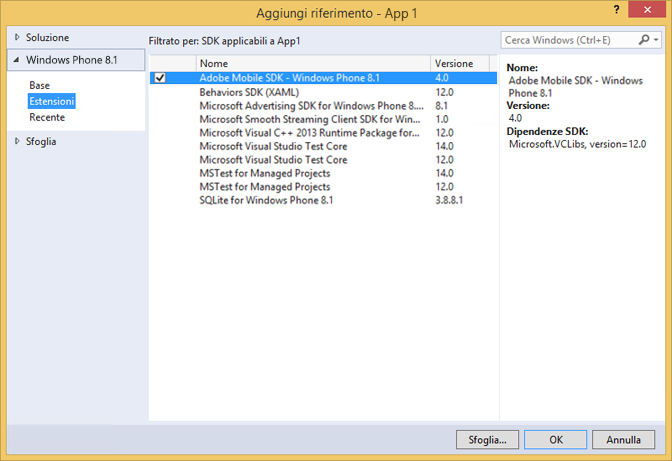

# Estensioni Windows Visual Studio per l’SDK 4.x delle soluzioni Experience Cloud {#windows-visual-studio-extensions-for-experience-cloud-solutions-x-sdk}

Questa estensione fornisce un modo molto più semplice per aggiungere nel progetto il riferimento dell’SDK Windows 4.x delle soluzioni Experience Cloud.

## Installare la libreria da GitHub {#section_F55DB6241EF1475286C05FEAEBF996A3}

1. Scarica l&#39;SDK universale di Windows da [GitHub](https://github.com/Adobe-Marketing-Cloud/mobile-services/releases).
1. Estrai il file scaricato localmente.
1. Fai doppio clic sul file **[!UICONTROL ADBMobileUniversalWindowsVSIX.vsix]** per aprire il programma di installazione.
1. Seleziona **[!UICONTROL Posizione globale]** e installa la libreria.

## Aggiungere riferimenti al progetto {#section_00C14FE9243D4330BE1F4BB56FCF08B1}

1. Apri il progetto Windows 10.
1. Apre la finestra di dialogo Gestione riferimenti.

   

1. Nella scheda **[!UICONTROL Estensioni]** , individua e seleziona **[!UICONTROL Adobe Mobile SDK]**.
1. Fare clic su **[!UICONTROL OK]** per salvarlo.

   L’SDK di Adobe Mobile verrà aggiunto al tuo progetto. Se il pacchetto **[!UICONTROL Microsoft Visual C++ Runtime]** non è ancora stato aggiunto, anche questo pacchetto verrà aggiunto al progetto.

1. In Gestione configurazione, seleziona un tipo di piattaforma e inizia a testare l’app.
