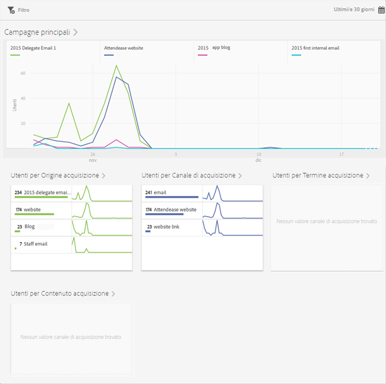
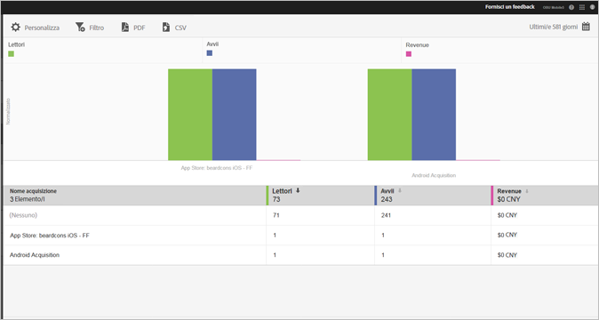

# Acquisizione {#acquisition}

Gli addetti al marketing possono creare collegamenti di tracciamento per promuovere e indirizzare il traffico verso le loro app. Questi collegamenti di tracciamento possono dirigere gli utenti verso app store, collegamenti profondi nelle app e interstiziali, che possono essere correlati a comportamenti in-app. Un esperto di marketing può creare un collegamento per indirizzare gli utenti a iOS, Android o altre piattaforme, a seconda delle necessità.

## Nuova versione SDK per Adobe Experience Cloud

Hai bisogno di informazioni e documentazione relative all’SDK per dispositivi mobili di Adobe Experience Platform? Fai clic [qui](https://aep-sdks.gitbook.io/docs/) per la documentazione più recente.

A settembre 2018 è stata rilasciata una nuova versione principale dell&#39;SDK. Questi nuovi SDK per dispositivi mobili di Adobe Experience Platform sono configurabili tramite [Experience Platform Launch](https://www.adobe.com/it/experience-platform/launch.html).

* To get started, go to [Launch](https://launch.adobe.com/).
* Per visualizzare cosa è compreso negli archivi Experience Platform SDK, passa a [Github: SDK di Adobe Experience Platform](https://github.com/Adobe-Marketing-Cloud/acp-sdks).

>[!IMPORTANT]
>
> Se utilizzi gli SDK per dispositivi mobili di Adobe Experience Platform con Adobe Launch, **devi** inoltre installare l’estensione Adobe Analytics Mobile Services per utilizzare le funzioni di Adobe Mobile Services, ad esempio i collegamenti di acquisizione. Per ulteriori informazioni, consulta [Adobe Analytics - Mobile Services](https://aep-sdks.gitbook.io/docs/using-mobile-extensions/adobe-analytics-mobile-services). Per ulteriori informazioni sull’uso dei collegamenti di acquisizione e marketing con gli SDK di Experience Cloud, consulta [Collegamenti di acquisizione e marketing](https://aep-sdks.gitbook.io/docs/using-mobile-extensions/adobe-analytics-mobile-services#acquisition-and-marketing-links).

>[!IMPORTANT]
>
>Anche se puoi configurare le funzionalità nell’interfaccia utente, non funzioneranno finché non avrai scaricato il file di configurazione generato e aggiunto il file all’SDK. Per informazioni sul download e sulla configurazione degli SDK, consulta la sezione *documentazione SDK* su questa pagina.

Puoi creare, modificare, gestire e visualizzare i rapporti sui collegamenti di marketing tracciabili nelle app mobili.

>[!TIP]
>
>Questa funzionalità richiede lo SKU Adobe Analytics - Mobile Apps o Adobe Analytics Premium.

Sono disponibili i seguenti rapporti di acquisizione che forniscono informazioni approfondite sulle prestazioni dei tuoi collegamenti di marketing:

* **Panoramica** {#section_5B2BA47F22694919A472AB591101237E}

   Questo rapporto mostra le campagne principali che hanno portato gli utenti alla tua app, con informazioni sulle prestazioni relativamente ad altri metadati di tracciamento, quali origine acquisizione, canale, termine e contenuto.

   

* **Rapporto collegamenti** {#section_A23A640C363B43569D9D484CF49EA277}

   Questo rapporto fornisce una vista a classifica delle prestazioni dei tuoi collegamenti di marketing. Oltre a riportare i nomi dei collegamenti con le relative metriche delle prestazioni, il rapporto è anche personalizzabile. Per ulteriori informazioni, vedi [Personalizzare i rapporti](/help/using/usage/reports-customize/t-reports-customize.md).

   Considerazioni da ricordare:

   * È possibile fare clic sulle icone freccia nelle intestazioni delle colonne per ordinare i dati in ordine crescente o decrescente.
   * Per esportare i dati in un documento PDF, puoi fare clic su **[!UICONTROL Scarica]**.
   
