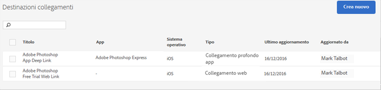

# Create and manage link destinations{#create-and-manage-link-destinations}

Nella pagina Gestione destinazioni collegamenti puoi creare, modificare, archiviare o annullare l'archiviazione ed eliminare le destinazioni dei collegamenti. Queste destinazioni possono essere richiamate in linea quando crei collegamenti di marketing, notifiche push o messaggi in-app.

Per visualizzare la pagina Gestione destinazioni collegamenti:

1. Dal menu di navigazione sinistro, fai clic su **[!UICONTROL Gestione app]**.
1. Fai clic sul nome dell'app per visualizzare la pagina Informazioni app corrispondente.
1. In alto a destra, fai clic su **[!UICONTROL Gestione destinazioni collegamenti]**.

La pagina Destinazioni collegamenti mostra le destinazioni dei collegamenti e fornisce opzioni per creare, archiviare, archiviare, modificare ed eliminare le destinazioni dei collegamenti.

Ad esempio:

