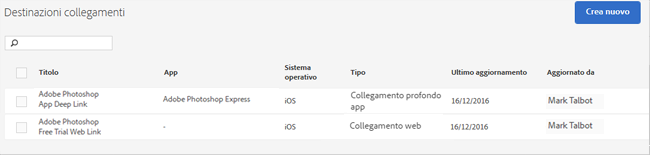

# Gestire le destinazioni dei collegamenti {#manage-link-destinations}

Puoi usare la pagina Destinazioni collegamenti per creare, modificare, archiviare, rimuovere dall’archivio o eliminare una destinazione esistente.

Per visualizzare la pagina Gestione destinazioni collegamenti:

1. Nell’interfaccia utente di Mobile Services, fai clic su **[!UICONTROL Gestione app]**.
1. Nella pagina Informazioni app dell’app, fai clic su **[!UICONTROL Gestione destinazioni collegamenti]**.

   

1. (Condizionale) Esegui le operazioni richieste:

   * **Modifica**

      Per modificare una destinazione di collegamento, fai clic sul nome corrispondente nell’elenco, quindi apporta le modifiche necessarie nei vari campi. Per ulteriori informazioni, vedi [Creare una nuova destinazione di collegamento](/help/using/acquisition-main/c-manage-link-destinations/t-create-new-app-deep-link-destination.md).

      >[!IMPORTANT]
      >
      >Le modifiche potrebbero richiedere fino a 15 minuti prima di diventare effettive.

   * **Archivia**

      Puoi archiviare delle destinazioni di collegamenti se desideri rimuoverle dall’elenco **[!UICONTROL Destinazioni collegamenti]**, ma conservarle per il futuro.

      Per archiviare delle destinazioni di collegamenti, seleziona una o più caselle di controllo accanto ai nomi dei collegamenti, quindi fai clic su **[!UICONTROL Archivia selezionati]**. Poiché la destinazione di collegamento è stata archiviata e puoi rimuoverla dall’archivio in qualsiasi momento, non è necessario confermare l’azione.

   * **Annulla archiviazione**

      Puoi rimuovere dall’archivio delle destinazioni di collegamenti precedentemente archiviate per rivisualizzarle nell’elenco Destinazioni collegamenti e riutilizzarle.

      Per annullare l’archiviazione di una destinazione di collegamento:

      1. Fai clic su **[!UICONTROL Visualizza archivio]**.
      1. Seleziona una o più caselle di controllo accanto ai nomi dei collegamenti da rimuovere dall’archivio.
      1. Fai clic su **[!UICONTROL Annulla archiviazione selezionati]**.

      L’opzione **[!UICONTROL Visualizza archivio]** è visibile solo se hai precedentemente archiviato delle destinazioni di collegamenti.

   * **Elimina**

      Per eliminare una destinazione di collegamento, seleziona la casella di controllo accanto ai collegamenti che desideri selezionare, quindi fai clic su **[!UICONTROL Elimina selezionati]** e poi su **[!UICONTROL Elimina]** per confermare l’azione.

      >[!IMPORTANT]
      >
      >L’eliminazione di una destinazione di collegamento è **permanente**. Se non sei sicuro di volerla eliminare, usa l’opzione di archiviazione.
