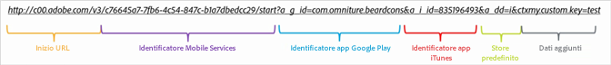
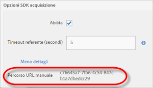

# Creare manualmente collegamenti di acquisizione {#create-acquisition-link-manually}

Puoi creare collegamenti di marketing per acquisire al volo nuovi utenti di app mobili configurando manualmente i parametri degli URL.

>[!IMPORTANT]
>
>Questa funzione richiede la versione SDK 4.6 o successiva. Per ulteriori informazioni, consulta [Prerequisiti per l’acquisizione](/help/using/acquisition-main/c-acquisition-prerequisites.md).

Il diagramma seguente illustra i componenti di un collegamento di tracciamento creato manualmente, con i diversi parametri URL da configurare quando crei manualmente dei collegamenti di acquisizione.

Questo collegamento è configurato per eseguire un reindirizzamento specifico della piattaforma a Google Play o a Apple App Store per un’app mobile. Se non è possibile determinare la destinazione, lo store predefinito viene impostato su Apple App Store. Dopo che l’app è stata installata, la chiave contestuale personalizzata `my.custom.key:test` viene associata all’hit di installazione Analytics.

Per creare manualmente i collegamenti, usa il formato di URL seguente:

`http(s)://c00.adobe.com/v3/ {mobile-services-app-hash}/start? {parameters}`

>[!TIP]
>
>La versione di Android SDK che utilizzi è indifferente in questo caso.

Per iOS, assicurati di usare il protocollo corretto:

* Usa **HTTP** se utilizzi una versione dell’SDK iOS precedente a 4.7.0 oppure se utilizzi l’SDK iOS 4.7.0 o versione successiva e se l’opzione **[!UICONTROL Usa HTTPS]** **non** è selezionata nella pagina Gestione impostazioni app.
* Usa **HTTPS** se utilizzi l’SDK iOS 4.7.0 o versione successiva e se l’opzione **[!UICONTROL Usa HTTPS]** **è** selezionata nella pagina Gestione impostazioni app.

Se si verificano le seguenti condizioni:

* `{mobile-services-app-hash}` corrisponde all’identificatore di applicazione nel file di configurazione `acquisition:appid `.

   Puoi trovare `{mobile-services-app-hash}` nella pagina Gestione impostazioni app in Opzioni acquisizione SDK, nel campo ID tracciamento.

   

* `{parameters}` è un elenco di parametri di query URL standard con nomi specifici.

Segue l’elenco dei parametri:

* **`a_g_id`**

   Identificatore app in Google Play.

   * Valore di esempio: `com.adobe.beardcons`

* **`a_g_lo`**

   Override lingua di Google Play.

   * Valore di esempio: `ko`

* **`a_i_id`**

   Identificatore app in iTunes.

   * Valore di esempio: `835196493`

* **`a_i_lo`**

   Override lingua di iTunes.

   * Valore di esempio: `jp`

* **`a_dd`**

   Store predefinito per reindirizzamento automatico.

   * Valore di esempio: `i | g`

* **`a_cid`**

   Override ID personalizzato (generalmente IDFA per iOS o ADID per Android).

   * Valore di esempio: `Any String < 255 characters (UTF-8 encoded)`

* **`ctx*`**

   Le chiavi con prefisso `ctx` vengono incluse nei dati contestuali dell’hit di lancio risultante.

   * Valore di esempio: `ctxmy.custom.key=myValue`

* **`ctxa.referrer.campaign.name`**

   Nome campagna di acquisizione.

   Questo parametro è necessario per i rapporti se vuoi confrontare le prestazioni di diversi collegamenti di acquisizione.

   * Valore di esempio: Vertice 2015

* **`ctxa.referrer.campaign.trackingcode`**

   Codice di tracciamento

   Questo parametro è necessario per i rapporti se vuoi confrontare le prestazioni di diversi collegamenti di acquisizione.

   * Valore di esempio: `lexsxouj`

* **`ctxa.referrer.campaign.source`**

   L’origine.

   * Valore di esempio: Network pubblicitario

* **`ctxa.referrer.campaign.medium`**

   Canale

   * Valore di esempio: E-mail

* **`ctxa.referrer.campaign.content`**

   Contenuto

   * Valore di esempio: Immagine # 325689

* **`ctxa.referrer.campaign.term`**

   Termine

   * Valore di esempio: escursione+scarponi

Quando crei manualmente dei collegamenti di acquisizione, tieni presente quanto segue:

* Tutti i parametri che non corrispondono a quelli della tabella vengono passati come parte del reindirizzamento all’app store.
* Tutti i parametri sono tecnicamente facoltativi; tuttavia, il collegamento non funzionerà se non viene specificato almeno un ID store.

   Ad esempio, un ID store potrebbe essere `a_g_id`/ `a_i_id`.

* Se non è possibile determinare automaticamente lo store di destinazione e non ne è stato fornito uno predefinito, viene restituito un errore 404.
