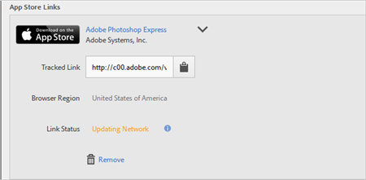

# Creare un collegamento di acquisizione{#create-an-acquisition-link}

Puoi creare collegamenti agli app store per scaricare applicazioni direttamente da Apple App Store e Google Play. I collegamenti creati consentono di attribuire i tuoi eventi di successo ai download.

1. Fai clic su **[!UICONTROL Acquisizione]** &gt; **[!UICONTROL Gestisci collegamenti di acquisizione]** &gt; **[!UICONTROL Crea nuovo]**.
1. Immetti le seguenti informazioni nella sezione **[!UICONTROL Informazioni collegamento]**:

   * (**Obbligatorio**) **[!UICONTROL Nome]**
Specifica un nome descrittivo per il collegamento all’app.
   * **[!UICONTROL Codice di monitoraggio]**
Specifica il codice di tracciamento desiderato o fai clic su **[!UICONTROL Genera]** per creare un nuovo codice di tracciamento.
   * (**Obbligatorio**) **[!UICONTROL Origine]**
Specifica il referente originale, ad esempio “newsletter” o “homepage”.
   * **[!UICONTROL Canale]**
Specifica il canale di marketing, ad esempio “banner” o “e-mail”.
   * **[!UICONTROL Contenuto]**
Specifica il nome o l’ID dell’annuncio che contiene il collegamento.
   * **[!UICONTROL Termine]**
Specifica i termini a pagamento o altri termini di ricerca per l’annuncio.
   >[!IMPORTANT]
   >
   >I valori inseriti in questi campi non possono più essere modificati dopo che il collegamento di acquisizione è stato creato.

1. Compila i campi seguenti nella sezione **[!UICONTROL Aggiungi collegamento app store.]**

   * **[!UICONTROL App store]**

      Seleziona un app store:
      * Apple App Store
      * Google Play
      Le opzioni disponibili per ciascun app store sono diverse (vedi di seguito).

   * **[!UICONTROL Regione browser (solo per Apple App Store)]**

      Specifica un app store regionale per i browser desktop.

      Questa impostazione consente di definire l’app store specifico per la regione a cui desideri indirizzare il collegamento di acquisizione quando un utente fa clic su tale collegamento da un browser desktop. I dispositivi mobili vengono reindirizzati automaticamente in base alle impostazioni del dispositivo.

   * **[!UICONTROL Lingua Del Browser (Lingua Google (Solo Google Play))]**

      Seleziona una lingua dall’elenco a discesa.

      Questa opzione permette di definire la lingua in cui visualizzare Google Play nei browser desktop. La lingua utilizzata per i dispositivi mobili dipende invece dalle impostazioni del dispositivo.

   * **[!UICONTROL Ricerca per nome]**

      * Per Apple App Store, se non conosci l’ID app, puoi cercare l’app in base al nome.

         Puoi limitare la ricerca selezionando una regione opzionale dall’elenco a discesa **[!UICONTROL nella regione]**.

      * Per Google Play, se non conosci il Nome pacchetto, puoi cercare l’app in base al nome.
   * **[!UICONTROL ID app (solo per Apple App Store)]**

      Se hai cercato l’app, questo campo viene compilato automaticamente. Puoi anche immettere il valore ID app direttamente anziché cercare l’app.

   * **[!UICONTROL Nome pacchetto (solo per Google Play)]**

      Se hai cercato l’app, questo campo viene compilato automaticamente. Invece di cercare puoi anche digitare direttamente il valore Nome pacchetto.

1. Per salvare la configurazione e generare il collegamento, fai clic su **[!UICONTROL Aggiungi]** &gt; **[!UICONTROL Salva]**.

   Il nuovo collegamento creato viene visualizzato nella sezione **[!UICONTROL Collegamenti all’app store]**.

   

1. Fai clic su  per copiare il collegamento tracciato negli Appunti.

1. Incolla il collegamento nei tuoi post per social media, annunci pubblicitari, messaggi e-mail e altro.