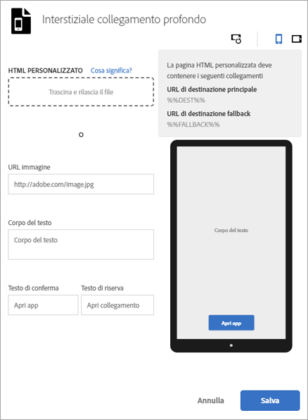

# Interstiziali{#interstitials}

{#eol}

Puoi indirizzare gli utenti a una particolare destinazione a seconda che abbiano installato l’app (un collegamento profondo nell’app) o meno (un sito web o un app store). È meglio lasciare agli utenti la scelta del percorso. Gli addetti al marketing possono configurare una pagina interstiziale che presenti agli utenti le opzioni per le destinazioni disponibili.

Per configurare una pagina interstiziale durante la   creazione di un collegamento di marketing:

1. Fai clic su **[!UICONTROL Modifica interstiziale collegamento diretto]**.

   

1. Digita le informazioni nei campi seguenti:

   * **[!UICONTROL HTML personalizzato]**

      Seleziona la tua pagina HTML interstiziale.

      Utilizzando interstiziali personalizzati, gli addetti al marketing possono personalizzare le pagine di destinazione interstiziali con codice HTML/CSS/JS personalizzato, per aggiungere elementi di branding alle pagine.

      La pagina HTML deve soddisfare i seguenti requisiti:

      * Deve essere un file HTML.
      * Deve contenere sia `%%DEST%%` sia `%%FALLBACK%%` come segnaposto.
      * Il codice HTML caricato deve essere servito in un `<iframe>`.

         Le tue destinazioni di collegamento devono puntare a una finestra principale. Puoi includere `<base target="_parent" />` in `<head>` oppure specificare una proprietà target specifica per ogni `<a/>`.

         >[!TIP]
         >
         >Se carichi un file HTML personalizzato, le altre quattro opzioni di questa tabella non vengono utilizzate a meno che tu non rimuova il file caricato.
   * **[!UICONTROL URL immagine]**

      Specifica l’URL di una risorsa di immagine.

   * **[!UICONTROL Corpo del testo]**

      Specifica il corpo del testo per l’interstiziale.

   * **[!UICONTROL Testo di conferma]**

      Specifica il testo per il pulsante di conferma.

   * **[!UICONTROL Testo di riserva]**

      Specifica il testo di riserva (o di fallback) da visualizzare.

      Se un collegamento profondo non funziona, il pulsante di testo viene aggiornato con questo campo. Gli utenti vengono invitati a provare il collegamento profondo prima di ricorrere a un’altra opzione. Ad esempio, la destinazione alternativa potrebbe essere un app store da cui scaricare e installare l’app oppure il sito web dell’azienda. Il testo di riserva segnala agli utenti che è disponibile un’altra azione se il collegamento profondo non funziona.

1. (**Facoltativo**) Fai clic sulle icone sopra l’immagine per controllare l’aspetto dell’interstiziale quando è ruotato e su diversi dispositivi.

   Puoi cambiare o modificare l’immagine fuori da Mobile Services per assicurarti che sia visualizzata correttamente in situazioni diverse.
1. Fai clic su **[!UICONTROL Salva]**.
