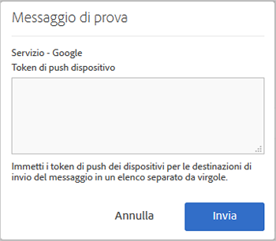

# Prerequisiti per abilitare i messaggi push {#prerequisites-to-enable-push-messaging}

{#eol}

Devi eseguire queste operazioni prima di configurare i messaggi push nelle applicazioni.

## Abilitare Experience Cloud per la tua azienda

La tua azienda Adobe Analytics deve essere abilitata per Experience Cloud. Per verificare lo stato, rivolgiti al responsabile aziendale dell’account Adobe.

## Installare e configurare l’SDK di Mobile

* **Installare l’SDK di Mobile**

   Per configurare i messaggi push, devi scaricare e installare almeno la versione 4.6 o successiva dell’SDK di Mobile. Per ulteriori informazioni, consulta [Scaricare gli SDK](/help/using/c-manage-app-settings/c-mob-confg-app/t-config-analytics/download-sdk.md).

* **Configurare i servizi push**

   Devi configurare i servizi push nell’SDK di Mobile.

## Accedi al servizio core Mobile utilizzando il tuo Adobe ID

>[!IMPORTANT]
>
>Per utilizzare la funzionalità Servizi push, gli utenti devono accedere al servizio core Mobile con il proprio Adobe ID, e il tuo account Analytics deve essere collegato ai loro Adobe ID. La funzionalità Servizi push non è disponibile se gli utenti accedono con gli account Adobe Analytics esistenti.

Se gli utenti non dispongono di un Adobe ID, effettua i seguenti passaggi:

1. (**Amministratore Experience Cloud**) invita gli utenti in Experience Cloud.

1. (**Utenti**) creano un Adobe ID personale seguendo le istruzioni ricevute dall’amministratore Experience Cloud.

   A ogni utente viene inviato automaticamente un messaggio e-mail dopo che l’amministratore ha eseguito l’operazione precedente.

1. (**Utenti**) accedono a Mobile con il proprio Adobe ID.

## Collega gli account degli utenti in Experience Cloud

Ogni utente deve collegare l’account della soluzione Analytics dall’organizzazione Experience Cloud.

1. Accedi a [Adobe Experience Cloud](https://experience.adobe.com) con un Adobe ID.

1. Nell’angolo in alto a destra, seleziona il nome dell’azienda Analytics.

1. Fai clic su **[!UICONTROL Aggiungi organizzazione]**, quindi seleziona **[!UICONTROL Adobe SiteCatalyst/Adobe Social]** dall’elenco a discesa.

1. Inserisci il nome dell’azienda e le credenziali legacy dell’azienda in questione, quindi fai clic su **[!UICONTROL Collega account]**.

   Ora l’Adobe ID è collegato al tuo account Analytics, alla tua società e alle relative credenziali di accesso.

Per ulteriori informazioni, consulta [Organizzazioni nell’Experience Cloud](https://experienceleague.adobe.com/docs/core-services/interface/administration/organizations.html?lang=it) nella guida Experience Cloud Central Interface Components.

## Configurare i servizi push e l’SDK del servizio ID nell’interfaccia utente di Mobile

Finché non attivi il servizio ID per la tua app, la sezione **[!UICONTROL Servizi push]** risulta disabilitata. Tuttavia, dopo aver abilitato il servizio ID, viene abilitata la sezione Servizi push. Per ulteriori informazioni sull’attivazione dei servizi push, vedere [Configurare le opzioni del servizio ID SDK](/help/using/c-manage-app-settings/c-mob-confg-app/t-config-visitor.md).

>[!IMPORTANT]
>
>Fai clic su **[!UICONTROL Salva]** per salvare le modifiche e aggiornare i Servizi push.
>
>Puoi configurare un’app per app store per Apple e una per Google in ogni suite di rapporti. Se hai bisogno di altre app, ad esempio una per un ambiente di produzione e una per un ambiente di sviluppo, configura una nuova app per app store e una nuova suite di rapporti per ciascun ambiente.

* Per **Apple**, trascina e rilascia la chiave privata e/o il certificato. Se la tua chiave privata è crittografata tramite password, digita la password.

   * Per **Chiave privata**, trascina e rilascia il file della chiave privata nell’apposita casella.

      Puoi anche fare clic su **[!UICONTROL Sfoglia]** per selezionare il file. Il file contiene la chiave privata. Nel file potrebbe essere incluso anche il certificato (`.p12`, `pkcs12`, `.pfx`, `.key`, `.pem`).

   * Per la **password della chiave privata**, se il file della chiave privata è crittografato, digita la password.

      (Condizionato) Per il **certificato**, trascina e rilascia il file del certificato nella casella. Puoi anche fare clic su **[!UICONTROL Sfoglia]** per selezionare il file. Questo campo non è richiesto se il file della chiave privata contiene anche il certificato ( `.cert`, `.cer`, `.crt`, `.pem`).

* Per **Google**, specifica la chiave API dell’app.

   Fai clic su **[!UICONTROL Prova]** per verificare che l’app e Mobile Services siano configurati correttamente. Questa opzione è utile per il debug e la risoluzione dei problemi.

   Digita i token push del dispositivo al quale vuoi inviare il messaggio. Puoi inviare il messaggio a più dispositivi specificando i diversi token in un elenco separato da virgole.

   
