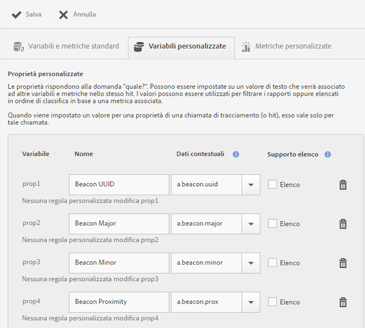

# Gestione dell’app {#managing-your-app}

Puoi tracciare e gestire i dati che ricevi dall’app configurando una serie di variabili e metriche.

## Gestire variabili e metriche   {#section_EC2D58AC334F4ED49E764B81C2423A62}

* **Variabili e metriche standard**

   Ogni app include variabili e metriche per il tracciamento del carrello e delle attività di acquisto. Poiché alcune informazioni di acquisto non possono essere gestite mediante regole di elaborazione, l’SDK espone i dati contestuali speciali `"&&products"`. Ad esempio, puoi avere variabili quali aggiunte al carrello, rimozioni dal carrello, pagamento, ordini e così via. I dati contestuali devono essere mappati su dati in Adobe Analytics. Se questa variabile viene compilata con una semplice mappatura dai dati di contesto, questa è la chiave che viene mappata su di essa. Lascia vuoto il valore se la variabile viene compilata da regole più complesse in Strumenti di amministrazione di Analytics.

   Per ulteriori informazioni su queste variabili e metriche, vedi:

   * [Variabili di prodotto in Android](/help/android/analytics-main/products/products.md)
   * [Variabili di prodotto in iOS](/help/ios/analytics-main/products/products.md)

* **Variabili personalizzate**

   Nella pagina Variabili personalizzate sono visualizzate tutte le variabili Analytics personalizzate configurate per la suite di rapporti che contiene i dati dell’app. In questa pagina puoi abilitare ulteriori variabili e mappare i dati contestuali a variabili di Analytics.

### Mappare dati contestuali a variabili Analytics

Fai clic su **[!UICONTROL Gestione impostazioni app]** > **[!UICONTROL Gestione variabili e metriche]** > **[!UICONTROL Variabili personalizzate]**.

Queste mappature richiameranno la stessa API utilizzata nelle [Regole di elaborazione](https://docs.adobe.com/content/help/it-IT/analytics/admin/admin-tools/processing-rules/processing-rules.html).

L’elenco seguente contiene le variabili personalizzate che puoi configurare:

* Le **[!UICONTROL Proprietà personalizzate]** rispondono alla domanda “quale?”. Le proprietà possono essere impostate su un valore di testo che sarà associato ad altre variabili e metriche inviate nello stesso hit. I valori possono essere utilizzati per filtrare i rapporti o elencati in ordine di classifica in base a una metrica associata.

   Quando un valore viene impostato per una proprietà in una chiamata di tracciamento (o hit), viene applicato solo a tale chiamata.

* Anche le **[!UICONTROL Variabili personalizzate]** (eVar) rispondono alla domanda “quale?”. Tuttavia, un valore eVar può essere applicato non solo all’hit in cui viene inviato ma anche alle variabili e alle metriche inviate negli hit successivi, fino alla scadenza del valore o all’impostazione di un nuovo valore.
* Le **[!UICONTROL Variabili di elenco personalizzate (o variabili multivalore)]** si comportano come le normali variabili, ma permettono di acquisire più valori con un solo hit. Per ulteriori informazioni, consulta [Variabili di elenco](https://docs.adobe.com/content/help/it-IT/analytics/implementation/javascript-implementation/variables-analytics-reporting/page-variables.html).

Le seguenti mappature sono visualizzate in Analytics in quanto create in Mobile Services.

* **[!UICONTROL Nome]**

   Nome descrittivo della variabile di raccolta dati.

* **[!UICONTROL Dati contestuali]**

   Se questa variabile viene compilata con una semplice mappatura dai dati di contesto, questa è la chiave che viene mappata su di essa. Lascia vuoto il campo se la variabile viene compilata da regole più complesse in Analytics Strumenti di amministrazione.

   Fai clic sulla colonna dei dati contestuali e seleziona la variabile di dati contestuali da mappare. L’elenco a discesa contiene le variabili ricevute negli ultimi 30 giorni; se i dati di contesto che desideri mappare non si trovano nell’elenco, puoi immetterli.

* **[!UICONTROL Persistenza (Variabili personalizzate e Variabili elenco personalizzate)]**

   La persistenza determina il punto in cui il valore di una variabile personalizzata (eVar) scade o non viene più associato a ulteriori hit. Se una eVar risulta scaduta nel momento in cui viene attivato un hit, il valore Nessuno viene associato a tale hit per la eVar in questione. Ciò significa che nessun valore eVar era attivo al momento dell’attivazione dell’hit.

   Puoi scegliere una delle opzioni seguenti:

   * **[!UICONTROL Sessione]**

      Il valore eVar persiste per tutta la durata della visita Analytics.

   * **[!UICONTROL Chiamata di tracciamento]**

      Il valore eVar persiste solo per la durata della chiamata di tracciamento o dell’hit nel quale è stata inclusa.

   * **[!UICONTROL Senza scadenza]**

      Il valore eVar persiste per tutte le chiamate d tracciamento successive.
   * **[!UICONTROL Avanzate]**

      Adobe Analytics offre un’interfaccia utente più avanzata per impostare la persistenza delle eVar. Se per la eVar è impostato un valore di persistenza che non è supportato in Mobile Services, tale valore viene visualizzato nell’interfaccia di Mobile Services.

      Per gestire le eVar, fai clic su **[!UICONTROL Gestione suite di rapporti Adobe Analytics]** > **[!UICONTROL Interfaccia variabili di conversione]**.

   * **[!UICONTROL Supporto elenco]**

      Abilita il passaggio di più valori da associare alla proprietà in una singola chiamata di tracciamento. Il delimitatore utilizzato deve essere un carattere e non può essere uno zero o uno spazio.

   * **[!UICONTROL Delimitatore]**

      Il delimitatore utilizzato deve essere un carattere e non può essere uno zero o uno spazio.

### Variabili Analytics supplementari

Puoi abilitare ulteriori variabili utilizzando l’elenco a discesa alla fine di ciascuna sezione di variabili.

Seleziona un numero di variabile non utilizzato e digita un nome. Facoltativamente puoi anche fornire la variabile di dati contestuali da memorizzare ed eventuali altre informazioni.

* **Metriche personalizzate**

   Le metriche (o eventi) rispondono alle domande *quanto?* o *quanti?*. Gli eventi possono essere incrementati ogni volta che l’utente esegue un’azione, oppure contenere valori numerici come prezzi. Le metriche personalizzate includono eventi quali la creazione di un’app, il download o l’esportazione di un file PDF o CSV, il salvataggio di una campagna, il download dell’SDK, la generazione di un rapporto, l’aggiunta di un collegamento all’app store, l’attivazione di un messaggio in-app e così via.

   Seleziona uno dei seguenti tipi di metriche personalizzate:

   * **[!UICONTROL Numero intero]**
   * **[!UICONTROL Numero decimale]**
   * **[!UICONTROL Valuta]**

## Gestire i punti di interesse {#section_990EF15E4E3B42CC807FCD9BEC8DB4C6}

I punti di interesse ti permettono di definire posizioni geografiche da utilizzare per correlazioni nei rapporti, come destinazioni di messaggi in-app e per altri scopi. Quando un hit viene inviato in un punto di interesse, quest’ultimo è associato all’hit. Per ulteriori informazioni sui punti di interesse, vedi   [Gestire i punti di interesse](/help/using/location/t-manage-points.md).

## Gestire le destinazioni dei collegamenti {#section_F722A387E22A430187B063D358A87711}

Puoi creare, modificare, archiviare o annullare l’archiviazione ed eliminare le destinazioni dei collegamenti. Queste destinazioni possono quindi essere richiamate in linea quando crei collegamenti di marketing, notifiche push o messaggi in-app. Per ulteriori informazioni sulle destinazioni dei collegamenti, consulta [Gestire le destinazioni dei collegamenti](/help/using/acquisition-main/c-manage-link-destinations/t-archive-unarchive-link-destinations.md).

## Gestione postback {#section_78B0A8D7AE6940E78D85AE3AB829E860}

I postback consentono di inviare i dati raccolti da Adobe Mobile a un server di terze parti separato. Sfruttando le caratteristiche e gli attivatori utilizzati per visualizzare un messaggio in-app, puoi configurare Mobile per l’invio di dati personalizzati a una destinazione terza. Per ulteriori informazioni sui postback, vedi   [Configurare i postback](/help/using/c-manage-app-settings/c-mob-confg-app/signals.md).
