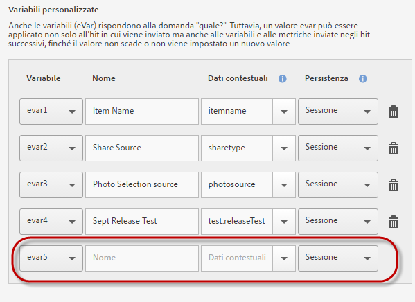

# Gestione dell'app {#managing-your-app}

Puoi tracciare e gestire i dati che ricevi dall'app configurando una serie di variabili e metriche.

## Gestire variabili e metriche {#section_EC2D58AC334F4ED49E764B81C2423A62}

* **Variabili standard e metriche**

   Ogni app include variabili e metriche per il tracciamento delle attività del carrello e di acquisto. Some purchase information cannot be handled with processing rules, so the SDK exposes the special `"&&products"` context data. Ad esempio, puoi utilizzare variabili per i prodotti aggiunti al carrello, quelli rimossi dal carrello, i pagamenti, gli ordini e così via. I dati contestuali devono essere mappati su dati di Adobe Analytics. Se questa variabile viene compilata con una semplice mappatura dai dati di contesto, questa è la chiave che viene mappata su di essa. Lascialo vuoto se la variabile viene compilata da regole più complesse in Strumenti di amministrazione di Analytics.

   Per ulteriori informazioni su queste variabili e metriche, vedi:

   * [Variabili di prodotto in Android](/help/android/analytics-main/products/products.md)
   * [Variabili di prodotto in iOS](/help/ios/analytics-main/products/products.md)

* **Variabili personalizzate**

   Nella pagina Variabili personalizzate sono visualizzate tutte le variabili Analytics personalizzate configurate per la suite di rapporti che contiene i dati dell'app. In questa pagina puoi abilitare ulteriori variabili e mappare i dati contestuali a variabili di Analytics.

### Mappare dati contestuali a variabili Analytics

Click **[!UICONTROL Manage App Settings]** &gt; **[!UICONTROL Manage Variables &amp; Metrics]** &gt; **[!UICONTROL Custom Variables]**.

These mappings call the same API that is used in [Processing Rules](https://docs.adobe.com/content/help/en/analytics/admin/admin-tools/processing-rules/processing-rules.html).

L'elenco seguente contiene le variabili personalizzate che puoi configurare:

* The **[!UICONTROL Custom Properties]** (or props) answer the question "which one?" Possono essere impostate su un valore di testo che verrà associato ad altre variabili e metriche nello stesso hit. I valori possono essere utilizzati per filtrare i rapporti oppure elencati in ordine di classifica in base a una metrica associata.

   Quando viene impostato un valore per una proprietà di una chiamata di tracciamento (o hit), esso vale solo per tale chiamata.

* The **[!UICONTROL Custom Variables]** (or evars) also answer the question "which one?" Tuttavia, un valore eVar può essere applicato non solo all'hit in cui viene inviato ma anche alle variabili e alle metriche inviate negli hit successivi, fino alla scadenza del valore o all'impostazione di un nuovo valore.
* The **[!UICONTROL Custom List Variables (or Multi-Value Variables)]** behave the same as variables except they allow you to capture multiple values on one hit. Per ulteriori informazioni, vedere Variabili elenco.

Le mappature seguenti vengono visualizzate in Analytics come create in Mobile Services.

* **[!UICONTROL Nome]**

   Nome descrittivo della variabile di raccolta dati.

* **[!UICONTROL Dati contestuali]**

   Se questa variabile viene compilata con una semplice mappatura dai dati di contesto, questa è la chiave che viene mappata su di essa. Lascia vuoto il campo se la variabile viene compilata da regole più complesse in Analytics Strumenti di amministrazione.

   Fai clic sulla colonna dei dati di contesto e seleziona la variabile di dati di contesto da mappare. L'elenco a discesa contiene le variabili ricevute negli ultimi 30 giorni; se i dati di contesto che desideri mappare non si trovano nell'elenco, puoi immetterli.

* **[!UICONTROL Permanenza (variabili personalizzate e variabili elenco personalizzate)]**

   La persistenza determina il punto in cui il valore di una variabile personalizzata (eVar) scade o non viene più associato a ulteriori hit. Se una eVar risulta scaduta nel momento in cui viene attivato un hit, il valore Nessuno viene associato a tale hit per la eVar in questione. Ciò significa che nessun valore eVar era attivo al momento dell'attivazione dell'hit.

   Puoi scegliere una delle opzioni seguenti:

   * **[!UICONTROL Sessione]**

      Il valore eVar persiste per tutta la durata della visita di Analytics.

   * **[!UICONTROL Chiamata di tracciamento]**

      Il valore eVar persiste solo per la chiamata di tracciamento o per l'hit in cui è stata inclusa.

   * **[!UICONTROL Senza scadenza]**

      Il valore eVar persiste per tutte le chiamate di tracciamento successive.
   * **[!UICONTROL Avanzate]**

      Adobe Analytics offre un'interfaccia utente più avanzata per impostare la persistenza delle eVar. Se per l'eVar è impostato un valore di persistenza che non è supportato in Mobile Services, tale valore viene visualizzato nell'interfaccia di Mobile Services.

      To manage eVars, click **[!UICONTROL Adobe Analytics Report Suite Manager]** &gt; **[!UICONTROL Conversion Variables UI]**.

   * **[!UICONTROL Supporto elenco]**

      Abilita il passaggio di più valori da associare alla proprietà in una chiamata di tracciamento. Il carattere di delimitazione deve essere un carattere e non può essere uno zero o uno spazio.

   * **[!UICONTROL Delimitatore]**

      Il carattere di delimitazione deve essere un carattere e non può essere uno zero o uno spazio.

### Variabili Analytics supplementari

Puoi abilitare ulteriori variabili utilizzando l'elenco a discesa alla fine di ciascuna sezione di variabili.

Seleziona un numero di variabile non utilizzato e specifica un nome. Se necessario, puoi anche specificare la variabile di dati contestuali da memorizzare ed eventuali altre informazioni.

* **Metriche personalizzate**

   *Le metriche (o eventi) rispondono alle domande* quanto? o *quanti?*. Gli eventi possono essere incrementati ogni volta che l'utente esegue un'azione, oppure contenere valori numerici come prezzi. Le metriche personalizzate includono eventi quali la creazione di un'app, il download o l'esportazione di un file PDF o CSV, il salvataggio di una campagna, il download dell'SDK, la generazione di un rapporto, l'aggiunta di un collegamento all'app store, l'attivazione di un messaggio in-app e così via.

   Seleziona uno dei seguenti tipi di metriche personalizzate:

   * **[!UICONTROL Numero intero]**
   * **[!UICONTROL Numero decimale]**
   * **[!UICONTROL Valuta]**

## Gestire i punti di interesse {#section_990EF15E4E3B42CC807FCD9BEC8DB4C6}

I punti di interesse consentono di definire posizioni geografiche da utilizzare per correlazioni, come destinazioni di messaggi in-app e così via. Quando un hit viene inviato in un punto di interesse, quest'ultimo è associato all'hit. Per ulteriori informazioni sui punti di interesse, vedi [Gestire i punti di interesse](/help/using/location/t-manage-points.md).

## Gestione destinazioni collegamenti {#section_F722A387E22A430187B063D358A87711}

Puoi creare, modificare, archiviare o annullare l'archiviazione ed eliminare le destinazioni dei collegamenti. Tali destinazioni possono essere richiamate in linea quando crei collegamenti marketing, notifiche push o messaggi in-app. Per ulteriori informazioni sulle destinazioni dei collegamenti, consulta [Gestione delle destinazioni](/help/using/acquisition-main/c-manage-link-destinations/t-archive-unarchive-link-destinations.md)dei collegamenti.

## Gestione postback {#section_78B0A8D7AE6940E78D85AE3AB829E860}

I postback consentono di inviare i dati raccolti da Adobe Mobile a un altro server di terze parti. Sfruttando le caratteristiche e gli attivatori utilizzati per visualizzare un messaggio in-app, puoi configurare Mobile per l'invio di dati personalizzati a una destinazione terza. Per ulteriori informazioni sui postback, vedi [Configurare i postback](/help/using/c-manage-app-settings/c-mob-confg-app/signals.md).
