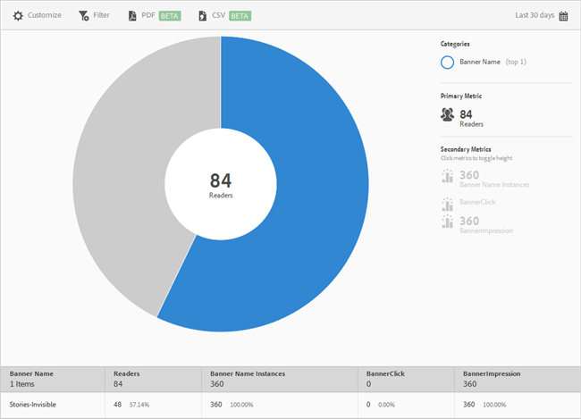

# Metriche banner {#banner-metrics}

Il rapporto **[!UICONTROL Metriche banner]fornisce una visualizzazione sunburst per i dati esistenti.** This report is only available to Digital Publishing Suite (DPS) customers.

Per impostazione predefinita, questo rapporto contiene le metriche seguenti:

* **[!UICONTROL Nome banner]**: il nome del banner.
* **[!UICONTROL Lettori]**: il numero di utenti dell'app.
* **[!UICONTROL Istanze]** nome banner: il numero di volte in cui al banner è stato fatto riferimento tramite clic e impressioni.
* **[!UICONTROL Clic su banner]**: il numero di volte in cui gli utenti hanno fatto clic sul banner.
* **[!UICONTROL Impression banner]**: il numero di volte in cui il banner è stato visualizzato (o era visibile) in una pagina di un browser.

Questo rapporto è simile al rapporto **[!UICONTROL Tecnologia].** For information about how to navigate and use sunburst reports; add breakdowns and metrics; create target activities; create sticky filters, and share reports, see [Technology](/help/using/usage/reports-technology.md). Le informazioni contenute in questo argomento possono essere utilizzate per personalizzare il rapporto **[!UICONTROL Metriche banner].**
