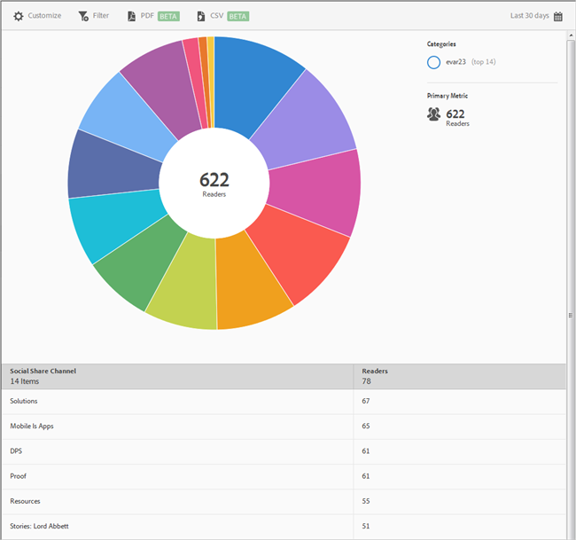

# Condivisione social {#social-sharing}

Il rapporto **[!UICONTROL Condivisione social]** fornisce una visualizzazione sunburst per i dati esistenti. Questo rapporto è disponibile solo per i clienti DPS.

Per impostazione predefinita, il rapporto mostra il numero di lettori che hanno condiviso degli articoli in diversi canali, quali e-mail, messaggi e così via.

Questo rapporto è simile al rapporto **[!UICONTROL Tecnologia]**. Per informazioni su come consultare e utilizzare i rapporti sunburst, aggiungere suddivisioni e metriche, creare attività target, creare filtri fissi e condividere i rapporti, vedi [Tecnologia](/help/using/usage/reports-technology.md). Le informazioni contenute nell’argomento Tecnologia possono essere utilizzate per personalizzare il rapporto **[!UICONTROL Condivisione social]**.
