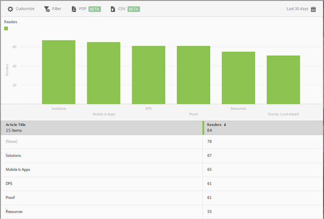

# Primi 50 articoli, rapporto{#top-articles}

Il rapporto **[!UICONTROL Primi 50 articoli]** visualizza un grafico a barre e una classifica degli articoli più letti utilizzando l’app. Questo rapporto è disponibile solo per i clienti DPS.

Anche se il rapporto predefinito visualizza i dati per gli ultimi 30 giorni raggruppati per numero di lettori, può essere personalizzato nel modo desiderato.

Per impostazione predefinita, questo rapporto mostra il titolo dell’articolo e il numero di lettori.

Per questo rapporto puoi configurare le seguenti opzioni:

* **[!UICONTROL Periodo di tempo]**
Fai clic sull’icona **[!UICONTROL Calendario]** per selezionare un periodo di tempo personalizzato o per sceglierne uno preimpostato dall’elenco a discesa.

* **[!UICONTROL Personalizza]**

   Per personalizzare i rapporti, puoi modificare le opzioni **[!UICONTROL Mostra per]**, aggiungere metriche e filtri, aggiungere serie (metriche) supplementari e altri elementi. Per ulteriori informazioni, vedi [Personalizzare i rapporti](/help/using/usage/reports-customize/reports-customize.md).

* **[!UICONTROL Filtro]**

   Fai clic su **[!UICONTROL Filtro]** per creare un filtro per più rapporti in modo da visualizzare il comportamento di un segmento in tutti i rapporti mobili. Un filtro fisso consente di definire un filtro applicato a tutti i rapporti non di percorso. Per ulteriori informazioni, consulta [Aggiungere un filtro fisso](/help/using/usage/reports-customize/t-sticky-filter.md).

* **[!UICONTROL Scarica]**

   Fai clic su **[!UICONTROL PDF]** o **[!UICONTROL CSV]** per scaricare o aprire dei documenti e condividerli con utenti che non hanno accesso a Mobile Services oppure per utilizzarli in presentazioni.