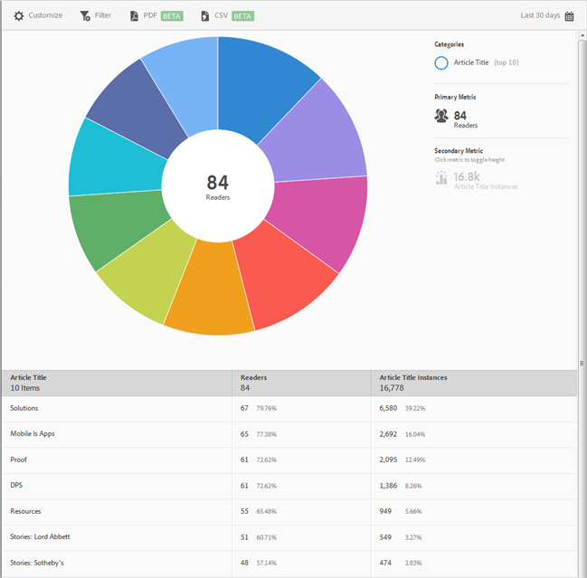

# Primi 10 articoli, rapporto{#top-articles}

Il rapporto **[!UICONTROL Primi 10 articoli]** fornisce una visualizzazione sunburst per i dati. Questo rapporto è disponibile solo per i clienti DPS.

Per impostazione predefinita, questo rapporto mostra il titolo dell’articolo, il numero di lettori e la percentuale di lettori totali, nonché le istanze del titolo dell’articolo e le relative percentuali.

Questo rapporto è simile al rapporto **[!UICONTROL Tecnologia]**. Per informazioni su come consultare e utilizzare i rapporti sunburst; aggiungere suddivisioni e metriche, creare attività target, creare filtri fissi e condividere i rapporti, vedi [Tecnologia](/help/using/usage/reports-technology.md). Queste informazioni possono essere utilizzate per personalizzare il rapporto **[!UICONTROL Primi 10 articoli]**.
