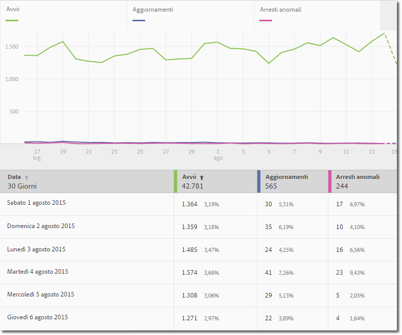
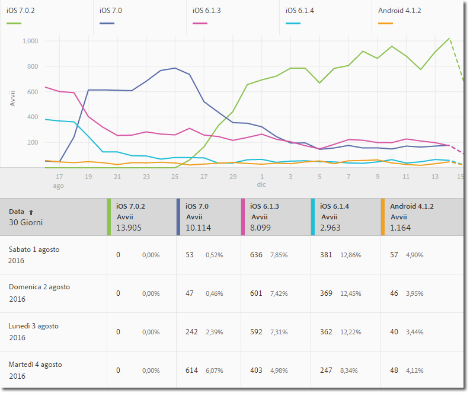
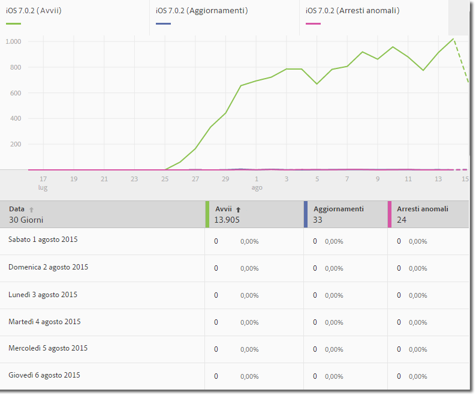
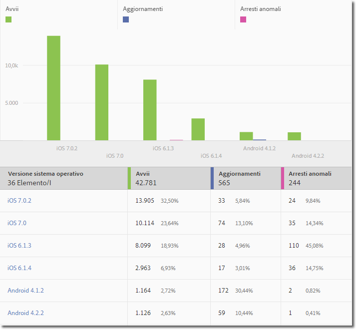
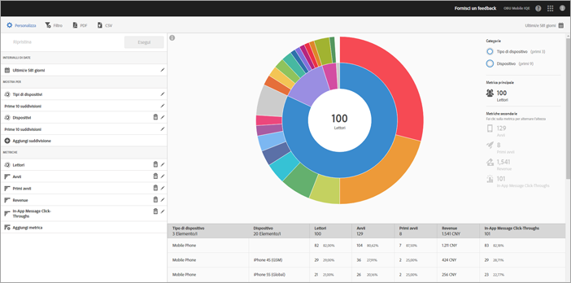
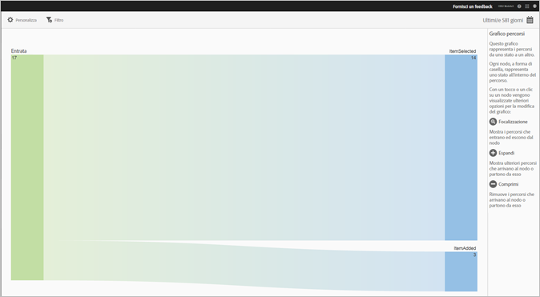
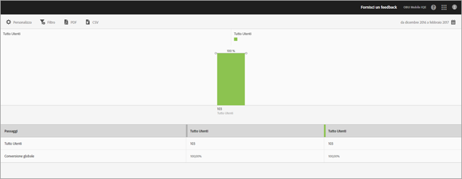

# Tipi di rapporti {#report-types}

Quando si personalizzano i rapporti, l'ampia flessibilità può far sorgere alcune domande rispetto al tipo di rapporto più adatto per ottenere i dati necessari.

Prima di iniziare a personalizzare i rapporti, è importante avere compreso la differenza tra una metrica e una dimensione.

* Metrica

   La metrica viene utilizzata per misurare i dati. Le metriche sono valori che possono essere contati e sommati; sono utilizzate per sapere con quale frequenza si verificano azioni specifiche nell'app. Alcune metriche comuni sono installazioni, avvii, ricavi, valore del ciclo di vita e accessi. Ad esempio, ogni volta che l’app viene avviata, gli _launches_value is increased by one.

* Dimensione

   La dimensione viene utilizzata per descrivere i dati. Le dimensioni sono rappresentate da una stringa o un numero che funge da stringa (ad esempio, un codice postale) ed è utilizzato per organizzare e segmentare i dati. Esempi comuni di dimensioni sono la versione del sistema operativo, il nome della campagna, il nome del prodotto e l'operatore di telefonia mobile. Ciascuna dimensione presenta un numero di valori specifici che sono associati a essa. For example, the OS version dimension has values such as _iOS 7_ and _Android 4.1.2_.

Di seguito sono elencati i tipi d rapporti che è possibile generare nell'interfaccia utente di Mobile:

## Rapporto nel tempo {#section_2741DA54C90C49AFB17C7B9BC7AD627D}

I rapporti nel tempo, o temporali, mostrano le prestazioni delle metriche in un intervallo di tempo e permettono di individuare rapidamente picchi e tendenze. Spesso l'analisi inizia con un rapporto temporale, quindi si passa a rapporti con tendenze e classifica per approfondire la ricerca e individuare i fattori che contribuiscono a un particolare picco o a una tendenza della metrica.

Ad esempio, se noti un picco negli avvii, puoi eseguire un rapporto con tendenze che mostri gli avvii per i primi cinque sistemi operativi, per scoprire quali sistemi operativi contribuiscono maggiormente al picco negli avvii:

Per visualizzare i valori delle dimensioni con altre metriche in un rapporto temporale, puoi utilizzare la metrica di istanza e definire un filtro di dimensione.

## Rapporto con tendenze {#section_C9BE9A2EDBFF4D938B9AF14C8AA67883}

I rapporti con tendenze consentono di vedere come si comportano le dimensioni più comuni rispetto a una metrica specifica. Mediante questo tipo di rapporto puoi scoprire quali valori contribuiscono maggiormente al cambiamento di una metrica.

Per visualizzare un rapporto con tendenze per una dimensione, aggiungi un filtro fisso (ad esempio, Sistema operativo = iOS 6.0.1) in un rapporto temporale per visualizzare gli stessi dati. Puoi anche aggiungere cinque ulteriori metriche nel rapporto nel tempo filtrato.

##  Report nel tempo filtrati {#section_F8FAF2A4496F449CA99EF1E052C71A2D}

Se vuoi visualizzare un valore di dimensione specifico, puoi aggiungere un filtro fisso a un rapporto nel tempo. Il rapporto seguente mostra 30 giorni di avvii, aggiornamenti e arresti per una versione specifica di un sistema operativo.

##  Report classifica{#section_C073D744A95843AF99EE74FB5B013735}

I rapporti con classifica mostrano la frequenza con cui le prime 50 dimensioni contribuiscono a determinare una metrica. Tale rapporto è utile per visualizzare il contributo totale di un intervallo di date su un grande numero di valori.

## Rapporti sunburst {#section_17A9842039174DE094A6B1E9837E35BB}

I rapporti sunburst forniscono, ad esempio, il rapporto di base insieme alle suddivisioni. La visualizzazione utilizza l'altezza per mostrare la metrica e le differenze di prestazioni tra le metriche. Ogni cerchio concentrico rappresenta un segmento di pubblico nella categoria del cerchio. Puoi intraprendere azioni su un pubblico, quali l'applicazione di un filtro fisso e la visualizzazione di metriche.

Puoi visualizzare il rapporto in un'esercitazione interna al prodotto che descrive come interagire con un grafico sunburst.

Per avviare l'esercitazione:

1. In Gestione impostazioni app, fai clic su **[!UICONTROL Utilizzo]**.

1. Click **[!UICONTROL Technology]** &gt; **[!UICONTROL Technology Breakdown]**.
1. In the title bar of the report, click **[!UICONTROL Customize]**, and click the information icon.

### Rapporto di percorsi {#section_AD400106BC684B50B27CCCD3F4497114}

Un rapporto di percorsi, basato sull'analisi dei percorsi, consiste in un grafico che rappresenta i percorsi seguiti per passare da uno stato dell'app a un altro stato.

Ogni nodo ha la forma di una casella e rappresenta uno stato nei percorsi seguiti dall'utente attraverso un'app. Ad esempio, nell'immagine qui sopra, il nodo più in alto rappresenta il numero di utenti che hanno avviato l'app e poi scelto una foto dalla galleria.

### Rapporto Funnel {#section_AF3B0C899D844FC3AD1F91A2C452C92F}

Un rapporto funnel consente di determinare dove i clienti abbandonano una campagna di marketing o deviano da un percorso di conversione definito durante l'interazione con la tua app mobile. Puoi usare il rapporto Funnel anche per confrontare le azioni di segmenti diversi.

La visualizzazione funnel ti permette di vedere in quale punto gli utenti abbandonano il processo. Grazie alla visibilità delle decisioni dei clienti in ogni fase, puoi comprendere più facilmente in quale momento vengono scoraggiati, che percorso tendono a seguire e quando i clienti abbandonano l'app.

