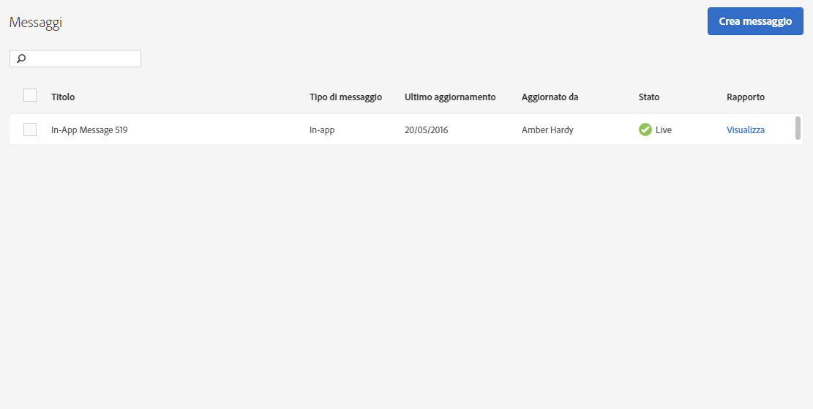

# Gestire i messaggi{#manage-messages}

Visualizza un elenco dei messaggi in-app e push con dettagli sull’ultimo aggiornamento e sullo stato (attivo o disattivato) di ciascuno.

Puoi duplicare i messaggi, attivarli o disattivarli e archiviarli o annullarne l’archiviazione. Puoi anche visualizzare un rapporto che mostra il numero di utenti che hanno visualizzato il messaggio e il numero di utenti che hanno fatto clic sul messaggio.

Per gestire i messaggi, fai clic su ***tuo_app_name*** > **[!UICONTROL Messaggi]** > **[!UICONTROL Gestione messaggi]**.

Seguono ulteriori informazioni sulle attività che è possibile completare con i messaggi:

* **Cercare e filtrare messaggi**

   Usa la casella di ricerca nella parte superiore dell’elenco per cercare e filtrare i messaggi. Quando inserisci un testo nella casella di ricerca, vengono visualizzati i messaggi dell’elenco corrispondenti a quel testo. La ricerca funziona in tutte le colonne della tabella. Ad esempio, puoi digitare  `Draft`per visualizzare solo i messaggi che sono nello stato di bozza, oppure puoi immettere il nome di un utente per mostrare solo i messaggi che sono stati aggiornati da quell’utente.

   Oltre alla casella di ricerca, puoi fare clic su qualsiasi intestazione di colonna per elencare le voci della tabella in ordine crescente o decrescente in base al contenuto di quella colonna.

   Ad esempio, se ordini la colonna **[!UICONTROL Tipo di messaggio]** in ordine crescente, tutti i messaggi in-app saranno visualizzati prima dei messaggi push. Se ordini la colonna **[!UICONTROL Ultimo aggiornamento]** in ordine decrescente, vengono visualizzati per primi i messaggi aggiornati più di recente.

* **Duplicare messaggi**

   1. Seleziona la casella di controllo accanto a uno o più messaggi e fai clic su **[!UICONTROL Duplica selezionati]**.
   1. Seleziona l’app per la quale vuoi duplicare un messaggio.
   1. Digita un nome per il messaggio.

      Per duplicare un messaggio per la stessa app, digita un nuovo nome per il messaggio. Se mantieni lo stesso nome per sovrascrivere il messaggio originale. Se stai duplicando un messaggio per un’app diversa, puoi mantenere lo stesso nome e il messaggio originale non verrà sovrascritto.

   1. Fai clic su **[!UICONTROL Duplica]** o **[!UICONTROL Sovrascrivi]**, a seconda dei casi.

* **Disattivare o attivare messaggi**

   Per disattivare dei messaggi, seleziona la casella di controllo accanto a uno o più messaggi e fai clic su **[!UICONTROL Disattiva selezionati]**.

   Per attivare dei messaggi disattivati, seleziona la casella di controllo accanto a uno o più messaggi disattivati e fai clic su **[!UICONTROL Attiva selezionati]**.

* **Archiviare messaggi**

   Per archiviare i messaggi e svuotare l’elenco dei messaggi:

   >[!TIP]
   >
   >Per poter archiviare un messaggio, devi prima disattivarlo.

   1. Seleziona la casella di controllo accanto a uno o più messaggi disattivati e fai clic su **[!UICONTROL Archivia selezionati]**.

* **Visualizzare messaggi archiviati**

   1. Fai clic su **[!UICONTROL Visualizza archivio]**.
   1. Per ripristinare dei messaggi archiviati, seleziona la casella di controllo accanto a uno o più messaggi archiviati e fai clic su **[!UICONTROL Annulla archiviazione selezionati]**.

