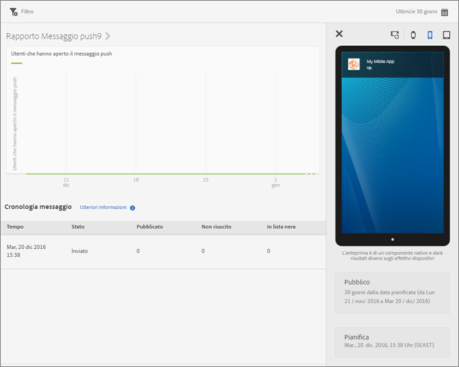

# Visualizzare rapporti sui messaggi{#view-message-reports}

Puoi visualizzare i rapporti sui messaggi in-app e push.

1. Fai clic sull’ nella colonna **[!UICONTROL Rapporto]** per un messaggio.
1. (**Facoltativo**) Crea un filtro fisso per il rapporto o modifica il periodo di tempo facendo clic sull’icona **[!UICONTROL Calendario]**.

   Per ulteriori informazioni sulla creazione di un filtro fisso, consulta [Aggiungere un filtro fisso](/help/using/usage/reports-customize/t-sticky-filter.md).

>[!TIP]
>
>Il rapporto può essere diverso a seconda del tipo di messaggio che stai visualizzando.

## Messaggi in-app {#section_90B79BA58E8141F78538C187EB1BF8C7}

Se visualizzi i rapporti relativi a un messaggio in-app, il rapporto è simile a quello dell’illustrazione seguente:

### Metriche messaggio in-app

Di seguito è riportato un elenco delle metriche disponibili per i messaggi in-app:

* **[!UICONTROL Impression]**, quando un messaggio viene attivato.

* **[!UICONTROL Click through]**, quando un utente preme il pulsante **[!UICONTROL Click-through]** su un avviso o su un messaggio a schermo intero, e quando un utente apre l’app da una notifica locale.

* **[!UICONTROL Annulla]**, quando un utente preme il pulsante **[!UICONTROL Annulla]** su un avviso o su un messaggio a schermo intero.

* **[!UICONTROL Livello di coinvolgimento]**, una metrica calcolata da Adobe Analytics che corrisponde al numero di click-through diviso per il numero di impression.

## Messaggi push {#section_BEAFD858CA194185B6F88903446058E9}

Se visualizzi i rapporti relativi a un messaggio push, il rapporto è simile a quello dell’illustrazione seguente:

Il grafico in alto mostra il numero di utenti che hanno aperto il messaggio.

### Metriche dei messaggi push

Di seguito è riportato un elenco delle metriche disponibili per i messaggi push:

* **[!UICONTROL Tempo]**

   L’ora in cui il messaggio è stato inviato ai dispositivi da Mobile Services.

* **[!UICONTROL Stato]**

   Lo stato del messaggio. Gli stati disponibili sono:

   * **[!UICONTROL Annullato]**
   * **[!UICONTROL Pianificato]**
   * **[!UICONTROL In esecuzione]**
   * **[!UICONTROL Eseguito]**

* **[!UICONTROL Pubblicato]**

   Il numero di token del dispositivo che sono stati inviati con successo a APNS/FCM (Apple Push Notification Service/Firebase Cloud Messaging) per l’invio del messaggio ai dispositivi degli utenti.

* **[!UICONTROL Non riuscito]**

   Numero di token del dispositivo non inviati correttamente ad APNS/FCM. Alcuni possibili motivi di errore:

   * Un pushID non valido

   * La piattaforma push (APNS, FCM, ecc.) specificata come destinazione del push non esiste per l’applicazione del lavoro. Ad esempio, la piattaforma potrebbe raccogliere token push di iOS e non disporre del servizio APNS configurato.

   * Il messaggio potrebbe non essere riuscito perché il servizio push non è stato configurato correttamente o il sistema Mobile Services si è interrotto.
   >[!IMPORTANT]
   >
   >In caso di un numero insolitamente elevato di errori, controlla la configurazione dei servizi push. Se sembrano configurati correttamente, contatta l’assistenza clienti Adobe.

* **[!UICONTROL Token inseriti nella blocklist]**

   Il numero di token dispositivi che non sono più validi da inviare al servizio APNS o FCM. Solitamente indicano che l’app è stata disinstallata dal dispositivo oppure che l’utente ha modificato le proprie opzioni di consenso alla ricezione dei messaggi. Android e iOS presentano delle differenze per quanto riguarda il momento in cui i token vengono considerati inseriti nella blocklist. I token Android appaiono immediatamente tra i token inseriti nella blocklist. I token iOS appaiono inizialmente come pubblicati, ma in base al feedback dal servizio APNS risultano inseriti nella blocklist nei messaggi successivi.
