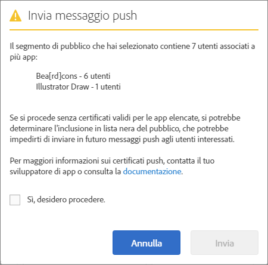

# Pubblico: messaggi push {#audience-define-and-configure-audience-segments-for-push-messages}

Puoi definire e configurare le opzioni relative al pubblico per i messaggi push: intervalli di date, segmenti di Analytics e segmenti personalizzati.

## Definire i segmenti di pubblico {#section_7C4D2393CF7441959FE2381A02867CAC}

Quando si crea un segmento di pubblico per i messaggi push, esso può includere utenti di una o più app perché le suite di rapporti o le suite di rapporti virtuali potrebbero contenere dati provenienti da una o più app. Per maggiori informazioni sulle suite di rapporti virtuali, vedi   [Suite di rapporti virtuali](/help/using/manage-apps/c-mob-vrs.md).

In Adobe Mobile Services, gli addetti al marketing possono inviare messaggi push a una sola app per piattaforma. Se gli addetti al marketing tentano di inviare messaggi push a segmenti contenenti utenti di più app, viene visualizzato un avviso in cui viene comunicato che procedendo è possibile causare gravi errori di invio push e il potenziale inserimento degli utenti nella blocklist. Se incontri un errore di invio push, vedi *Risoluzione degli errori di invio push* in   [Risoluzione dei problemi dei messaggi push](/help/using/in-app-messaging/t-create-push-message/c-schedule-push-message.md).

Per utilizzare i dati di Audience Manager nelle tue definizioni di segmenti, vedi [Audience Analytics](https://experienceleague.adobe.com/docs/analytics/integration/audience-analytics/mc-audiences-aam.html).

>[!IMPORTANT]
>
>Se gli utenti dell’app vengono inseriti nella blocklist, gli addetti al marketing non potranno **mai più** inviare messaggi push agli utenti in questione.

Se scegli un segmento di pubblico che contiene utenti di più app, potresti incontrare il seguente messaggio di avviso:

Il nome app è basato su una versione ridotta dell’appId, che viene inviata automaticamente ad Adobe Analytics dall’SDK per Mobile Services nel formato `<app name> <version number> (<bundle id>)`.

>[!TIP]
>
>Il numero di versione è facoltativo.

Vengono rimossi fino a 6 serie di numeri dalla versione e fino a 5 serie di numeri dall’ID bundle.

Ad esempio:

* `Bea[rd]cons 1.0 (123)` verrà visualizzato come `Bea[rd]cons`
* `Bea[rd]cons 1.2 (1.2)` verrà visualizzato come `Bea[rd]cons`
* `Bea[rd]cons 1.2.3.4.5.6.7 (1111)` verrà visualizzato come `Bea[rd]cons .7`
* `Bea[rd]cons 1.2.3. (1.2.3.4.5.6)` verrà visualizzato come `Bea[rd]cons (.6)`

Per continuare a inviare il messaggio push alle app elencate, seleziona la casella di controllo **[!UICONTROL Sì, desidero procedere.]** e fai clic su **[!UICONTROL Invia]**.

## Procedure consigliate

Seguono alcune procedure consigliate da osservare:

* Per non fare confusione, **evita** di definire suite di rapporti virtuali per app mobili che contengono dati di più app.
* Utilizza un ID app univoco per un segmento di pubblico **ogni** volta che vuoi inviare un messaggio push.
In questo modo, le notifiche push vengono inviate a un segmento di pubblico che appartiene a **una sola** app.

### Esempi

Di seguito sono riportati alcuni esempi per comprendere come definire correttamente i segmenti:

**Procedura corretta**: l’addetto al marketing fornisce dei certificati push per le versioni iOS e Android di un’app, ad esempio Adobe Photoshop. L’addetto al marketing potrebbe inviare una notifica push a un segmento di utenti che si estende su entrambe le piattaforme.

**Procedura non corretta**: l’addetto al marketing fornisce certificati push per le versioni iOS e Android di un’app, ad esempio Adobe Photoshop. Se l’addetto al marketing crea e invia messaggi push a un segmento di *tutti gli utenti attivi negli ultimi 30 giorni*, solo gli utenti dell’app Android e iOS di Adobe Photoshop riceveranno i messaggi push, mentre gli utenti dell’app Android e iOS di Adobe Illustrator verranno inseriti nella blocklist. Per un esempio più dettagliato, vedi *Risoluzione degli errori relativi ai messaggi push* in   [Risoluzione dei problemi dei messaggi push](/help/using/in-app-messaging/t-create-push-message/c-troubleshooting-push-messaging.md).

## Configurare i segmenti di pubblico {#section_A92C60885A30421B8150820EC1CCBF13}

1. Vai alla pagina Pubblico per visualizzare un nuovo messaggio push.

   Per ulteriori informazioni, consulta [Creare un messaggio push](/help/using/in-app-messaging/t-create-push-message/t-create-push-message.md).

   Quando configuri i messaggi push, ricorda le seguenti informazioni **importanti**:

   * Il **[!UICONTROL Pubblico con consenso stimato]** rappresenta il numero di dispositivi che corrispondono al segmento di Adobe Analytics **e** al numero di dispositivi con consenso.

      È possibile visualizzare una stima del numero di utenti nei segmenti selezionati che hanno prestato il consenso alla ricezione dei messaggi e che riceveranno il messaggio push. Sotto la stima viene indicato il numero totale di utenti dell’app, che abbiano prestato o meno il consenso.

   * Il **[!UICONTROL Totale]** è il numero di dispositivi che corrispondono al segmento di Adobe Analytics.

   * I messaggi push sono inviati ai dispositivi che fanno parte di un segmento Adobe Analytics definito **e** hanno prestato il consenso per i messaggi push.

      Questo significa che l’SDK ha inviato un valore `True` per l’eVar Messaggio push di consenso.

   * Anche se il dispositivo ha un token dispositivo valido, il messaggio non viene inviato al dispositivo a meno che Adobe Analytics non abbia impostato il flag che indica il consenso prestato.

   * Per ulteriori informazioni sulla risoluzione dei problemi dei messaggi push, vedi:

      * [Messaggi push in iOS](https://docs.adobe.com/content/help/it-IT/mobile-services/ios/messaging-ios/push-messaging/push-messaging.html)

      * [Messaggi push in Android](https://docs.adobe.com/content/help/it-IT/mobile-services/android/messaging-android/push-messaging/push-messaging.html)

1. Digita le informazioni nei campi seguenti:

   * **[!UICONTROL Periodo]**

      Specifica l’intervallo di tempo da utilizzare per il pubblico stimato. Dall’elenco a discesa **[!UICONTROL Periodo]**, seleziona un’opzione:

   * **[!UICONTROL Ultimo/i:]** seleziona un periodo di tempo relativo (ad esempio gli ultimi 7, 30 o 60 giorni) dal momento in cui è pianificato il push del messaggio.

      Per esempio, se selezioni gli ultimi 30 giorni e pianifichi l’invio in push del messaggio per il 31 ottobre, il pubblico stimato corrisponderebbe al numero di utenti che hanno acconsentito alla ricezione dei messaggi push nei 30 giorni precedenti al 31 ottobre.

   * **[!UICONTROL Intervallo statico:]** seleziona un intervallo di tempo statico scegliendo la data di inizio e la data di fine per il pubblico stimato.

      Rifacendoci all’esempio precedente, se selezioni un intervallo di date che va dal 1° al 15 ottobre ma pianifichi l’invio in push del messaggio per il 31 ottobre, il pubblico stimato corrisponderebbe al numero di utenti che hanno acconsentito alla ricezione dei messaggi push nell’intervallo di tempo statico specificato (dal 1° al 15 ottobre).

   * **[!UICONTROL Segmenti di Analytics]**

      Seleziona un segmento esistente di Adobe Analytics dall’elenco a discesa. Per ulteriori informazioni, consulta [Generazione di segmenti](https://docs.adobe.com/content/help/it-IT/analytics/components/segmentation/segmentation-workflow/seg-build.html).

   * **[!UICONTROL Segmenti personalizzati]**

      Seleziona una metrica o una variabile dall’elenco a discesa (ad esempio, **[!UICONTROL Giorni dall’ultimo utilizzo]** o **[!UICONTROL Punto di interesse]**), quindi configura il filtro nel modo desiderato. Ad esempio, il segmento personalizzato seguente ha come target gli utenti che hanno uno smartphone iOS e si trovano nell’area della California (Stati Uniti).
   >[!IMPORTANT]
   >
   >Nella sezione **[!UICONTROL Crea pubblico]**, se fai clic su **[!UICONTROL E]**, viene visualizzata una finestra di dialogo che ti ricorda di verificare che ogni app indicata **deve** avere un certificato valido. Se invece fai clic su **[!UICONTROL O]**, viene visualizzata la finestra di dialogo predefinita. Per maggiori informazioni sui certificati validi e sulle suite di rapporti, vedi [Suite di rapporti virtuali](/help/using/manage-apps/c-mob-vrs.md).
