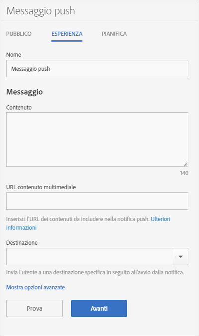

# Experience: push message {#experience-push-message}

Puoi configurare le opzioni relative all'esperienza dei messaggi push standard e potenziati: nome, testo del messaggio e opzioni di destinazione. Puoi anche configurare opzioni avanzate quali quelle relative al payload e le opzioni personalizzate per i dispositivi iOS.

1. On the Audience page for a new push message, click Experience.****

   

1. Specifica un nome per il messaggio.
1. Compila i seguenti campi nella sezione **[!UICONTROL Messaggio]:**

   * **[!UICONTROL Contenuto]**

      Specifica il testo del messaggio. Puoi immettere fino a 140 caratteri.

   * **[!UICONTROL URL contenuto multimediale]**

      Inserisci l'URL del file multimediale che intendi utilizzare nel messaggio di notifica push. For requirements to use rich push notifications, see Requirements for Rich Push Notifications below.**

      >[!IMPORTANT]
      >
      >Per visualizzare un'immagine o un video in una notifica push, tieni presente quanto segue:
      > * I dati `attachment-url` vengono gestiti dal payload push.
      > * L'URL del contenuto multimediale deve essere in grado di gestire i picchi di richieste.

   * **[!UICONTROL Destinazione]**

      Seleziona una destinazione specifica, ad esempio un collegamento web, profondo o ibrido, alla quale indirizzare l'utente che fa clic sul messaggio. For more information, see [Destinations](/help/using/acquisition-main/c-create-destinations.md).

      >[!TIP]
      >
      >When you use the * **[!UICONTROL Web Link]** or **[!UICONTROL Custom Link]** destination types, the destination type is not tracked. Solo i **[!UICONTROL collegamenti profondi]vengono tracciati.**

## Requisiti per le notifiche push potenziate

Here are the requirements for sending rich push notifications:

* **Versioni supportate**

   Rich push notifications are supported on the following versions:
   * Android 4.1.0 o successivo
   * iOS 10 o successivo

      >[!IMPORTANT]
      >
      >Considerazioni da ricordare:
      >* I messaggi push potenziati inviati a versioni precedenti verranno comunque inviati, ma viene visualizzato solo il testo.
      >* Al momento il supporto per gli orologi non è disponibile.

* **Formati file**

   Sono supportati i formati file seguenti:
   * Immagini: JPG e PNG
   * Animazioni (solo iOS): GIF
   * Video (solo iOS): MP4

* **URL Formats**
   * Solo HTTPS

* **Dimensioni**
   * Le immagini devono essere in formato 2:1, altrimenti verranno ritagliate.

Per ulteriori informazioni sulla configurazione delle notifiche push potenziate, vedi:

* [Receive Push Notifications in Android](/help/android/messaging-main/push-messaging/c-set-up-rich-push-notif-android.md)
* [Ricevere notifiche push potenziate in iOS](/help/ios/messaging-main/push-messaging/c-set-up-rich-push-notif-ios.md)

To configure a push message on the Experience page:

1. (**Optional**) Click the **[!UICONTROL Show Advanced Options]** link to configure additional options:

   * **[!UICONTROL Payload: Dati]**

      Specifica un payload push personalizzato in JSON da inviare all'app tramite una notifica push o locale. Il limite per Android e iOS è di 4 KB.

   * **[!UICONTROL Opzioni Apple: Categoria]**

      Specifica una categoria per le notifiche push e locali. Per maggiori informazioni, vedi [Managing Your App's Notification Support](https://developer.apple.com/library/content/documentation/NetworkingInternet/Conceptual/RemoteNotificationsPG/SupportingNotificationsinYourApp.html#//apple_ref/doc/uid/TP40008194-CH4-SW9) nella *iOS Developer Library*.

   * **[!UICONTROL Opzioni Apple: Suono]**

      Specifica il nome del file audio da riprodurre nel pacchetto dell'app. Se non viene impostato, viene utilizzato un avviso sonoro predefinito. Per maggiori informazioni, vedi [Managing Your App's Notificaton Support](https://developer.apple.com/library/content/documentation/NetworkingInternet/Conceptual/RemoteNotificationsPG/SupportingNotificationsinYourApp.html#//apple_ref/doc/uid/TP40008194-CH4-SW10) nella *iOS Developer Library*.

   * **[!UICONTROL Opzioni Apple: Contenuto disponibile]**

      Seleziona questa opzione affinché, all'arrivo del messaggio, iOS riattivi l'app in background e le consenta di eseguire un codice in base al payload del messaggio. Per maggiori informazioni, vedi [Apple Push Notification Service](https://developer.apple.com/library/content/documentation/NetworkingInternet/Conceptual/RemoteNotificationsPG/APNSOverview.html#//apple_ref/doc/uid/TP40008194-CH8-SW1) nella *iOS Developer Library*.

1. (Facoltativo) Per verificare il layout del messaggio, fai clic sulle icone seguenti:

   * **[!UICONTROL x Summary}**

      Nasconde il riquadro di anteprima. Click preview to display the preview pane again.

   * **[!UICONTROL Change the orientation]**

      To change the orientation of the preview from portrait to landscape mode, click . Per gli orologi, l'orientamento cambia da quadrante rotondo a quadrante quadrato.

   * **[!UICONTROL Preview on a user's watch]**

      To preview your message as it will appear on a users's watches click watch icon.

   * **[!UICONTROL Anteprima sul cellulare di un utente]**

      Per visualizzare l'anteprima del messaggio così come apparirà sul telefono cellulare di un utente, fai clic sull'icona telefono.

   * **[!UICONTROL Preview on a user's tablet]**

      Per visualizzare l'anteprima del messaggio sul tablet di un utente, fai clic sull'icona tablet.
   Nella parte inferiore del riquadro di anteprima puoi visualizzare una descrizione del pubblico che hai selezionato nel passaggi precedente.

1. (**Optional**) Click **[!UICONTROL Test]** to push your message to specified devices for testing purposes.
1. Seleziona il servizio e digita i token di push per almeno uno dei dispositivi ai quali vuoi inviare il messaggio push.

   Per inviare il messaggio a più dispositivi, specifica i vari token in un elenco di voci separate da virgole.

1. Configura le le opzioni di pianificazione per il messaggio.

   Per ulteriori informazioni, consulta [Pianificazione: messaggio](/help/using/in-app-messaging/t-create-push-message/c-schedule-push-message.md)push.
