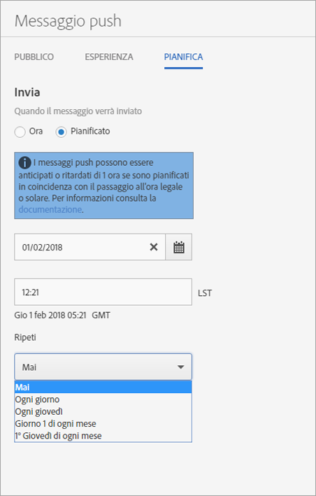

# Pianificazione: messaggi push{#schedule-push-message}

Nell'interfaccia di Adobe Mobile Services puoi pianificare un messaggio push per l'invio immediato, successivo o come evento ricorrente. Questi eventi possono essere pianificati su base giornaliera, settimanale o mensile.

>[!TIP]
>
>Users can modify the scheduling settings for a push message job at any time. Se non esiste una data valida per l'invio di un messaggio ricorrente (ad esempio il 31 febbraio, per un lavoro ricorrente pianificato per il 31° giorno del mese, oppure il 5° martedì del mese), il messaggio non viene inviato.

Considerazioni da ricordare:

* Il formato di data e ora corretto è `hh:mm` e `mm/dd/yyyy`.

* Puoi modificare un messaggio pianificato nei modi seguenti:

   * Cambia la data in una data successiva.
   * Modificando l'intervallo di ripetizione.

      Ad esempio, se il messaggio originale veniva inviato ogni giorno, puoi impostare la ricorrenza settimanale.

## Prima di pianificare messaggi push ricorrenti

È **fondamentale** comprendere le informazioni seguenti prima di pianificare dei messaggi push ricorrenti:

* Le opzioni visualizzate nell'elenco a discesa **[!UICONTROL Ripeti]dipendono dalla data che hai digitato o selezionato.**

   Ad esempio, se hai digitato `Saturday, October 7`, vengono visualizzate le seguenti opzioni:

   * **[!UICONTROL Mai]**
   * **[!UICONTROL Ogni giorno]**
   * **[!UICONTROL Ogni sabato]**
   * **[!UICONTROL Giorno 7 di ogni mese]**
   * **[!UICONTROL 1° sabato di ogni mese]**

* I messaggi push vengono pianificati e inviati in base all'Ora di Greenwich (GMT).

   Ad esempio, se hai pianificato un messaggio ricorrente da inviare ogni sabato alle 12:00 (mezzogiorno) **PST** (ora del Pacifico), a partire dal 7 ottobre, il messaggio verrà in realtà inviato di sabato alle 19:00 **GMT**.
* I messaggi vengono inviati in modo diverso a seconda che tu ti trovi negli Stati Uniti, in Europa o in Asia.

   Ad esempio, se ti trovi a San Jose, California, e pianifichi un messaggio da inviare il ***31 ottobre*** alle 17:30 **PST**, l'invio avverrà effettivamente il ***1° novembre*** alle 00:30 **GMT**. Se sei a Tokyo e pianifichi un messaggio da inviare il ***1° gennaio*** alle 05:30, l'invio avverrà effettivamente il ***31 dicembre*** alle 20:30 **GMT**.
* I messaggi push vengono inviati un'ora prima o dopo a seconda che sia attiva o meno l'ora legale.
* Nel rapporto sui messaggi push, il messaggio è indicato rispetto al fuso orario del tuo sistema.

   Ad esempio, se l'orario di invio è 12:00 **PST**, anche se il messaggio sarà inviato effettivamente alle 19:00 **GMT**, nel rapporto risulterà inviato alle 12:00 **PST**.

## Schedule a recurring push message {#section_675BD754E5A04423A1751193698A978F}

1. Nella pagina Pianifica per un nuovo messaggio push, seleziona **[!UICONTROL Pianificato]** o **[!UICONTROL Ora]**.

   For more information, see [Create a push message](/help/using/in-app-messaging/t-create-push-message/t-create-push-message.md).

   If you selected **[!UICONTROL Now]**, the message is pushed immediately. Per evitare che il messaggio venga pianificato subito, fai clic su **[!UICONTROL Salva come bozza]**.

   

1. If you selected **[!UICONTROL Scheduled]**, click the calendar icon and select or type a start date.
1. Digita un orario. 
1. Under **[!UICONTROL Repeat]**, select one of the following options:

   * **[!UICONTROL Mai]**
   * **[!UICONTROL Ogni giorno]**
   * **[!UICONTROL Ogni martedì]**
   * **`<Day x>`del mese**

      Le opzioni visualizzate variano a seconda del giorno selezionato come giorno iniziale.
   * **`<nth day>`di ogni mese**

      Il valore visualizzato cambia a seconda della data che hai selezionato o digitato come data iniziale.

1. In **[!UICONTROL End Repeat]**, type an end date and time.
1. Fai clic su una delle opzioni seguenti:

   * **[!UICONTROL Salva come bozza]**

      Il messaggio viene inviato in formato bozza. Puoi scegliere questa opzione per salvare un messaggio non ancora completato oppure per salvarne una versione provvisoria che dovrà essere modificata e approvata prima dell'attivazione.

      If you selected **[!UICONTROL Now]** in the previous step, the draft message is sent immediately on activation. Se hai selezionato una data e un'ora per inviare il messaggio push, il messaggio viene inviato in base a questa pianificazione.

   * **[!UICONTROL Salva e pianifica]**

      Il messaggio viene inviato nel giorno e all'ora pianificati.

Per inviare la bozza di messaggio in un secondo momento, effettua una delle operazioni seguenti:

* Click **[!UICONTROL Manage Messages]**, select the check box next to the message, and click **[!UICONTROL Activate Selected]**.
* Fai clic su **[!UICONTROL Salva e invia]per salvare il messaggio e inviarlo.**
