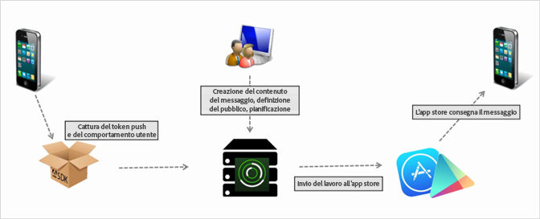

# Creare un messaggio push {#create-a-push-message}

Puoi inviare messaggi push ai segmenti Analytics dall'interfaccia utente di Mobile Services per sfruttare i sofisticati dati di Analytics nell'interazione con gli utenti.

>[!IMPORTANT]
>
>Prima di creare un messaggio push, vedi [Prerequisiti per abilitare i messaggi](/help/using/c-manage-app-settings/c-mob-confg-app/configure-push-messaging/prerequisites-push-messaging.md)push.

I messaggi push vengono visualizzati agli utenti che hanno acconsentito alla ricezione di notifiche quando non stanno utilizzando attivamente l'app. Queste notifiche avvisano gli utenti di nuovi aggiornamenti, offerte e promemoria. Grazie a queste notifiche, puoi creare, testare, gestire e includere nei rapporti i messaggi push in un flusso di lavoro semplificato.

I messaggi push vengono inviati tramite server dagli app store anziché Adobe Mobile Services:

Per creare un messaggio push:

1. Click ***your_app_name*** &gt; **[!UICONTROL Messaging]** &gt; **[!UICONTROL Manage Messages]** &gt; **[!UICONTROL Create Message]** &gt; **[!UICONTROL Create Push]**.
1. Configure the audience options.

   For more information, see Audience: define and configure audience segments for push messages.
