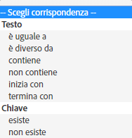

# Pubblico: messaggio in-app {#audience-in-app-message}

Puoi configurare le opzioni relative al pubblico per i messaggi in-app, incluso vista, attivatore e caratteristiche.

1. In your app, click **[!UICONTROL Messaging]** > **[!UICONTROL Manage Messages]** > **[!UICONTROL Create Message]** > **[!UICONTROL Create In-App]**.
1. Nella pagina Pubblico, digita le informazioni nei campi seguenti:

   * **[!UICONTROL Visualizzazione]**

      Specifica l’opzione che attiva la visualizzazione di un messaggio:

      * **[!UICONTROL Sempre]**

         Il messaggio viene visualizzato ogni volta che si verifica l’evento di attivazione.

      * **[!UICONTROL Una volta]**

         Il messaggio viene visualizzato solo la prima volta che si verifica l’evento di attivazione.

      * **[!UICONTROL Fino al click-through]**

         Il messaggio viene visualizzato ogni volta che si verifica l’evento di attivazione fino al click-through dell’utente. Questo attivatore vale solo per i messaggi a schermo intero e di avviso. La maggior parte dei messaggi richiede un reindirizzamento o utilizza una risorsa da Internet e non viene visualizzata in modalità offline. Per visualizzare sempre il messaggio indipendentemente dalla connettività di rete, seleziona la casella di controllo **[!UICONTROL Mostra offline]**.
   * **[!UICONTROL Attivatore]**

      Seleziona un’opzione dall’elenco a discesa, quindi scegli una condizione. Ad esempio, seleziona **[!UICONTROL Avviato]** dal primo elenco a discesa ed **[!UICONTROL Esiste]** dal secondo. Per visualizzare il messaggio, puoi inoltre specificare dati di contesto personalizzato che devono essere inclusi nell’hit di attivazione.

      >[!IMPORTANT]
      >
      >Se selezioni più attivatori, devono verificarsi tutti sullo stesso hit per attivare la visualizzazione del messaggio.

   * **[!UICONTROL Caratteristiche]**
Puoi scegliere chi deve visualizzare il messaggio in-app quando viene attivato e filtrare (segmentare) il pubblico in base a hit con dati specifici. Ad esempio, puoi definire una regola in cui i punti di interesse contengono Denver. Questo filtro consente di mostrare il messaggio a clienti che rientrano in uno dei tuoi punti di interesse il cui nome contiene Denver, al momento dell’attivazione.

## Informazioni aggiuntive su caratteristiche e attivatori {#section_48C39EFB8CAA4F62B994FCC91DF588E6}

>[!IMPORTANT]
>
>Gli attivatori e le caratteristiche utilizzano dati trasmessi ad Analytics dalla tua app. Questi valori vengono passati come dati contestuali, variabili mappate e metriche. Una variabile è un valore basato su testo e una metrica è un valore numerico.

To see the mapping of these key value pairs in the Mobile Services UI and validate the value for your trigger, click **[!UICONTROL Manage App Settings]** >  **[!UICONTROL Manage Variables &amp; Metrics]** >, which displays the following tabs:

* **[!UICONTROL Variabili standard e metriche]**
* **[!UICONTROL Variabili personalizzate]**
* **[!UICONTROL Metriche personalizzate]**

Convalida la mappatura, quindi seleziona la corrispondenza o l’operatore logico appropriato per configurare il pubblico per il messaggio.

### Selezione di metriche e variabili {#example_AB126F03BD1C4094B791E230B3DB1189}

Gli scenari di seguito sono utili per determinare se selezionare una metrica o una variabile per l’attivatore:

### Metrics (Metriche)

Una metrica è un valore numerico, ad esempio il numero di acquisti effettuati.

1. Click **[!UICONTROL Manage Messages]** > **[!UICONTROL Create Message]**.
1. Completa i seguenti passaggi nella sezione **[!UICONTROL Attivatore]** della scheda **[!UICONTROL Pubblico]**:

   1. Seleziona un evento standard, ad esempio **[!UICONTROL Avviato]** e seleziona **[!UICONTROL esiste]**.
   1. Seleziona un secondo attivatore che sia un punto dati personalizzato, mappato su una metrica.
   1. In **[!UICONTROL Numero]**, seleziona un’opzione di corrispondenza.

### Variabili

Una variabile è una stringa di testo che sia un identificatore univoco, ad esempio paese, aeroporto e così via.

1. Click **[!UICONTROL Manage Messages]** > **[!UICONTROL Create Message]**.
1. Completa i seguenti passaggi nella sezione **[!UICONTROL Attivatore]** della scheda **[!UICONTROL Pubblico]**:

   1. Seleziona un evento standard, ad esempio **[!UICONTROL Avviato]** e seleziona **[!UICONTROL esiste]**.
   1. Seleziona un secondo attivatore che sia un punto dati personalizzato, mappato su una variabile.
   1. In **[!UICONTROL Testo]**, seleziona un’opzione di corrispondenza.

Per ulteriori informazioni su dati di contesto, variabili e metriche, consulta [Gestione dell’app](/help/using/manage-apps/manage-apps.md).
