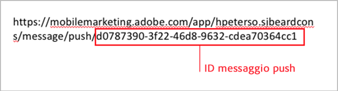
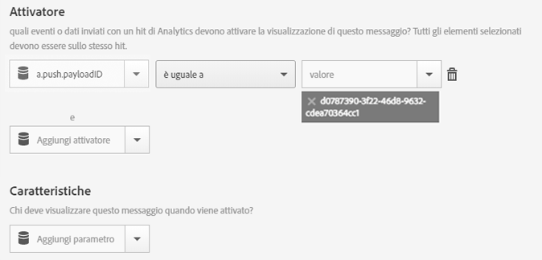

# Attivare un messaggio in-app quando l’app viene aperta da un messaggio push{#trigger-an-in-app-message-when-the-app-is-opened-from-a-push-message}

È possibile impostare come attivatore del messaggio in-app l’ID del messaggio push che viene inviato quando un utente apre l’app dal messaggio push.

1. Ottieni l’ID del messaggio push che sarà inviato all’utente.

   Puoi ricavare l’ID del messaggio push dall’URL durante il flusso di lavoro di creazione del messaggio.

   Ecco un esempio:

   

1. Salva e attiva il messaggio in-app con il seguente attivatore:

   `“a.push.payloadID” =`

   >[!TIP]
   >
   >L’ID del messaggio push è l’ID individuato al punto 1.

   Questo attivatore deve essere aggiunto manualmente perché non è disponibile nell’elenco a discesa **[!UICONTROL Attivatore]**.

   

1. Salva e invia il messaggio push che ha l’ID push individuato al punto 1.
1. Fai clic sul messaggio push per aprire l’app e verifica che il messaggio in-app sia visualizzato quando l’app si apre.

   Durante il test, tenete presenti le informazioni seguenti:

   * Dopo aver salvato il messaggio in-app, l&#39;aggiornamento del file di configurazione in hosting con il nuovo messaggio richiede circa 45 secondi.
   * L’app cerca gli aggiornamenti del file di configurazione (il nuovo messaggio in-app) quando viene eseguito un **nuovo** avvio, quindi devi assicurarti che l’app attivi un nuovo avvio quando fai clic sul messaggio push.

   In genere, questo significa controllare che sia scaduto l’intervallo di timeout della sessione. L’intervallo predefinito è di 5 minuti.

