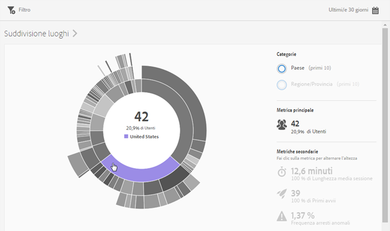

# Panoramica (Posizione){#overview-location}

The **[!UICONTROL Location Overview]** report lets you see the different countries, regions, and points of interest (POI) where your app is being used.

Questo rapporto fornisce una visualizzazione sunburst dei dati esistenti; può essere utilizzato per scoprire i segmenti di pubblico (raccolte di visitatori) per il targeting. La creazione e la gestione dei tipi di pubblico è simile alla creazione e all’utilizzo dei segmenti, con la differenza che un pubblico può essere reso disponibile in Experience Cloud.

Seguono alcune informazioni aggiuntive su questo rapporto:

## Navigation and usage {#section_4A88C3849B5847BF8CF433CCFD99FDC3}

Questa visualizzazione fornisce, ad esempio, il rapporto di base con le suddivisioni. La visualizzazione utilizza l'altezza per mostrare la metrica in questione e le differenze di prestazioni tra le metriche. Ciascun anello rappresenta un segmento di pubblico nella categoria dell'anello. Puoi intraprendere azioni su un pubblico, quali l'applicazione di un filtro fisso e la visualizzazione di metriche.

>[!TIP]
>
>Oltre a queste informazioni, puoi visualizzare un'esercitazione interna al prodotto che descrive come interagire con il grafico sunburst. Per avviare l'esercitazione, fai clic su **[!UICONTROL Suddivisione luoghi]** nella barra del titolo del rapporto, quindi fai clic sull'icona **i[!UICONTROL .]**

Questo grafico sunburst è interattivo. Per modificare il periodo temporale, fai clic sull'icona **[!UICONTROL Calendario]in alto a destra.** Per visualizzare ulteriori informazioni, passa il cursore sopra una parte del grafico. Ad esempio, nell'illustrazione seguente, si possono vedere il numero totale e la percentuale di utenti che usano l'app negli Stati Uniti.

In questa illustrazione, i pulsanti **[!UICONTROL Categorie]** in alto a destra permettono di alternare tra le informazioni sui dieci paesi e aree geografiche principali e i tre principali **[!UICONTROL punti di interesse]**.

Questa è la visualizzazione quando si seleziona **[!UICONTROL Paese]**:

Questa è la visualizzazione quando si seleziona **[!UICONTROL Punti di interesse]**:

Puoi fare clic su una sezione dell’anello per selezionare il pubblico su cui eseguire azioni quali ingrandire, nascondere dei tipi di pubblico, creare un messaggio in-app o un filtro fisso.

Puoi fare clic su una metrica secondaria a destra per aggiungerla alla visualizzazione e visualizzarla scegliendo un colore, un'altezza o entrambi.

## Add breakdowns and metrics {#section_15833511E82648869E7B1EFC24EF7B82}

Puoi aggiungere suddivisioni e metriche secondarie, che modificano l'altezza di ogni pubblico rispetto ai tipi di pubblico riportati nel grafico.

>[!TIP]
>
>Più anelli vengono aggiunti al grafico sunburst, più tempo necessario per elaborare.

Per aggiungere suddivisioni e metriche secondarie, fai clic su **[!UICONTROL Suddivisione luoghi]** nella barra del titolo del rapporto, quindi fai clic su **Personalizza]per aprire la barra laterale destra.[!UICONTROL **

When you click **[!UICONTROL Add Breakdown]** or **[!UICONTROL Add Metric]**, a new item displays with the same name as the previous item in the respective list. Fai clic sulla suddivisione o metrica appena creata per accedere a un elenco a discesa dal quale selezionare un nuovo elemento.

## Create a sticky filter {#section_365999D49FC744ECBF9273132497E06C}

Fai clic su una sezione dell'anello per selezionare il pubblico per il quale vuoi creare un filtro fisso, quindi fai clic su **[!UICONTROL Filtro fisso]**. Il filtro fisso consente di applicare i filtri correnti e di eseguire un nuovo rapporto basato sui filtri.

## Condividere i rapporti {#section_F8AF2AA73D4C4C008976D45847F82D0B}

Dopo che hai creato un rapporto, le tue impostazioni vengono utilizzate per creare un URL personalizzato, che puoi copiare e condividere.

## Informazioni aggiuntive

Per ulteriori informazioni sulla localizzazione, consulta:

* [Mappa](/help/using/location/c-map-points.md)
* [Gestire i punti di interesse](/help/using/location/t-manage-points.md)