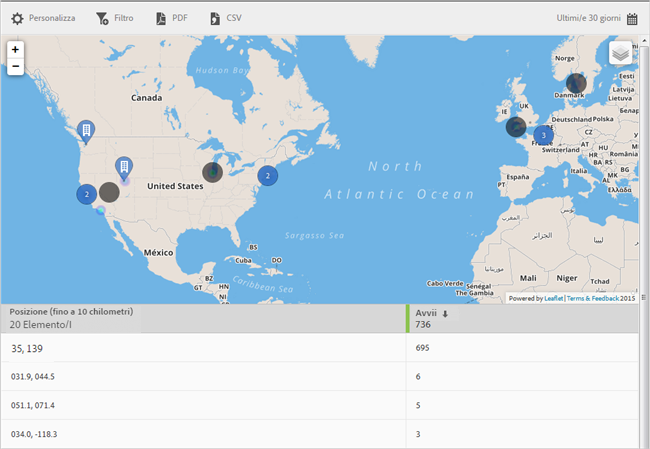

# Mappa {#map}

Puoi visualizzare una mappa interattiva con i tuoi punti di interesse e altri marcatori dati.

Seguono alcune considerazioni importanti da tenere a mente:

* Puoi aumentare o diminuire la dimensione della mappa.

   Questa funzione è utile, ad esempio, se hai due punti di interesse vicini tra loro. Ingrandendo la mappa ne puoi osservare meglio i dettagli.
* I punti di interesse sono visualizzati in blu.

   Altri marcatori di dati sono indicati in nero (ad esempio gli avvii). Fai clic su un marcatore per visualizzare maggiori informazioni.

Fai clic su  per selezionare le opzioni seguenti:

* **[!UICONTROL Mappa]**

   Visualizza una mappa semplice.

* **[!UICONTROL Satellite]**
Visualizza la mappa in versione satellitare.

* **[!UICONTROL Marcatori dati]**

   Scegli se visualizzare i marcatori neri dei dati.

* **[!UICONTROL Mappa di calore]**

   Scegli se visualizzare i marcatori della mappa di calore. Maggiore è l’intensità del colore, più alta è la frequenza con cui si verifica la relativa condizione (ad esempio, gli avvii).

* **[!UICONTROL Punti di interesse]**

   Scegli se visualizzare i punti di interesse.

Per questo rapporto puoi configurare le seguenti opzioni:

* **[!UICONTROL Periodo di tempo]**

   Fai clic sull’icona **[!UICONTROL Calendario]** per selezionare un periodo di tempo personalizzato o per sceglierne uno preimpostato dall’elenco a discesa.

* **[!UICONTROL Personalizza]**

   Per personalizzare i rapporti, puoi modificare le opzioni **[!UICONTROL Mostra per]**, aggiungere metriche e filtri, aggiungere serie (metriche) supplementari e altri elementi. Per ulteriori informazioni, vedi [Personalizzare i rapporti](/help/using/usage/reports-customize/t-reports-customize.md).

* **[!UICONTROL Filtro]**

   Fai clic su **[!UICONTROL Filtro]** per creare un filtro per più rapporti in modo da visualizzare il comportamento di un segmento in tutti i rapporti mobili. Un filtro fisso consente di definire un filtro applicato a tutti i rapporti non di percorso. Per ulteriori informazioni, consulta [Aggiungere un filtro fisso](/help/using/usage/reports-customize/t-sticky-filter.md).

* **[!UICONTROL Scarica]**

   Fai clic su **[!UICONTROL PDF]** o **[!UICONTROL CSV]** per scaricare o aprire dei documenti e condividerli con utenti che non hanno accesso a Mobile Services oppure per utilizzarli in presentazioni.