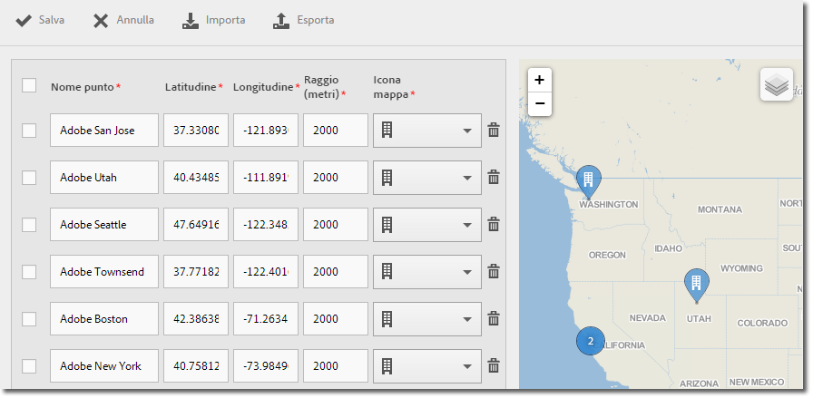

# Manage points of interest {#manage-points-of-interest}

Puoi creare e gestire i POI, che ti consentono di definire posizioni geografiche da utilizzare per correlazioni, come destinazioni di messaggi in-app e così via. Quando un hit viene inviato in un POI, il POI è collegato all’hit.

Prima di poter utilizzare Location, verifica i seguenti requisiti:

* Devi avere Analytics – Mobile Apps o Analytics Premium.
* Devi abilitare i **[!UICONTROL Rapporti sulla posizione]per l'app.**
* If you are using a version of the iOS SDK or Android SDK older than version 4.2, after adding new **[!UICONTROL Points of Interest]**, you must download a new configuration file and give it to your app developers.

   If you are using the iOS SDK or Android SDK version 4.2 or later, you do not need to submit an app update to the store to update your **[!UICONTROL Points of Interest]**. Nella pagina Gestisci punti di interesse, quando fai clic su **[!UICONTROL Salva]**, le modifiche vengono inserite nell'elenco **[!UICONTROL Punti di interesse]** e il file di configurazione per l'app live viene aggiornato. Il salvataggio aggiorna anche l’elenco dei punti nell’app sui dispositivi dell’utente, purché l’app utilizzi l’SDK aggiornato e la configurazione con un URL POI remoto.

On the user's device, for a hit to be assigned to a **[!UICONTROL Points of Interest]**, location must be enabled for the app.

Per utilizzare Posizione, completare le seguenti attività:

1. Fai clic sul nome dell'app per visualizzare la pagina Gestione impostazioni app.
1. Click **[!UICONTROL Location]** &gt; **[!UICONTROL Manage Points of Interest]**.

   

1. Digitate le informazioni in ciascuno dei campi seguenti:

   * **[!UICONTROL Nome punto]**

      Digita il nome del **[!UICONTROL punto di interesse.]**

      Può essere il nome di una città, una provincia o una regione. Puoi anche creare **[!UICONTROL punti di interesse]intorno a posizioni specifiche, ad esempio uno stadio sportivo o un'azienda.**

   * **[!UICONTROL Latitudine]**

      Digita la latitudine del **[!UICONTROL punto di interesse]**. Puoi ricavare questa informazione da altre fonti, ad esempio Internet.

   * **[!UICONTROL Longitudine]**

      Digita la longitudine del **[!UICONTROL punto di interesse]**. Puoi ricavare questa informazione da altre fonti, ad esempio Internet.

   * **[!UICONTROL Raggio (metri)]**

      Digita il raggio (in metri) intorno al **[!UICONTROL punto di interesse]che vuoi includere.** Ad esempio, se create un POI per Denver in Colorado, potete specificare un raggio sufficientemente ampio che includa la città di Denver e le aree circostanti, escludendo però Colorado Springs.

   * **[!UICONTROL Icona mappa]**

      Selezionate un’icona che verrà visualizzata nei rapporti [Panoramica](/help/using/location/c-location-overview.md) e [Mappa](/help/using/location/c-map-points.md) .

1. Se necessario, aggiungete altri punti di interesse.

   È consigliabile non aggiungerne più di 5.000. Se aggiungi più di 5.000 punti di interesse, potrai salvarli ma riceverai un avviso che ti consiglia di non superare i 5.000 punti di interesse.

1. Fai clic su **[!UICONTROL Salva]**.

To delete one or more POIs, select the applicable check boxes, and click **[!UICONTROL Remove Selected]**.

Click **[!UICONTROL Import]** or **[!UICONTROL Export]** to work with the data by using a `.csv` file instead of using the Adobe Mobile user interface.
