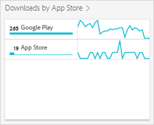

# Rapporto Panoramica dell’app store{#app-store-overview-report}

Il rapporto **[!UICONTROL Panoramica dell’app store]** fornisce un’istantanea delle metriche dell’app store, con informazioni quali numero di download, acquisti in-app, valutazione media nell’app store, ricavi da download, ricavi in-app, download per paese, download per app store e acquisti in-app per nome.

>[!TIP]
>
>Nell’interfaccia di Mobile Services, l’opzione di menu **[!UICONTROL App store]** e il rapporto **[!UICONTROL Panoramica]** sono visibili nel menu di navigazione sinistro dopo che l’integrazione è stata configurata.

Il rapporto **[!UICONTROL Panoramica]** contiene un grafico temporale che visualizza informazioni sul numero di download dall’app store, acquisti in-app effettuati utilizzando la tua app e valutazione media dell’app.

Puoi fare clic su qualsiasi metrica per nascondere o visualizzare la riga corrispondente. Passa il cursore sopra una data per visualizzare i dati di quel giorno.

>[!IMPORTANT]
>
>Le metriche dell’app store, ad esempio download, classificazione, ricavi, valutazione e così via, in Adobe Analytics richiedono integrazione tramite Data Connector con un provider adeguato. `appFigures` attualmente offre un’integrazione, che richiede l’acquisto di uno specifico prodotto e/o servizio da `appFigures` **prima** che sia possibile abilitare l’integrazione. Per maggiori informazioni sulle integrazioni tramite Data Connector, consulta [Adobe Exchange](https://www.adobeexchange.com/experiencecloud.html).

>[!TIP]
>
>Oltre a modificare l’intervallo di date del rapporto facendo clic sull’icona del calendario, puoi personalizzare alcuni dei rapporti con possibilità di approfondimento, aggiungere filtri e serie (metriche), aggiungere filtri fissi e scaricare il rapporto in formato PDF o CSV. Per ulteriori informazioni, vedi [Personalizzare i rapporti](/help/using/usage/reports-customize/reports-customize.md).

## Valutazione media in app store {#section_60D0D21824AE4450BC3E34D7ACA12A7A}

Questo rapporto indica il punteggio medio assegnato dagli utenti alla tua app utilizzando l’apposita funzione dell’app store.

Puoi fare clic in un punto qualsiasi del widget **[!UICONTROL Valutazione media in app store]** per visualizzare un grafico con diagramma che mostra la valutazione media per data. Passa il cursore sopra una data per visualizzare i dati di quel giorno.

## Ricavi da download {#section_34F05998E8444544A1B507C1B852C4EE}

Questo rapporto visualizza la quantità di ricavi generati dai download dell’app.

## Ricavi in-app  {#section_58792ED9C4B54B7D836E30CF09E8E204}

Questo rapporto visualizza la quantità di ricavi generati dagli acquisti effettuati nell’app.

## Download per paese  {#section_10373CD28CA94BA5859DFDEED7D548C6}

Questo rapporto visualizza il numero di download dell’app, raggruppati per paese.

Per visualizzare un grafico con diagramma che mostra il numero di download per paese e per data, fai clic su **[!UICONTROL Download per paese]**. Puoi passare il cursore sopra una data per visualizzare i dati di un giorno.

## Download per app store  {#section_F1CD1A3F0105469D879E4F280CE32484}

Questo rapporto visualizza il numero di download dell’app, raggruppati per app store.

Per visualizzare un grafico con diagramma che mostra il numero di download per app store raggruppati per data, fai clic su **[!UICONTROL Download per app store]**. Puoi passare il cursore sopra una data per visualizzare i dati di quel giorno.

## Acquisti in-app per nome  {#section_D747A64F9F6449E0A02EF31D56C92F83}

Questo rapporto visualizza tutti gli acquisti in-app raggruppati per nome.
