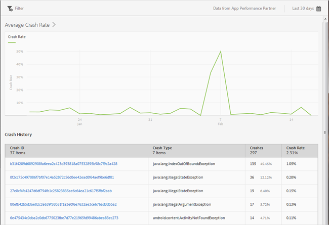

# Rapporto Arresti anomali {#crashes}

Il rapporto **[!UICONTROL Arresti anomali]** fornisce un’istantanea degli arresti anomali dell’app. Puoi verificare il numero di arresti anomali e la frequenza di tali eventi e accedere all’interfaccia utente Apteligent.

>[!IMPORTANT]
>
>Per visualizzare il rapporto **[!UICONTROL Arresti anomali]** nel menu di navigazione di sinistra, devi prima integrare l’app con Apteligent.

Il grafico **[!UICONTROL Frequenza media arresti anomali]** visualizza la frequenza degli arresti per data. Puoi passare il cursore sopra una data per visualizzare la frequenza degli arresti anomali di quel giorno.

Il grafico **[!UICONTROL Cronologia arresti anomali]** visualizza informazioni su ogni arresto anomalo dell’app, indicandone l’ID, il tipo di arresto, quante volte e in che data si sono verificati. Per accedere ad Apteligent al fine di visualizzare più dettagli su un arresto anomalo, fai clic sul collegamento nella colonna **[!UICONTROL ID arresto anomalo].**

Per questo rapporto puoi configurare le seguenti opzioni:

* **[!UICONTROL Periodo di tempo]**

   Fai clic sull’icona **[!UICONTROL Calendario]** per selezionare un periodo di tempo personalizzato o per sceglierne uno preimpostato dall’elenco a discesa.

* **[!UICONTROL Filtro]**

   Fai clic su **[!UICONTROL Filtro]** per creare un filtro per più rapporti in modo da visualizzare il comportamento di un segmento in tutti i rapporti mobili. Un filtro fisso consente di definire un filtro applicato a tutti i rapporti non di percorso.

   Per ulteriori informazioni, consulta [Aggiungere un filtro fisso](/help/using/usage/reports-customize/t-sticky-filter.md).