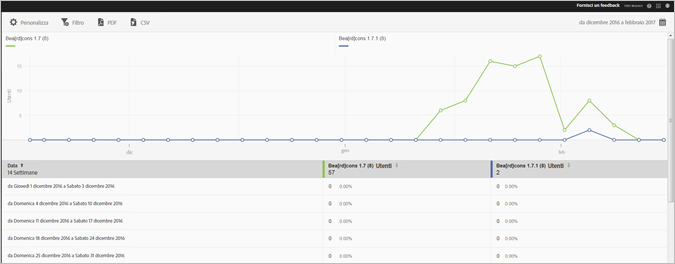

# Versions report {#versions}

Il rapporto Versioni è un rapporto temporale che presenta informazioni sulle diverse versioni dell'app eseguite sui dispositivi degli utenti.

Ecco un esempio di questo rapporto:

