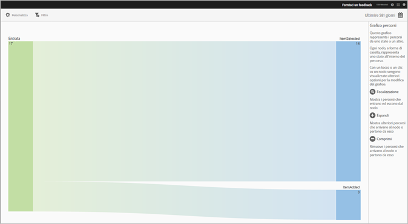
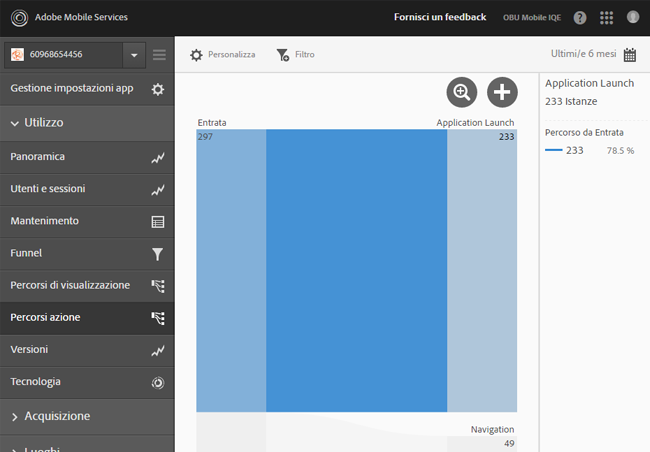
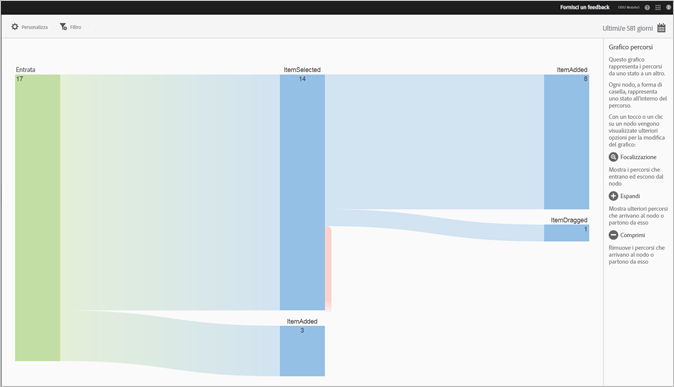
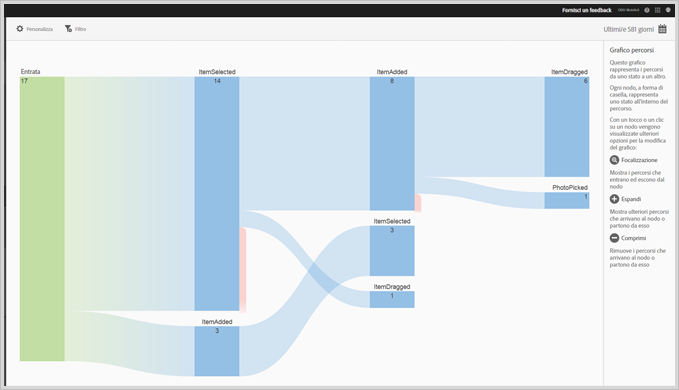
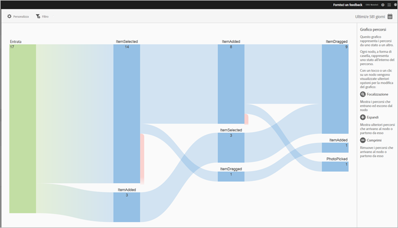

# Rapporto Percorsi azione {#action-paths}

Il rapporto Percorsi azione è basato sull’analisi dei percorsi e visualizza un grafico che rappresenta i percorsi seguiti da uno stato dell’app a un altro stato.

I rapporti **[!UICONTROL Percorsi di visualizzazione]** e **[!UICONTROL Percorsi azione]** sono entrambi relativi ai percorsi. Il rapporto **[!UICONTROL Percorsi di visualizzazione]** ti permette di vedere come gli utenti si spostano nell’app passando da una schermata all’altra. Il rapporto **[!UICONTROL Percorsi azione]** mostra la sequenza di eventi e di azioni (clic, selezioni, ridimensionamento ecc.) eseguite dagli utenti nell’app.

>[!TIP]
>
>Puoi utilizzare un rapporto funnel per combinare la navigazione e le azioni in un unico rapporto. Per ulteriori informazioni, vedi [Funnel](/help/using/usage/reports-funnel.md).

Ogni nodo, a forma di casella, rappresenta uno stato nei percorsi seguiti dall’utente attraverso un’app. Ad esempio, nell’immagine qui sopra, il nodo più in alto rappresenta il numero di utenti che hanno avviato l’app e poi scelto una foto dalla galleria.

Per visualizzare le opzioni di modifica del grafico, fai clic su un nodo e poi su **[!UICONTROL Attiva]** o **[!UICONTROL Espandi]**. Ad esempio, se fai clic sullo stato **[!UICONTROL PhotoPicked]** nel nodo principale, vengono visualizzate le icone **[!UICONTROL Attiva]** ed **[!UICONTROL Espandi]**.

Per espandere, fai clic sull’icona **[!UICONTROL +]**. Questa opzione visualizza i percorsi aggiuntivi in entrata o in uscita rispetto al nodo. Nell’illustrazione seguente, lo stato 1 è l’avvio dell’app, lo stato 2 è la scelta di una foto (l’elemento che abbiamo espanso), lo stato 3 include quattro percorsi differenti che sono stati seguiti dagli utenti:

* Selezione di un elemento
* Aggiunta di un elemento
* Trascinamento di un elemento
* Ridimensionamento di un elemento

L’espansione di uno stato è simile alla creazione di un funnel.

Per isolare il nodo e visualizzare i percorsi che entrano ed escono dal nodo selezionato, fai clic sull’icona . Nell’immagine seguente, i percorsi seguenti sono stati completati **prima** che gli utenti abbiano selezionato una foto:

* Rotazione di un elemento
* Ridimensionamento di un elemento
* Trascinamento di un elemento
* Rimozione di un elemento

Per gli utenti che hanno selezionato una foto, i percorsi seguenti sono stati completati **dopo** la selezione della foto:

* Selezione di un elemento
* Aggiunta di un elemento
* Trascinamento di un elemento
* Ridimensionamento di un elemento

Puoi rendere attivi o espandere più nodi per ottenere una vista dettagliata dei percorsi seguiti dagli utenti nell’app. Ad esempio:

Per questo rapporto puoi configurare le seguenti opzioni:

* **[!UICONTROL Periodo di tempo]**

   Fai clic sull’icona **[!UICONTROL Calendario]** per selezionare un periodo di tempo personalizzato o per sceglierne uno preimpostato dall’elenco a discesa.

* **[!UICONTROL Personalizza]**

   Per personalizzare i rapporti, puoi modificare le opzioni **[!UICONTROL Mostra per]** e aggiungere metriche e filtri, serie (metriche) supplementari e altri elementi. Per ulteriori informazioni, vedi [Personalizzare i rapporti](/help/using/usage/reports-customize/reports-customize.md).

* **[!UICONTROL Filtro]**

   Fai clic su **[!UICONTROL Filtro]** per creare un filtro per più rapporti in modo da visualizzare il comportamento di un segmento in tutti i rapporti mobili. Un filtro fisso consente di definire un filtro applicato a tutti i rapporti non di percorso. Per ulteriori informazioni, consulta [Aggiungere un filtro fisso](/help/using/usage/reports-customize/t-sticky-filter.md).

* **[!UICONTROL Scarica]**

   Fai clic su **[!UICONTROL PDF]** o **[!UICONTROL CSV]** per scaricare o aprire dei documenti e condividerli con utenti che non hanno accesso a Mobile Services oppure per utilizzarli in presentazioni.
