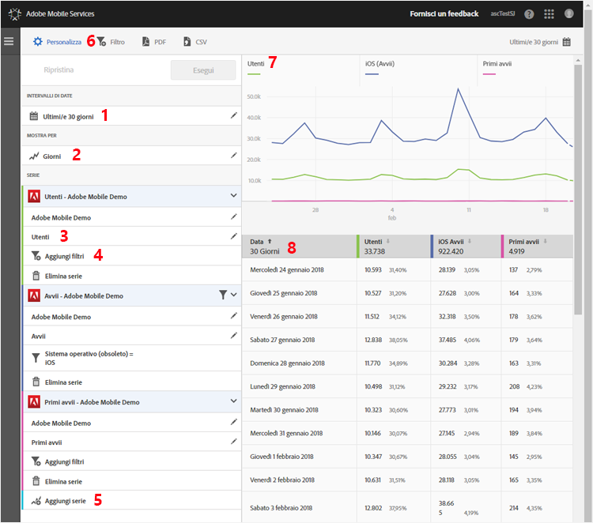

# Personalizzare i rapporti {#customize-reports}

Queste informazioni sono utili per comprendere e personalizzare i rapporti incorporati.

Puoi personalizzare i rapporti modificando l’intervallo di date, le opzioni **[!UICONTROL Mostra per]** (visualizzazione dei dati sotto forma di grafico o tabella per periodi di tempo o per dimensioni), aggiungendo metriche e filtri, oppure serie (metriche) supplementari e altri elementi.

Per visualizzare la barra Personalizza, fai clic sul nome dell’app per passare alla pagina Panoramica corrispondente, quindi fai clic su **[!UICONTROL Personalizza]**.

L’esempio seguente mostra il rapporto Utenti e sessioni con la barra **[!UICONTROL Personalizza]** aperta. Questo esempio mostra i dati relativi agli ultimi 30 giorni, raggruppati per giorni, con quattro serie attive:

* **[!UICONTROL Utenti]**
* **[!UICONTROL Avvii]**
* **[!UICONTROL Primi avvii]**
* **[!UICONTROL Download dall’app store]**

Di seguito sono descritte le diverse sezioni del rapporto e la barra **[!UICONTROL Personalizza]**:

| Numero | Descrizione |
|--- |--- |
| 1 | In **[!UICONTROL Intervalli di date]**, l’elenco a discesa permette di selezionare vari intervalli di date per il rapporto. Tutti i dati del grafico (9) e della tabella corrispondente (10) sono relativi all’intervallo di date selezionato. |
| 2 | In **[!UICONTROL Mostra per]** l’elenco a discesa permette di selezionare per il rapporto una visualizzazione basata su un’unità di misura temporale o dimensionale. Ad esempio, nell’illustrazione è selezionato il periodo Giorni. Osserva le date sotto il grafico (7) e le righe della tabella (8): i dati sono organizzati per data in un arco di tempo. Nel rapporto temporale è possibile visualizzare fino a sei metriche, aggiungendovi ulteriori serie.  Se selezioni una dimensione Ciclo di vita, puoi visualizzare i primi 50 valori in un elenco classificato, i primi 5 valori con tendenze per giorno o settimana o una suddivisione dei primi 5 o 10 valori. |
| 3 | Le **[!UICONTROL Serie]** rappresentano singole metriche, quali Utenti, Avvii, Primi avvii e Download da app store nell’esempio precedente. Ogni serie è visualizzata con un colore diverso nei dati del grafico (7) e della tabella (8).  Puoi aggiungere altre serie (metriche) e anche app differenti in suite di rapporti diverse per confrontare i dati.  Per ulteriori informazioni, consulta [Aggiungere serie (metriche) ai rapporti](/help/using/usage/reports-customize/t-reports-series.md). |
| 4 | **[!UICONTROL Aggiungi filtro]** consente di aggiungere altri filtri (segmenti) per personalizzare i rapporti incorporati. Per ulteriori informazioni, consulta [Aggiungere filtri ai rapporti](/help/using/usage/reports-customize/t-reports-customize.md). |
| 5 | **[!UICONTROL Aggiungi serie]** permette di personalizzare i rapporti incorporati aggiungendo serie (metriche) o app supplementari da suite di rapporti diverse per confrontare i dati. Per ulteriori informazioni, consulta [Aggiungere serie (metriche) ai rapporti](/help/using/usage/reports-customize/t-reports-series.md). |
| 6 | **[!UICONTROL Filtro fisso]** consente di creare un filtro per più rapporti. Ad esempio, a volte può essere utile visualizzare il comportamento di un particolare segmento in tutti i rapporti mobili. Un filtro fisso consente di definire un filtro applicato a tutti i rapporti non di percorso.  Per ulteriori informazioni, consulta [Aggiungere un filtro fisso](/help/using/usage/reports-customize/t-sticky-filter.md). |
| 7 | **[!UICONTROL Grafico dati]** visualizza i dati sotto forma di diagramma appropriato per le metriche selezionate. Sono disponibili diversi tipi di grafico, come grafici a linee, a barre, ad anello ecc. |
| 8 | **[!UICONTROL Tabella dati]** mostra i dati sotto forma di tabella. Puoi fare clic su un’intestazione di colonna per ordinare i dati in ordine crescente o decrescente. |
