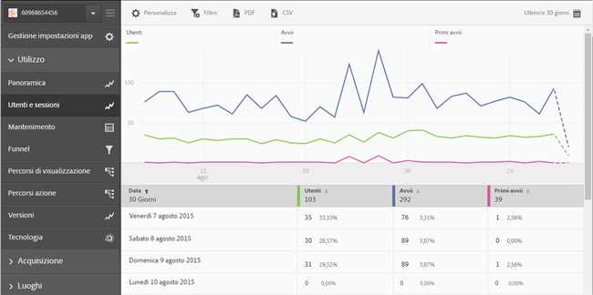

# Aggiungere filtri ai rapporti {#add-filters-to-reports}

Queste informazioni sono utili per personalizzare i rapporti incorporati aggiungendo altri filtri (segmenti).

>[!IMPORTANT]
>
>Le metriche delle app Mobile sono disponibili anche in reporting e analisi di marketing, nelle analisi ad hoc, nei data warehouse e in altre interfacce di reporting di Analytics. Se una suddivisione o un tipo di rapporto non è disponibile in Adobe Mobile, può essere generato utilizzando un’altra interfaccia di reporting.

In questo esempio personalizzeremo il rapporto **[!UICONTROL Utenti e sessioni]**, ma le istruzioni sono valide per qualsiasi tipo di rapporto.

1. Apri l’app e fai clic su **[!UICONTROL Utilizzo]** > **[!UICONTROL Utenti e sessioni]**.

   

   Questo rapporto fornisce una vista completa degli utenti dell’app nel corso del tempo. Tuttavia, le metriche per le versioni iOS e Android dell’app vengono raccolte nella stessa suite di rapporti. È possibile segmentare gli utenti per sistema operativo mobile aggiungendo un filtro personalizzato alla metrica Utenti.

1. Fai clic su **[!UICONTROL Personalizza]**.

   

1. In **[!UICONTROL Utenti]**, fai clic su **[!UICONTROL Aggiungi filtro]**, quindi su **[!UICONTROL Aggiungi regola]**.

1. Seleziona **[!UICONTROL Sistema operativo]**, quindi scegli **[!UICONTROL iOS]** dall’elenco a discesa.

   

   Per aggiungere Android come filtro, devi ripetere questo passaggio.

1. Fai clic su **[!UICONTROL E]**, seleziona **[!UICONTROL Sistema operativo]** dall’elenco a discesa, quindi scegli **[!UICONTROL Android]**.

   A questo punto i filtri dovrebbero essere come nell’esempio seguente:

   

1. Fai clic su **[!UICONTROL Aggiorna]**.
1. Per rigenerare il rapporto, fai clic su **[!UICONTROL Esegui]**.

   Questo rapporto ora mostra gli utenti suddivisi per sistema operativo. Il titolo del rapporto è stato modificato per corrispondere ai filtri applicati al rapporto.

   

   Puoi personalizzare ulteriormente il rapporto. A partire da iOS 8.3, puoi aggiungere la metrica Primi avvii con un filtro di versione del sistema operativo iOS 8.3 per vedere quanti clienti iOS 8.3 hanno aggiornato le app ed eseguito un primo avvio.
1. In **[!UICONTROL Primi avvii]**, fai clic su **[!UICONTROL Aggiungi filtro]**, poi su **[!UICONTROL Aggiungi regola]**, seleziona **[!UICONTROL Sistema operativo]** dall’elenco a discesa e infine scegli **[!UICONTROL iOS]**.
1. Fai clic su **[!UICONTROL E]**, seleziona **[!UICONTROL Versioni sistema operativo]** dall’elenco a discesa, quindi scegli **[!UICONTROL iOS 8.3]**.

   A questo punto i filtri dovrebbero presentarsi come in questo esempio:

   

1. Fai clic su **[!UICONTROL Aggiorna]** ed **[!UICONTROL Esegui]**.

   Il rapporto aggiornato mostra gli utenti con iOS 8.3 che hanno avviato l’app per la prima volta.

   

   Dedica un po’ di tempo a provare le diverse opzioni nel menu di personalizzazione dei rapporti e provvedi ad aggiungere ai segnalibri i tuoi preferiti. In Adobe Mobile gli URL dei rapporti sono funzionanti e possono essere inviati via e-mail o aggiunti ai preferiti.
