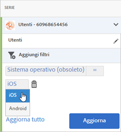

# Add filters to reports{#add-filters-to-reports}

Queste informazioni sono utili per personalizzare i rapporti incorporati aggiungendo altri filtri (segmenti).

>[!IMPORTANT]
>
>Le metriche delle app mobili sono disponibili anche in reporting e analisi di marketing, analisi ad hoc, data warehouse e altre interfacce di reporting di Analytics. Se una suddivisione o un tipo di rapporto non è disponibile in Adobe Mobile, può essere generato utilizzando un'altra interfaccia di reporting.

In questo esempio personalizzeremo il rapporto **[!UICONTROL Utenti e sessioni], ma le istruzioni sono valide per qualsiasi tipo di rapporto.**

1. Apri l'app e fai clic su **Utilizzo** &gt; **[!UICONTROL Utenti e sessioni]**.

   

   Questo rapporto fornisce una vista completa degli utenti dell'app nel corso del tempo. Tuttavia, le metriche per le versioni iOS e Android dell'app vengono raccolte nella stessa suite di rapporti. Possiamo segmentare gli utenti per sistema operativo mobile aggiungendo un filtro personalizzato alla metrica Utenti.

1. Click **[!UICONTROL Customize]**.

   

1. Under **[!UICONTROL Users]**, click **[!UICONTROL Add Filter]** and click **[!UICONTROL Add Rule]**.

1. Select **[!UICONTROL Operating Systems]**, and from the drop-down list, and select **[!UICONTROL iOS]**.

   

   To add Android as a filter, you need to repeat this step.

1. Click **[!UICONTROL And]**, select **[!UICONTROL Operating Systems]** from the drop-down list, and select **[!UICONTROL Android]**.

   A questo punto i filtri dovrebbero essere come nell'esempio seguente:

   

1. Fai clic su **[!UICONTROL Aggiorna]**.
1. To regenerate the report, click **[!UICONTROL Run]**.

   Il rapporto ora mostra gli utenti suddivisi per sistema operativo. Il titolo del rapporto è stato modificato in modo da corrispondere ai filtri applicati al rapporto.

   

   Puoi personalizzare ulteriormente il rapporto. Da iOS 8.3, potete aggiungere la metrica Primi avvii con un filtro di versione del sistema operativo iOS 8.3 per vedere quanti clienti iOS 8.3 hanno aggiornato le app ed eseguito un primo avvio.
1. Under **[!UICONTROL First Launches]**, click **[!UICONTROL Add Filter]**, click **[!UICONTROL Add Rule]**, select **[!UICONTROL Operating Systems]** from the drop-down list, and select **[!UICONTROL iOS]**.
1. Click **[!UICONTROL And]**, select **[!UICONTROL Operating System Versions]** from the drop-down list, and select **[!UICONTROL iOS 8.3]**.

   A questo punto i filtri dovrebbero essere come in questo esempio:

   

1. Click **[!UICONTROL Update]** and **[!UICONTROL Run]**.

   Il rapporto aggiornato mostra gli utenti con iOS 8.3 che hanno avviato l'app per la prima volta.

   

   Dedica un po' di tempo a provare le diverse opzioni nel menu di personalizzazione dei rapporti e provvedi ad aggiungere ai segnalibri i tuoi preferiti. Gli URL dei rapporti in Adobe Mobile funzionano e possono essere inviati via e-mail o aggiunti ai preferiti.
