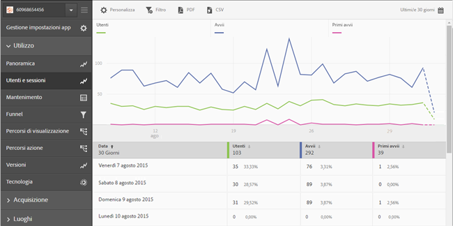
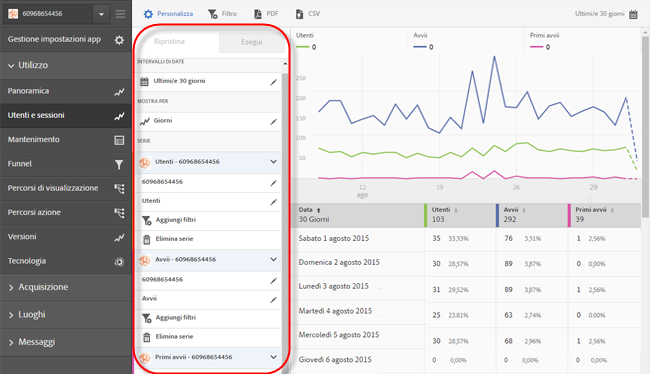
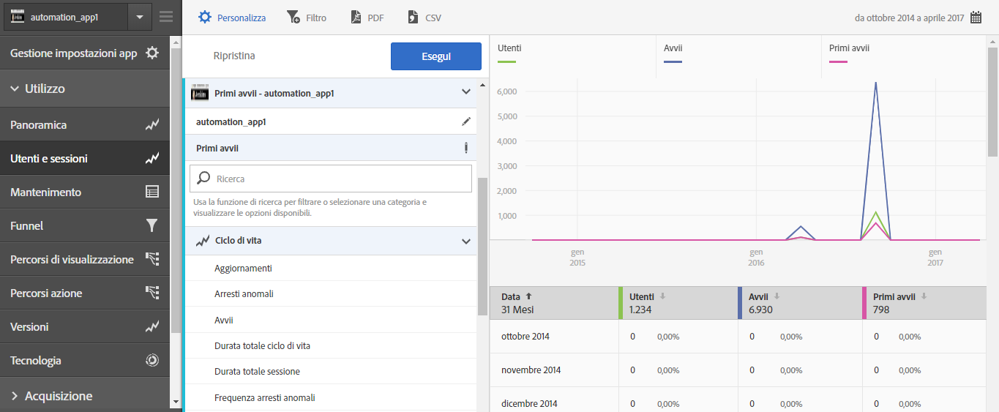
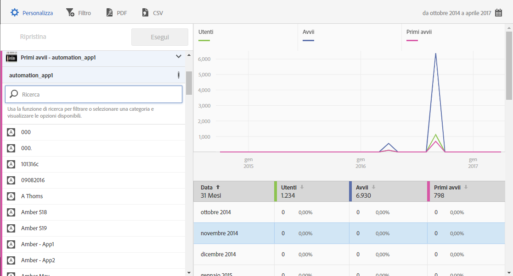

# Aggiungere serie (metriche) ai rapporti {#add-series-metrics-to-reports}

Informazioni utili per personalizzare i rapporti incorporati aggiungendo serie (metriche) o app supplementari da suite di rapporti diverse per confrontare i dati.

>[!IMPORTANT]
>
>Le metriche delle app Mobile sono disponibili anche in reporting e analisi di marketing, nelle analisi ad hoc, nei data warehouse e in altre interfacce di reporting di Analytics. Se una suddivisione o un tipo di rapporto non è disponibile in Adobe Mobile, può essere generato utilizzando un’altra interfaccia di reporting.

In questo esempio personalizzeremo il rapporto **[!UICONTROL Utenti e sessioni]**, ma le istruzioni sono valide per qualsiasi tipo di rapporto.

1. Apri l’app e fai clic su **[!UICONTROL Utilizzo]** > **[!UICONTROL Utenti e sessioni]**.

   

   Questo rapporto fornisce una vista completa degli utenti dell’app nel corso del tempo. Vogliamo però aggiungere una serie per indicare nel rapporto gli arresti anomali dell’app.

1. Fai clic su **[!UICONTROL Personalizza]**.

   

1. Scorri verso il basso e fai clic su **[!UICONTROL Aggiungi serie]**.

   Inizialmente, il nome della serie è uguale a quello dell’ultima serie dell’elenco. Nell’illustrazione precedente, l’ultima serie è **[!UICONTROL Download da app store]**, quindi viene aggiunta una nuova serie con lo stesso nome **[!UICONTROL Download da app store]**.

1. Completa una delle seguenti attività:

   * Per aggiungere una nuova serie (metrica), fai clic sul nome della serie che hai appena creato per selezionare una nuova metrica Ciclo di vita dall’elenco a discesa.

      

   * Per aggiungere una nuova app in una suite di rapporti diversa e fare quindi un confronto tra dati di app differenti, fai clic sul nome dell’app nella nuova serie che hai creato, quindi seleziona l’app desiderata.

      

1. (Condizionale) Aggiungi dei filtri alla nuova serie.

   Per ulteriori informazioni, consulta [Aggiungere filtri ai rapporti](/help/using/usage/reports-customize/t-reports-customize.md).
1. Fai clic su **[!UICONTROL Aggiorna]** ed **[!UICONTROL Esegui]**.
